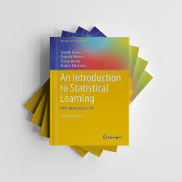
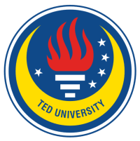

## ADA 442

  
### Statistical Learning with R
TED University remote lecture series notes organized for 

Fall/Spring 2021-2022

[Dr. Ozan Evkaya](https://ozanevkaya.netlify.app/)  
    

This course introduces the introductory level of Statistical Learning with R course notes that are designed for 2021. Lecture slides are created by using the main course book and related readings. Weekly slides and hands-on session materials are all created by R programming. 

Main objective of this course is to introduce fundamental statistical modeling
techniques to students and enable them to solve real life problems using
these various methods using R language as a statistical computation tool.

Applications include real data from wide-range of fields following reproducible practices. Homeworks will be assessed individually, but the project can be prepared as a small team (it depends on the total number of enrolments for the course).

**Course Descriptions**

- Statistical Learning and Data Pre-processing, 
- Supervised versus Unsupervised Learning,
- Prediction versus Classification, 
- Simple and Multiple Linear Regressions, Classification,
- Logistic Regression, 
- Cross Validation and Bootstrap, 
- Linear Model Selection and
- Regularization, Nonlinear Regression algorithms, 
- Decision Trees and its derivatives, 
- Principal Component Analysis, 
- Clustering methods

**Course Sources**

*Main Textbook:* 

An Introduction to Statistical Learning with Applications in R”,
James G., Witten D., Hastie T, Tibshirani R., Springer ISBN 978-1-4614-7138-7.

Available online: https://www.statlearning.com/

*Supplementary Materials:*

[Hands on Machine Learning with R](https://bradleyboehmke.github.io/HOML/)

[Applied Predictive Modeling](http://appliedpredictivemodeling.com/)

[Intro to Data Science- Data Analysis and Prediction Algorithms in R](https://rafalab.github.io/dsbook/)

[Supervised Machine Learning](https://bookdown.org/mpfoley1973/supervised-ml/)

[R For Data Science](https://r4ds.had.co.nz/)

Note that Turkish version of the R for Data Science (r4ds) is available via
http://tr.r4ds.hadley.nz

If you see anything missing or broken links please feel free to file an issue in this repo or let me know. 

Note that this is a public repo so if you create an issue it would be publicly be available. If you are concerned about privacy you can directly email me.

**Instructors** if you are planning to use any of the website design or resources (except the videos) feel free to do so but please attribute accordingly. 

**My credit for the course repo initial design for Introduction Data Science University of California Irvine, designed by Mine Dogucu** 

Everything on this website except the videos are licensed under [Creative Commons Attribution-NonCommercial-ShareAlike 4.0 International License](http://creativecommons.org/licenses/by-nc-sa/4.0/).

The videos are copyrighted and all rights are reserved.

