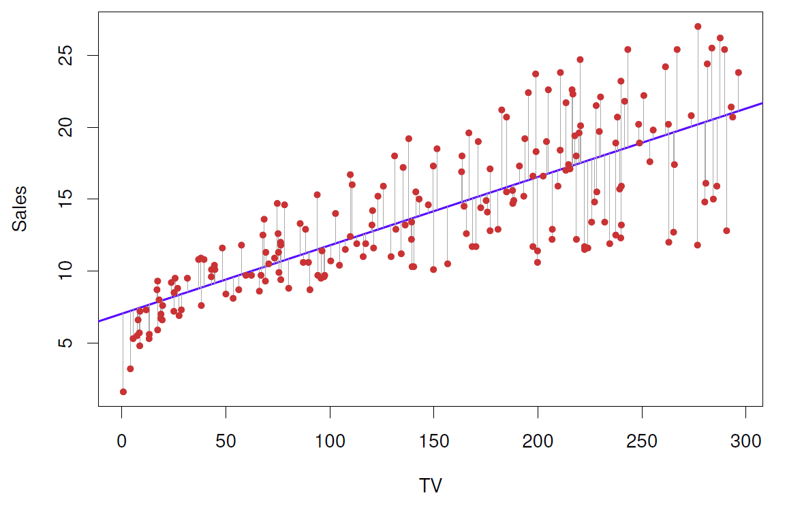

```{r setup, include=FALSE, out.width="50", fig.align= 'center'}
knitr::opts_chunk$set(echo = T)
```

## Before Regression


## Be Careful about

{width=50%}

Source: https://www.tylervigen.com/spurious-correlations

## Previously in ADA-442


Source: FIGURE 2.1 (ISLR book, page 16)

## ABC of Linear Regression

A very simple approach for supervised learning, a useful tool for predicting
a quantitative response!

- Our aim is to fit a function $f(.)$ from the set of **data points** $y_i = f(x_i)$ under some error function. 

- A few important questions that we might seek to address to provide some recommendation from FIGURE 2.1

## Discussion on graphs


## Possible Questions

- Is there a relationship between advertising budget and sales?
- How strong is the relationship between advertising budget and sales?
- Which media are associated with sales?
- How large is the association between each medium and sales?
- How accurately can we predict future sales?
- Is the relationship linear or not ?
- Is there synergy (**interaction**) effect among the advertising media?

It turns out that linear regression can be used to answer each of these
questions.

## Simple Linear Regression

It is a very straightforward approach for predicting a quantitative response $Y$ on the basis of a single predictor variable $X$. 

- Other names: 
  * Linear Regression, Least Squares Estimation, Best fitted Line

- It assumes that there is approximately a linear relationship between X and Y

- Equivalently saying that we are regressing Y on X (or Y onto X).

Mathematically, we have this notation; 

$Y \approx \beta_0 + \beta_1 X$

- where $\beta_0$ and $\beta_1$ are two unknown constants that represent
the **intercept** and **slope** terms in the linear model. In general, $(\beta_0, \beta_1)$ are model coefficients (parameters). 

For our example, ie.

$Sales \approx \beta_0 + \beta_1 TV_{adv}$

## More General

{width=50%}


## How to Estimate Parameters

- By using our training data set, we get the estimates of $\widehat{\beta}_0$ and $\widehat{\beta}_1$ 

- After learning our parameters, we can make predictions on new $X$ data.

- For the model itself, we will see some performance measure metrics.  

- By using our test data, we can compare our predictions and the true values for testing the model perfomance

- Repeat above procedures for the number of each different model, and then compare their performance by using performance measure metrics


## New notation

$\widehat{y} = \widehat{\beta}_0 + \widehat{\beta}_1 x$ 

where

- $\widehat{y}$ indicates a prediction of Y on the basis of X = x

Lets assume we have pairwise observations $(y_i, x_i)$ for $i = 1, \ldots, n$

Goal: To obtain coefficient estimates $\widehat{\beta}_0$ and $\widehat{\beta}_1$ such that the linear model $Y \approx \beta_0 + \beta_1 X$ fits the available data well—that is, so that $\widehat{y} = \widehat{\beta}_0 + \widehat{\beta}_1 x$ for $i = 1, \ldots, n$

## Error/Residual term

{width=50%}

Source: FIGURE 3.1 (ISLR book, page 62)

## How to calculate

There are a number of ways of measuring closeness. However, by far the
most common approach involves minimizing the least squares criterion. 

- Let $\widehat{y}_i = \widehat{\beta}_0 + \widehat{\beta}_1 x_i$ is the prediction for $Y$ based on the $i$th value of $X$.

- Then we have the $i$th residual, $e_i = y_i - \widehat{y}_i$

- We have set of residuals for set of $n$ observations so we can define Residual Sum of Squares (RSS)

$RSS = \sum_{i=1}^{n} e_i^2 = e_1^2 + e_2^2 + \ldots + e_n^2$

Or equivalently ?

## Least Squares Approach

It finds the parameters that minimizing the $RSS$. Using some calculus, we have 

$$\widehat{\beta}_1 =\frac{\sum_{i=1}^{n}(x_i - \bar{x})(y_i-\bar{y})}{\sum_{i=1}^{n}(x_i - \bar{x})^2}$$ 

$$\widehat{\beta}_0 = \bar{y}- \widehat{\beta}_1\bar{x}$$

where $\bar{y} = \frac{\sum_{i=1}^{n}y_i}{n}$ and $\bar{x} = \frac{\sum_{i=1}^{n}x_i}{n}$ are our sample means. 

## What about the accuracy of the Estimates ?

Recall: $Y = f(X) + \epsilon$, now if we have a linear function then

$Y  = \beta_0 + \beta_1 X + \epsilon$

- Here $\beta_0$ is the intercept term—that is, the expected value of $Y$ when 
$X = 0$, and $\beta_1$ is the slope—the average increase in $Y$ associated with a one-unit increase in $X$

- The error term is a catch-all for what we miss with this simple model: 
  * the true relationship is probably not linear, 
  * there may be other variables that cause variation in Y , and 
  * there may be measurement error
  
- Typically assume that the error term is independent of X.

## Importance of Standart Errors

True relationship: $Y = f(X) + \epsilon$ for some unknown function $f$, 
where $\epsilon$ is a mean-zero random error term. If f is to be approximated by a linear function, then we can write; $Y = \beta_0 + \beta_1X + \epsilon$. 

- The true relationship is generally not known for
real data, but the least squares line can always be computed using the
coefficient estimates OR we have access to a set of observations from which we can compute the least squares line; however, the population regression line is unobserved ($\mu$ example?)

- The analogy between linear regression and estimation of the mean of a
random variable ($\mu$) is an apt one based on the concept of bias

- The property of **unbiasedness** holds for the least squares coefficient estimates given above: if we estimate $\beta_0$ and $\beta_1$ on the basis of a particular data set, then our estimates **won’t be exactly equal** to $\beta_0$ 
and $\beta_1$ 

Next natural question: How accurate our estimates? Now, we need to compute the standard error of the interested parameter here, like $SE(\widehat{\mu})$
or in linear regression $SE(\widehat{\beta_1})$

## About Standard Error

A well-known formula; 

$Var(\widehat{\mu}) = SE(\widehat{\mu})^2 = \frac{\sigma^2}{n}$ where $\sigma$ is the standard deviation of each of the realizations $y_i$ of Y (Note that the formula is true when the n observations are uncorrelated).

Meaning: The standard error tells us the average amount that this
estimate $\widehat{\mu}$ differs from the actual value of $\mu$. With the same analogy, 

$SE(\widehat{\beta_0}) = \sigma^2 [\frac{1}{n} + \frac{\bar{x}^2}{\sum_{i=1}^{n}(x_i - \bar{x})^2}]$

$SE(\widehat{\beta_1}) = \sigma^2 / \sum_{i=1}^{n} (x_i - \bar{x})^2$

where $\sigma^2 = Var(\epsilon)$. 

- For these formulas to be strictly valid, we need to
assume that the errors $\epsilon_i$ for each observation have common variance 
$\sigma^2$ and are uncorrelated

- In general, $\sigma^2$ is not known, but can be estimated from the data.

- This estimate of $\sigma^2$ is known as the residual standard error, and is 
given by $RSE = \sqrt{RSS/(n-2)}$. 

- Standard errors can be used to compute confidence intervals. 

- A $95\%$ confidence interval is defined as a range of values such that with $95\%$ interval probability, the range will contain the true unknown value of the parameter.

For linear regression, the $95\%$ confidence interval for $\beta_1$ approximately takes the form;

$\widehat{\beta}_1 \pm 2.SE(\widehat{\beta}_1)$


## Hypothesis test on Coefficients

- Standard errors can also be used to perform hypothesis tests on the coefficients, to understand whether it is significant or not. The most common hypothesis test

- $H_0:$ There is no relationship between X and Y ($\beta_1 = 0$)

- $H_a:$ There is some relationship between X and Y ($\beta_1 \neq 0$)

Note that, if $\beta_1 = 0$ then the model reduces to $Y = \beta_0 + \epsilon$, 
and X is not associated with Y. 

- To test the null hypothesis, we need to determine
whether $\widehat{\beta}_1$, our estimate for $\beta_1$, 
is sufficiently far from zero that we can be confident that $\beta_1$ is non-zero. 
**How far is far enough?**

- In practice, we compute a t-statistic given by $t = \frac{\widehat{\beta}_1-0}{SE(\widehat{\beta}_1)}$. Which measures the number of standard deviations that $\widehat{\beta}_1$ is away from 0. 

- The corresponding t-distribution has a bell shape and for values of n greater than approximately 30 it is quite similar to the standard normal distribution. And the resulting probability of probability of observing any number equal
to $|t|$ or larger in absolute value (assume $\beta_1 = 0$) is called $p-value$. 

Interpretation: If we see a small $p-value$, then we can infer that there is an association between the predictor and the response. We reject the null hypothesis—that is, we declare a relationship to exist between $X$ and $Y$ — 
if the $p-value$ is small enough

NOTE: Typical p-value cutoffs for rejecting the null hypothesis are $5\%$ or
$1\%$. When n = 30, these correspond to t-statistics (3.14) of around $2$
and $2.75$, respectively

## Example

{width=50%}

Source: TABLE 3.1 (ISLR book, page 68)

## What about the accuracy of the model ?

The quality of a linear regression fit is typically assessed
using two related quantities: 

- the Residual Standard Error ($RSE$) 

- the Coefficient of Determination ($R^2$) statistic


Source: TABLE 3.2 (ISLR book, page 69)

## Their definitions

- The $RSE$ is an estimate of the standard deviation of $\epsilon$. It is the average amount that the response will deviate from the true regression line,

$RSE = \sqrt{\frac{RSS}{(n-2)}}$ with $RSS = \sum_{i=1}^{n} (y_i - \widehat{y}_i)^2$

- The RSE is considered a measure of the lack of fit of the model the data. If the predictions obtained using the model are very close to the true outcome values then $RSE$ will be small, and we can conclude that the model fits the data very well

- Since $RSE$ is measured in the units of Y , it is not always
clear what constitutes a good $RSE$. The $R^2$ statistic provides an alternative
measure of fit. 

- It takes the form of the proportion of variance explained—and so it always takes on a value between 0 and 1, and is independent of the scale of $Y$

$R^2 = \frac{TSS-RSS}{TSS} = 1- \frac{RSS}{TSS}$ where $TSS = \sum_{i=1}^{n} (y_i - \bar{y}_i)^2$ is the total sum of squares, and $RSS$ is defined above

- $TSS - RSS$ measures the amount of variability in the response that is explained (or removed) by performing the regression, and $R^2$ measures the proportion of
variability in $Y$ that can be explained using $X$

- An $R^2$ statistic that is close to 1 indicates that a large proportion of the variability in the response is explained by the regression

- An $R^2$ statistic near 0 indicates that the regression does not explain much of the variability in the response; this might occur,
  * because the linear model is wrong, 
  * the error variance $\sigma^2$ is high, 
  * both of them
  
## Correlation Coefficient

{width=50%}

Source: https://narendransolai.blogspot.com/2021/02/coefficient-of-determination-linear.html

## Multiple Linear Regression

{width=50%}

Source: FIGURE 3.4 (ISLR book, page 73) 

## MLR Formulation

Simple linear regression is a useful approach for predicting a response on the
basis of a single predictor variable. However, in practice we often have more
than one predictor. 

Suppose that we have $p$ distinct predictors, then MLR model has the form

$Y = \beta_0 + \beta_1 X_1 + \beta_2 X_2 + \ldots + \beta_p X_p +\epsilon$

where $X_j$ is the $j$th predictor with its coefficient $\beta_j$ that quantifies the association between that variable and the response. 

- $\beta_j$ is the average effect on $Y$ of a one unit increase in $X_j$ , holding all other predictors fixed

Sales example; 

## Some Useful Questions ? 

- Is at least one of the predictors $X_1,X_2, \ldots,X_p$ useful in predicting
the response $Y$?

- Do all the predictors help to explain $Y$ , or is only a subset of the
predictors useful?

- How well does the model fit the data?

- Given a set of predictor values, what response value should we predict,
and how accurate is our prediction?

## Estimation of the Coefficients

- As was the case in the simple linear regression setting, the regression coefficients $\beta_{1:p}$ are unknown, and must be estimated to estimate the model

- Given the estimates, $\widehat{\beta}_{1:p}$, one can make predictions for $y$ as follows;

$\widehat{y} = \sum_{j=1}^{p} \widehat{\beta}_{j} x_j$

- Here, the estimation procedure is similar to what we did in simple linear regression: Choose the values of $\beta_{1:p}$ that minimize the sum of squared residuals

$RSS = \sum_{i=1}^{n} (y_i - \widehat{y}_{i})^2 =$

- The values $\widehat{\beta}_{1:p}$ that minimize $RSS$  above are the multiple least squares regression coefficient estimates

## Sales Example again

{width=50%}


Question: Does it make sense for the multiple regression to suggest no relationship
between sales and newspaper while the simple linear regression implies the
opposite?

## Measuring the Quality of Fit

- In the multiple regression setting with $p$ predictors, we need to ask whether all of the regression coefficients are zero, ie. all $\beta_{1:p} = 0$

It means we have the null hypothesis;

- $H_0 : \beta_1 = \ldots = \beta_p$

- $H_1 :$ at least one $B_j$ is nonzero

- This hypothesis test is performed by computing the F-statistic. When there is no relationship between the response and predictors, one would expect the F-statistic to take on a value close to 1

- When n is large, an F-statistic that is just a little larger than 1 might still provide evidence against $H_0$. In contrast, a larger F-statistic is needed to reject $H_0$ if n is small.


## Deciding on Important Variables

- If we conclude on the basis of that p-value that at least one of the
predictors is related to the response, then it is natural to wonder which are
the guilty ones!

- It is more often the case that the response is only associated with
a subset of the predictors

- The task of determining which predictors are associated with the response, in order to fit a single model involving only those predictors, is referred to as **variable selection**

- Ideally, we would like to perform variable selection by trying out a lot of
different models, each containing a different subset of the predictors. Ideally again, we need to compare different models using some criterions like
  * Mallow’s Cp 
  * Akaike information criterion (AIC), 
  * Bayesian information criterion (BIC), 
  * adjusted R2.
  
## For large p!

There are three classical approaches for this task

- **Forward selection:** We begin with the null model—a model that conforward
selection null model contains an intercept but no predictors. 
We then fit p simple linear regressions and add to the null model the variable that results in the lowest RSS. 
We then add to that model the variable that results in the lowest RSS for the new two-variable model. This approach is continued until some stopping rule is satisfied.

- **Backward selection:** start with all variables in the model, and
remove the variable with the largest $p$-value—that is, the variable selection that is the least statistically significant. The new $(p − 1)$-variable
model is fit, and the variable with the largest $p$-value is removed. This
procedure continues until a stopping rule is reached. 

- **Mixed selection:** This is a combination of forward and backward 
selection. We start with no variables in the model, and as with forward selection
selection, we add the variable that provides the best fit. We continue
to add variables one-by-one

NOTE: Backward selection cannot be used if $p > n$, while forward selection can
always be used. Forward selection is a greedy approach, and might include
variables early that later become redundant. Mixed selection can remedy
this.

## About Model Fit

- Two of the most common numerical measures of model fit are the 
  * $RSE$
  * $R^2$, the fraction of variance explained.
  
- $R^2$ value close to 1 indicates that the model explains a large portion
of the variance in the response variable
  
- Adjusted $R^2$ is a modified version of $R^2$ that has been adjusted for the number of predictors in the model. The adjusted $R^2$increases when the new term improves the model more than would be expected by chance. 

- In general, $RSE = \sqrt{\frac{RSS}{n-p-1}}$ so that models with
more variables can have higher $RSE$ if the decrease in $RSS$ is small relative
to the increase in $p$.

## Predictions

Once we fit the MLR model, it is straightforward to predict the response $Y$ on the basis of a set of values for the predictors, namely $X_{1:p}$. There are three sorts of uncertainty here; 

1. the least squares plane: $\widehat{Y} = \beta_0 + \sum_{j=1}^{p} \widehat{\beta}_j X_j$ is only an estimate for the true population regression 
plane $F(X)$ so the inaccuracy in the coefficient estimates is related to the **reducible error**. 

- How close $\widehat{Y}$ will be to $f(X)$ ? **confidence interval**

2. In practice assuming a linear model for $f(X)$ is almost
always an approximation of reality, so there is an additional source of
potentially **reducible error** which we call model bias.

3. Even if we knew $f(X)$ that is, even if we knew the true values
for $\beta_{1:p}$, the response value cannot be predicted perfectly
because of the random error $\epsilon$ in the model, **irreducible error**

- How much will $Y$ vary from $\widehat{Y}$ ? **prediction intervals**

NOTE: Prediction intervals are always wider than confidence intervals

## Potential Problems of regression

When we fit a linear regression model to a particular data set, many problems
may occur. Some of the common issues are; 

1. Non-linearity of the response-predictor relationships

2. Correlation of error terms

3. Non-constant variance of error terms

4. Outliers

5. High-leverage points

6. Collinearity

**REMARK: Identifying and overcoming these problems is as much an
art as a science. So we will discuss briefly below with some examples from our book**

## Non-linearity 

- The linear regression model assumes that there is a straight-line relationship
between the predictors and the response. 

- Residual plots are a useful graphical  tool for identifying non-linearity.

- Ideally, the residual plot will show no fitted discernible pattern. The presence of a pattern may indicate a problem with some aspect of the linear model

{width=50%}

## Correlation of error terms

- An important assumption of the linear regression model is that the error
terms, $\epsilon_i$s, are uncorrelated. It means the fact that $\epsilon_i$ is positive provides little or no information about the sign of $\epsilon_{i+1}$.

- If there is correlation among the error terms, then the estimated standard errors will tend to underestimate the true standard errors. 

- In short, if the error terms are correlated, we may have an unwarranted sense of confidence in our model.

{width=50%}

## Non-constant variance of error terms

Called as **Heteroskedasticity** as well. 

- The important assumption of the linear regression model is that the
error terms have a constant variance, $Var(\epsilon_i) = \sigma^2$. The standard errors, confidence intervals, and hypothesis tests associated with the linear model
rely upon this assumption.

- One can identify non-constant variances in the errors, or heteroscedasticity, from the presence of a funnel shape in above Figure 3.11. 

- When faced with this problem, one possible solution is to transform
the response $Y$ using a concave function, such as $log(Y)$ or $\sqrt{Y}$

Sometimes,

* the $i$th response could be an average of $n_i$ raw observations

* If each of these raw observations is uncorrelated with variance $\sigma^2$, then their average has variance $\sigma^2_i = \sigma^2/n_i$. In this case, the simple solution might be **weighted least squares estimation**

## Outliers

{width=50%}

- An outlier is a point for which $y_i$ is far from the value predicted by the
model. Outliers can arise for a variety of reasons, such as incorrect recording
of an observation during data collection. 

- we can identify those graphically by boxplots, but we need further statistical testing in general. 

- Residual plots can be used to identify outliers. In this example, the outlier
is clearly visible in the residual plot illustrated in the center panel of
Figure 3.12.

- It is typical for an outlier that does not have an unusual
predictor value to have little effect on the least squares fit. However, even
if an outlier does not have much effect on the least squares fit, it can cause
other problems (like interpretation of confidence intervals, high but doubtful $R^2$ values for model fit diagnostics)

- In practice, it can be difficult to decide how large a residual
needs to be before we considering it as an outlier. To address
this problem, we can plot the studentized residuals, calculated by dividing each residual $\epsilon_i$ by its estimated standard studentized error

## High-leverage points

- We just saw that outliers are observations for which the response $y_i$ is
unusual given the predictor $x_i$. In contrast, observations with **high leverage** have an unusual value for $x_i$.

- In fact, high leverage observations tend to have a sizable impact on the estimated regression line

- In a simple linear regression, high leverage observations are easy to
identify, since we can simply look for observations for which the predictor
value is outside of the normal range of the observations. 

- But in a multiple linear regression with many predictors, it is possible to have an observation that is well within the range of each individual predictor’s values, but that is unusual in terms of the full set of predictors

## Example

{width=50%}

## How to detect ? 

In order to quantify an observation’s leverage, we compute the leverage
statistic, 

$h_i = 1/n + \frac{(x_i-\bar{x})^2}{\sum_{j=1}^{n}(x_j-\bar{x})^2}$ for each point $i=1:n$

- From this equation, $h_i$ increases with the distance of $x_i$ from $\bar{x}$

- The leverage statistic $h_i$ is always in $(1/n,1)$, and the average leverage 
for all the observations is always equal to $(p+1)/n$

- If a given observation has a leverage statistic that greatly exceeds $(p+1)/n$, then we may suspect that the corresponding point has high leverage

## Collinearity issue

- Collinearity refers to the situation in which two or more predictor variables
are closely related to one another !

- The presence of collinearity can pose problems in the regression context, since it can be difficult to separate out the individual effects of collinear variables on the response

- To avoid such a situation, it is desirable to identify and address potential
collinearity problems while fitting the model. We have two approaches for it,
  * A simple way to detect collinearity is to look at the correlation matrix
of the predictors. Not practical for multicollinearity problem !
  * A better way to assess multi- collinearity is to compute the **variance inflation factor (VIF)**.
  
- When faced with **the problem of collinearity**, there are two simple solutions.
  * **Drop one of the problematic variables** from the regression
  * **Combine the collinear variables together** into a single predictor
  
## Example

{width=50%}

{width=50%}


## Extensions of the Linear Model

{width=75%}

## 

{width=75%}

## General Overview

{width=75%}

Source: https://www.cheatsheets.aqeel-anwar.com 

## Hands-on session with R

NOTE: First Look at LinearModel_R Script and try to understand the commands !

- Necessary Libraries

- Linear least-squares regression – finding a line of best fit, Regression terminology

- The optimality criterion for least-squares regression, Solution for the least-squares criterion

- Illustrating linear regression with simulated data

- Specifying Regression Models in R

- Fitted values, Getting the model coefficients, Residuals, Regression as sum-of-squares decomposition, Variance “explained” by a regression model

- Broom: a library for converting model results into data frames
broom::tidy, broom::augment, broom::glance

## Libraries

Basically,

```{r}
library(tidyverse)
```

Recall the terminology of the variables

- **Predictors, explanatory, or independent variable:** the variables from which we want to make ourprediction.

- **Outcomes, dependent, or response variable:** the variable we are trying to predict in ourregression.

## Simulated data sets

To illustrate how regression works, we’ll use a simulated data set where we specify the relationship between two variables. Using a simulation is desirable because it allows us to know what the “true” underlying model that relates so we can evaluate how well we do in terms of recovering the model

- True model:  $Y  = 1.5X + 1.0$ where $\epsilon_i$ is a noise term

```{r}
# this seeds our random number generator
# by setting a seed, we can make random number generation reproducible
set.seed(2021)

npts <- 50
X <- seq(1, 5, length.out = npts) + rnorm(npts)
a <- 1.0
b <- 1.5
Y <- b*X + a + rnorm(npts, sd = 2)  # Y = 1.5X + 1.0 + noise

df.xy <- data.frame(X = X, Y = Y)

```

## Visulize the relationship

```{r}
library(ggExtra)  # a new library, provides ggMarginal plot
                  # install if you don't already have it

p <- ggplot(df.xy, aes(x = X, y = Y)) + geom_point()
ggMarginal(p, type = "histogram", bins = 11)
```

## Specifying Regression Models in R

NOTE: The function lm can be used not only to carry out bivariate linear regression but a wide range of linear models, including multiple regression, analysis of variance, analysis of covariance, and others.

```{r}
fit.xy <- lm(Y ~ X, df.xy)

fit.xy

# Calling summary on a fit model provides more detailed output:
summary(fit.xy)

# The model fit object is actually a list
typeof(fit.xy)

# names(fit.xy)
# Simple Model diagnostics
plot(fit.xy)
```

## Fitted values

The component fitted.values gives the predicted values of Y (Y^ in the equations above) for each observed value of X. We can plot these predicted values of  Y

```{r}
ggplot(df.xy, aes(x = X, y = Y)) + 
  geom_point() +     # observed data alpha=0.7
  geom_point(aes(x = X, y = fit.xy$fitted.values),   # predicted data , alpha=0.5
             color='red')
```

## Model coefficients

```{r}
fit.xy$coefficients
```

NOTE: As shown above, the estimated slope is 1.5511 and the estimated intercept is 0.7688. With this information in hand we can draw the regression line

```{r}
ggplot(df.xy, aes(x = X, y = Y)) + 
  geom_point(alpha=0.7) +     # observed data
  geom_abline(slope = fit.xy$coefficients[[2]],
              intercept = fit.xy$coefficients[[1]],
              color='red', alpha=0.5)
 # geom_smooth(method="lm", color = 'red') 
```


## About Residuals 

RECALL: Residuals are the difference between the observed values of Y and the predicted values

```{r}
ggplot(df.xy, aes(x = X)) +
  geom_point(aes(y = fit.xy$residuals)) + 
  geom_hline(yintercept = 0, color = 'red', linetype = "dashed") + 
  labs(x = "X", y = "Residuals")
```

NOTE: When the linear regression model is appropriate, residuals should be centered around zero and should show no strong trends or extreme differences in spread for different values of X.

## Sum-of-squares decomposition

```{r}
ss.Y <- sum((Y - mean(Y))^2)
ss.Yhat <- sum((fit.xy$fitted.values - mean(Y))^2)
ss.residuals <- sum(fit.xy$residuals^2)
ss.Y

ss.Yhat + ss.residuals
```

## Variance explained by the model

The sum-of-square decomposition to understand the relative proportion of variance "explained" (accounted for) by the regression model. 
We call this quantity the "Coefficient of Determination", designated $R^2$ as,

$R^2 = 1 - \frac{SS_{residuals}}{SS_{total}}$

```{r}
R2 <- 1.0 - (ss.residuals/ss.Y)
R2

```

Our linear model accounts for about 63% of the variance in Y. Note that the coefficient of determination is also reported when you apply the summary function to a linear model.

## Broom package (Our friend)

The R package Broom converts “statisticalanalysis objects from R into tidy data frames, so that they can more easily be combined, reshaped andotherwise processed with tools like "dplyr", "tidyr" and "ggplot2".  There are three broom functions that are particularly useful;

- tidy

- augment

- glance

```{r}
library(broom)

tidy(fit.xy)

df.xy.augmented <- augment(fit.xy, df.xy)
head(df.xy.augmented)

glance(fit.xy)

```

## Some plotting 

```{r}
# Just plotting with ggplot2, not necessary but good to know
ggplot(df.xy.augmented, aes(X, Y)) + 
  geom_point() + geom_smooth(method="lm", color="red") +
  geom_segment(aes(xend = X, yend = .fitted), linetype="dashed")

# we can recreate our residual
ggplot(df.xy.augmented, aes(X, .resid)) + 
  geom_point() + 
  geom_hline(yintercept = 0, color = "red", linetype='dashed') + 
  labs(y = "Residuals", title = "Residual plot for synthetic data example.")

```

## Application for a data set

```{r}
library(MASS)
# install.packages("ISLR2")
library(ISLR2)

```

Here, we will focus on **Boston data** from our book, which records **medv** (median house value) for **506** census tracts in Boston. We will seek to predict
**medv** using 12 predictors such as **rm** (average number of rooms per house),
**age** (average age of houses), and **lstat** (percent of households with low
socioeconomic status)

```{r}
# data(Boston)
head(Boston)
summary(Boston)
plot(Boston[, c("lstat", "medv")])
```

## Simple Linear Regression

start by using the lm() function to fit a simple linear regression
lm() model, with medv as the response and lstat as the predictor.


```{r}
attach(Boston)
lm.fit <- lm(medv ~ lstat , data = Boston)
# attach(Boston)
lm.fit <- lm(medv ~ lstat)

summary(lm.fit)

plot(lm.fit)
```

In order to obtain a confidence interval for the coefficient estimates

```{r}
confint(lm.fit)
```

The predict() function can be used to produce confidence intervals and
prediction intervals for the prediction of medv for a given value of lstat

```{r}
predict(lm.fit , data.frame(lstat = (c(5, 10, 15))),
interval = "confidence")

predict(lm.fit , data.frame(lstat = (c(5, 10, 15))),
interval = "prediction")
```

## Some plotting

Plot medv and lstat along with the least squares regression
line using the plot() and abline() functions

```{r}
plot(lstat , medv)
abline(lm.fit)

```


```{r}
par(mfrow = c(2, 2))
plot(lm.fit)
```


Alternatively, we can compute the residuals from a linear regression fit
using the residuals() function. The function rstudent() will return the
studentized residuals

```{r}
plot(predict(lm.fit), residuals(lm.fit))
plot(predict(lm.fit), rstudent(lm.fit))
```

Leverage statistics can be computed for any number of predictors using the
hatvalues() function.

```{r}
plot(hatvalues(lm.fit))
which.max(hatvalues(lm.fit))

```


## Multiple Linear Regression

In order to fit a multiple linear regression model using least squares, we
again use the lm() function with two predictors below

```{r}
lm.fit <- lm(medv ~ lstat + age , data = Boston)
summary(lm.fit)
```

The Boston data set contains 12 variables, and so it would be cumbersome
to have to type all of these in order to perform a regression using all of the
predictors

```{r}
lm.fit <- lm(medv ~ ., data = Boston)
summary(lm.fit)
```


The vif() function, part of the car package, can be used to compute variance inflation factors

```{r}
library(car)
vif(lm.fit)
```

For example, in the above regression output, age has a high p-value.
So we may wish to run a regression excluding this predictor. The following
syntax results in a regression using all predictors except age

```{r}
lm.fit1 <- lm(medv ~. - age, data = Boston)
summary(lm.fit1)

# Or use update() function 
# lm.fit1 <- update(lm.fit , ∼ . - age)
```

## Training and Testing Partitioning

```{r}
# Splitting the data set 

set.seed(123) # for reproducible results
sample.size <- floor(0.75 * nrow(Boston))
train.index <- sample(seq_len(nrow(Boston)), size = sample.size)
train <- Boston[train.index, ]
test <- Boston[- train.index, ]

```

```{r}
# Simple linear regression 
lm.fit = lm(medv ~ lstat, data = train) 
summary(lm.fit) 

par(mfrow = c(2,2))
plot(lm.fit)
```

```{r}
# About doing prediction, now use the test data set 

head(predict(lm.fit, test, interval = "confidence"), 5)
head(predict(lm.fit, test, interval = "prediction"), 5)

# What about performance measures
# Necessary packages
library(tidyverse)
library(modelr)

# Make predictions and compute the
# R2, RMSE and MAE
test %>%
  add_predictions(lm.fit) %>%
  summarise(
    R2 = cor(medv, pred)^2,
    MSE = mean((medv - pred)^2),
    RMSE = sqrt(MSE),
    MAE = mean(abs(medv - pred))
  )


library(modelr)
data.frame(
  R2 = rsquare(lm.fit, data = test),
  MSE = mse(lm.fit, data = test), 
  RMSE = rmse(lm.fit, data = test),
  MAE = mae(lm.fit, data = test)
)

# OR with glance
library(broom)
glance(lm.fit)
```

## Interaction Terms

The syntax lstat:black tells R to include an interaction term between
lstat and black. The syntax lstat * age simultaneously includes
lstat, age, and the interaction term lstat × age as predictors; it is a shorthand
for lstat + age + lstat * age.


```{r}
summary(lm(medv ~ lstat * age , data = Boston))
```

## Non-linear Transformations of the Predictors

For instance, given a predictor $X$, we can create a predictor $X^2$
using $I(X^2)$.

```{r}
lm.fit2 <- lm(medv ~ lstat + I(lstat^2))
summary(lm.fit2)
```

We use the anova() function to further quantify the extent to which the quadratic fit is superior to the linear fit

```{r}
lm.fit <- lm(medv ~ lstat)
anova(lm.fit , lm.fit2)
```

```{r}
par(mfrow = c(2, 2))
plot(lm.fit2)
```

Sometimes, log-transformation could be useful 

```{r}
summary(lm(medv ~ log(rm), data = Boston))
```

## Qualitative Predictors

Now examine the Carseats data and to predict Sales (child car seat sales) in 400 locations based on a number of predictors.

```{r}
head(Carseats)

lm.fit <- lm(Sales ~ . + Income:Advertising + Price:Age, data = Carseats)
summary(lm.fit)
```

## Other related packages

For further exploration

- **modelr** package for general modeling

- **performance** for checking possible problems about linear model

- **leaps** package for subset selection for the regression

- **gglm** for model diagnostic plots 

- **lindia** package for again model diagnostics for linar model


