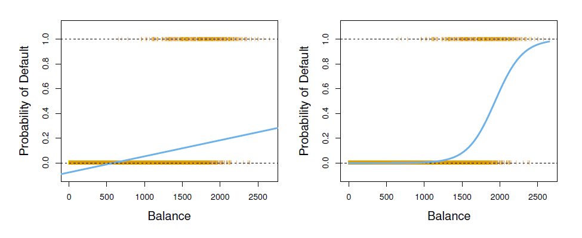
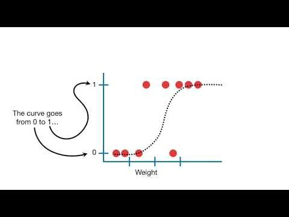
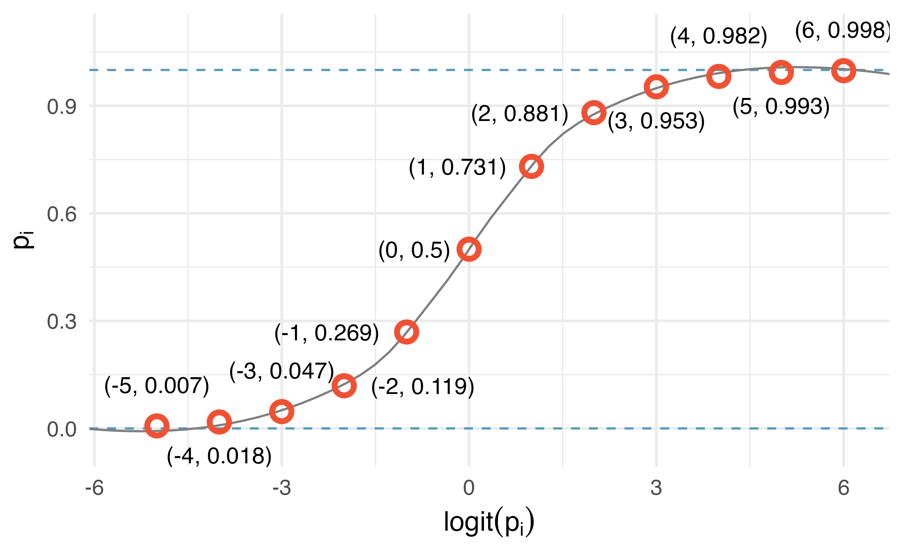
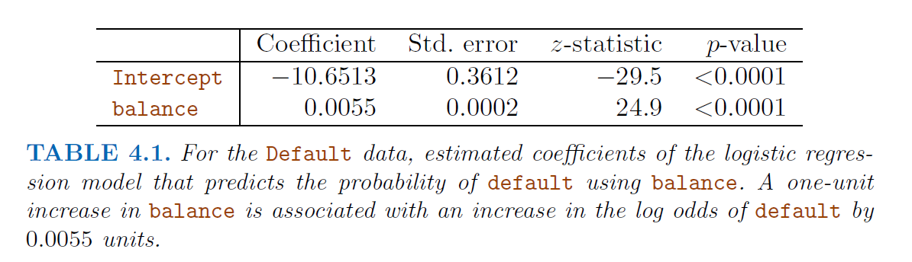
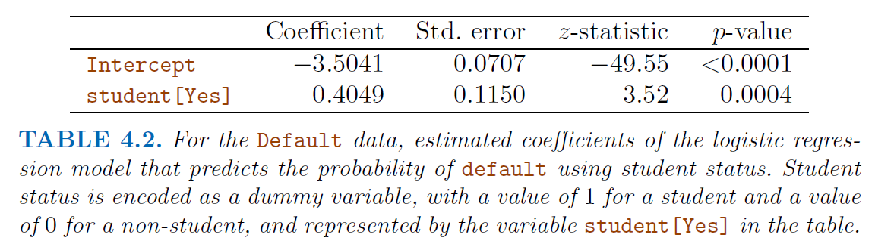
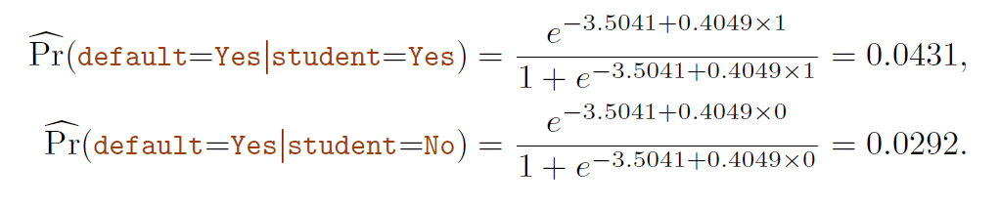
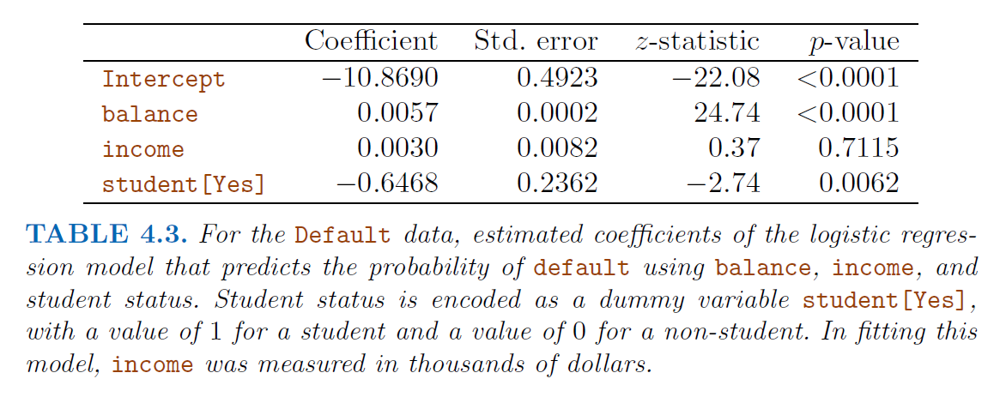
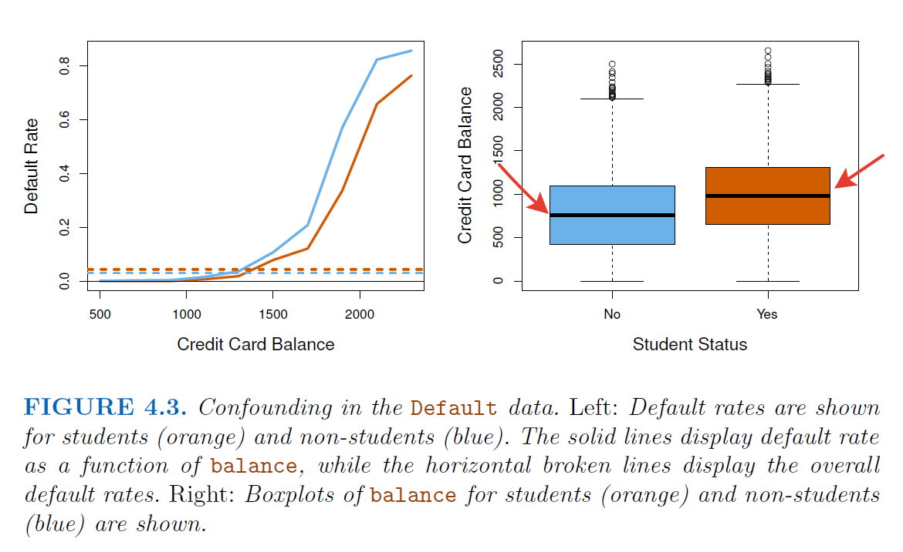
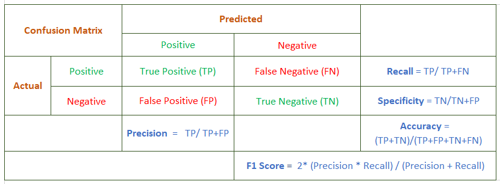

```{r setup, include=FALSE, fig.height=4, fig.width= 4, fig.align= 'center'}
knitr::opts_chunk$set(echo = T)

library(tidyverse)
library(caret)

```

## Recall Linear Regression

A very simple approach for supervised learning, a useful tool for predicting
a quantitative response!

- Our aim is to fit a function $f(.)$ from the set of **data points** $y_i = f(x_i)$ under some error function. 

- A few important questions that we might seek to address to provide some recommendation from FIGURE 2.1

## Possible Questions

- Is there a relationship between advertising budget and sales?
- How strong is the relationship between advertising budget and sales?
- Which media are associated with sales?
- How large is the association between each medium and sales?
- How accurately can we predict future sales?
- Is the relationship linear or not ?
- Is there synergy (**interaction**) effect among the advertising media?

It turns out that linear regression can be used to answer each of these questions. What if, our problem is classifying the response variable, when it is not quantitative but qualitative simply.

## Before Logistic Regression

we study approaches for predicting qualitative responses, a process that is known as **classification**

- Predicting classification a qualitative response for an observation can be referred to as classifying that observation, since it involves assigning the observation to a category, or class

- Often the methods used for classification first predict the probability that the observation belongs to each of the categories of a qualitative variable, as the basis for making the classification. In this sense they also behave like regression methods

- We have lots of options in the literature for classification;

  * logistic regression, 
  * linear discriminant analysis, 
  * quadratic discriminant analysis, 
  * naive Bayes, 
  * K-nearest neighbors

- The discussion of **logistic regression** is used as a jumping-off point for a discussion of **generalized linear models**

## Overview of Classification

- Classifying the spam mail or not for our mail boxes (very old fashioned example)

- An online banking service must be able to determine whether or not
a transaction being performed on the site is fraudulent, on the basis
of the user’s IP address, past transaction history, and so forth.

- On the basis of DNA sequence data for a number of patients with
and without a given disease, a biologist would like to figure out which
DNA mutations are deleterious (disease-causing) and which are not

- A person arrives at the emergency room with a set of symptoms
that could possibly be attributed to one of three medical conditions.
Which of the three conditions does the individual have?

Just as in the regression setting, in the classification setting we have a
set of training observations $(x_i,y_i)$ that we can use to build
a classifier where $x_i$s are still predictors whereas $y_i$ is qualitative response in this case.

## Why Not linear regression ?



As a simple example, think about the prediction of the medical condition of a 
patient in the emergency room on the basis of her symptoms

- Three diagnoses (categories): stroke, drug overdose, and epileptic seizure 

- Consider some encoding for the response, $Y$ 

- Different encodings might result in different linear regression estimations ? 

- In general there is no natural way to convert a qualitative response variable with more than two levels into a quantitative response that is ready for linear regression

- What about the binary case ?

## Much simpler, binary qualitative response

- The situation is better. For instance, perhaps there are only two possibilities for the patient’s medical condition: **stroke** and **drug overdose**. We could then potentially use the dummy variable approach? 

$Y = 0$ if stroke; $Y=1$ if drug overdose

* In the binary case it is not hard to show that even if we flip the above coding, linear regression will produce the same final predictions

* Regression by least squares is not completely unreasonable, but if we use linear regression, some of our estimates might be outside the [0, 1] interval, making them
hard to interpret as probabilities!

- To summarize, there are at least two reasons not to perform classification
using a regression method;
  * a regression method cannot accommodate a qualitative response with more than two classes
  * a regression method will not provide meaningful estimates of $Pr(Y|X)$, even with just two classes

## Logistic Regression

Consider the **Default data set**, where the response default falls into
one of two categories, **Yes** or **No**. Rather than modeling the response Y
directly, logistic regression models **the probability that Y belongs to a particular category**. 

- For example, logistic regression models the probability of default given balance, 
$Pr(default = Yes|balance)$

- Since it is a probability, the values of $$Pr(default = Yes|balance)$$, which we abbreviate $p(balance)$, will range on $[0, 1]$

- For any given value of balance, a prediction can be made for default. To illustrate, one might predict $default = Yes$ for any individual for whom 
$p(balance) > 0.5$

**Question:** How should we model the relationship between $p(X) = Pr(Y = 1|X)$ 
and $X$?

## More Notation

Recall the problem of considering the model $p(X) = \beta_0 + \beta_1 X$ to represent these probabilities !

- To avoid this problem, we must model $p(X)$ using a function that gives
outputs between 0 and 1 for all values of $X$

- We have lots of options indeed, but we are using the logistic function $p(X)=\frac{e^{\beta_0 + \beta_1X}}{1 + e^{\beta_0 + \beta_1X}}$ for this purpose.

- The logistic function will always produce an **S-shaped curve** of this form, and so regardless of the value of $X$, we will obtain a sensible prediction

## Relationship between least squares estimation

After a small derivation, 

$\frac{p(X)}{1-p(X)} = e^{\beta_0 + \beta_1X}$

where the left-hand side is called **odds**, can take any value between $[0,\infty)$

By taking the logarithm of both sides of;

$\log(\frac{p(X)}{1-p(X)}) = \beta_0 + \beta_1X$

- The left-hand side is called the **log odds** or **logit**.

- the logistic regression model has a **logit that is linear in X**.

## Important Notes 

- In a logistic regression model, increasing $X$ by one unit changes the log
odds by $\beta_1$.

- Since the relationship between $p(X)$ and $X$ is not a straight line,
$\beta_1$ does not correspond to the change in $p(X)$ associated with a one-unit
increase in $X$

- The amount that $p(X)$ changes due to a one-unit change in
$X$ depends on the current value of $X$.

- But regardless of the value of $X$, if $\beta_1$ is positive then increasing $X$ will be associated with increasing $p(X)$, and if $\beta_1$ is negative then increasing $X$ will be associated with decreasing $p(X)$

## Estimating the Regression Coefficients

The more general method of maximum likelihood is preferred, since it has better statistical properties. The basic intuition is,

- We seek estimates for $\beta_0$ and $\beta_1$ such that the predicted probability $\widehat{p}(x_i)$ of default for each individual, corresponds as closely as possible to the individual’s observed default status

- Equivalently, try to find $\widehat{\beta}_0$ and $\widehat{\beta}_1$ such that plugging these estimates into the model for $p(X)$, yields a number
close to **one** for all individuals who defaulted, and a number close to **zero** for all individuals who did not

This intuition can be formalized using a mathematical equation called a **likelihood function**

$l(\beta_0,\beta_1) = \prod_{i:y_i=1}p(x_i) \prod_{i':y_{i'} = 0}(1-p(x_i)$

- Here, the estimates are chosen to maximize this likelihood function!

- Do not worry about the mathematical details about it, it is beyond the scope of our course!

## Visualizations

{width=50%}


{width=50%}


## An Example result






## Making Predictions 

Once the coefficients have been estimated, we can compute the probability
of default for any given credit card balance. Consider the coefficients given in Table 4.1 above; 

- Predict that the default probability for an individual with a balance of 
$\$ 1000$ as,

$\widehat{p}(x) = \frac{e^{\widehat{\beta}_{0} + \widehat{\beta}_{1}X}}{1 + e^{\widehat{\beta}_{0} + \widehat{\beta}_{1}X}}$

Put the estimated coefficients and $X=1000$ here, 

$\widehat{p}(x) = \frac{e^{-10.6513 + 0.0055\times1000}}{1 + e^{-10.6513 + 0.0055\times1000}} = 0.00576$

- which is below $\% 1$ but 

- The predicted probability of default for an individual with a balance of 
$\$ 2000$ is much higher, equals $\% 58.6$

## Calculation with dummy variables

- One can use **qualitative predictors** with the logistic regression model using
the **dummy variable approach**

- To fit a model that uses **student status** as a predictor variable, we simply create a dummy variable that takes on a value of **1 for students** and **0 for non-students**

- The **coefficient associated with the dummy variable is positive**, and the associated p-value is statistically significant so it indicates that students tend to have higher default probabilities than non-students

To illustrate;



## Multiple Logistic Regression

Very similar to what we have done for multiple linear regression,

- It is the problem of predicting a binary response using multiple predictors

- One can generalize the log-odds ratio (logit function) as, 

$\log(\frac{p(X)}{1-p(X)}) = \beta_0 + \beta_1X_1 \ldots \beta_p X_p$

where $\mathbf{X} = (X_1,\ldots,X_p)$ are p-predictors. 

- Equivalently, we have,

$\widehat{p}(x) = \frac{e^{\widehat{\beta}_{0} + \widehat{\beta}_{1}X_1 + \ldots + \beta_p X_p}}{1 + e^{\widehat{\beta}_{0} + \widehat{\beta}_{1}X_1 + \ldots+ \beta_pX_p}}$

- For the parameter estimations, again we are using the maximum likelihood method to estimate. 

## An Example 





## Multinomial Logistic Regression

- Classifying the a response variable that has more than two classes, like **three categories** of medical condition in the emergency room: **stroke**, **drug overdose**, **epileptic seizure**.

- However, the logistic regression approach that we have seen in this section
only allows for $K = 2$ classes !

- But it is possible to extend the two-class logistic regression
approach to the setting of $K > 2$ classes. This extension is sometimes
known as **multinomial logistic regression**

## How it is possible ? 

- First select a single class to serve as the baseline; without loss of generality, you can select the $K$th class for this role, 

- We get the new model as, 

$P(Y= k | X=x) = \frac{e^{{\beta}_{k0} + {\beta}_{k1}x_1 + \ldots + \beta_{kp} x_p}}{1 + \sum_{l=1}^{K-1} e^{{\beta}_{l0} + {\beta}_{l1}x_1 + \ldots + \beta_{lp}x_p}}$

for $k = 1, \ldots, K-1$

- We know that, 

$P(Y= K | X=x) = \frac{1}{1 + \sum_{l=1}^{K-1} e^{{\beta}_{l0} + {\beta}_{l1}x_1 + \ldots + \beta_{lp}x_p}}$

and not hard to write that 

$log(\frac{P(Y= k | X=x)}{P(Y= K | X=x)}) = {\beta}_{k0} + {\beta}_{k1}x_1 + \ldots + \beta_{kp} x_p$

for $k = 1, \ldots, K-1$

- Here, the **log odds between any pair of classes** is linear in the features

- The decision to treat the $K$th class as the baseline is unimportant. 

- Suppose we fit two multinomial logistic regression models: one treating stroke as the baseline, another treating drug overdose as the baseline. The coefficient
estimates will differ between the two fitted models due to the differing
choice of baseline, but the fitted values (predictions), the log odds between
any pair of classes, and the other key model outputs will remain the same.

## Interpretation of Coefficients

- It should be done with care, since it depends on the choice of baseline! 

- To illustrate, if we set **epileptic seizure** to be the baseline,
then we can interpret, $\beta_{stroke,0}$ as the log odds of stroke versus **epileptic seizure**, given that $x_1 = \ldots = x_p = 0$

- Here, a one-unit increase in $X_j$ is associated with a $\beta_{stroke,0}$ increase in the **log odds** of **stroke** over **epileptic seizure**. In another way, if $X_j$ increases by one unit, then

$\frac{P(Y = stroke | X=x)}{P(Y = epileptic size| X = x)}$

increases by $e^{\beta_{stroke,j}}$ unit. 

The multinomial logistic regression can be coded alternatively and it is known as **softmax coding**. 

- REMARK

**Softmax coding** is equivalent to the coding just described in the sense that the fitted values, log odds between any pair of classes, and other key model outputs will remain the same, regardless of coding. But the softmax coding is **used extensively in some areas of the machine learning literature**, so it is worth being aware of it

## Other Generative Models

Why do we need another method, when we have logistic regression?
There are several reasons:

* When there is substantial separation between the two classes, the
parameter estimates for the logistic regression model are surprisingly
unstable

* If the distribution of the predictors X is approximately normal in
each of the classes and the sample size is small, then the approaches
in this section may be more accurate than logistic regression

* The methods in this section can be naturally extended to the case
of more than two response classes

* These alternatives primarily based on the **Bayes’ theorem**, the main component is the calculation of the **posterior probability** that an observation
posterior $X = x$ belongs to the $k$th class. Main alternatives that use this approach to approximate the Bayes classifier:
  - linear discriminant analysis, 
  - quadratic discriminant analysis, 
  - naive Bayes

## What are the alternatives in general? 

- Linear Discriminant Analysis for $p = 1$ (pg. 142)

- Linear Discriminant Analysis for $p > 1$ (pg. 145)

- Quadratic Discriminant Analysis (pg. 152)

- Naive Bayes (pg. 153)

## In a different way

- Logistic regression is a type of **generalized linear model (GLM)** for response variables where regular multiple regression does not work very well

- GLMs can be thought of as a two-stage modeling approach. We first model the response variable using a probability distribution, such as the binomial or Poisson distribution

- Second, we model the parameter of the distribution using a collection of predictors and a special form of multiple regression.

- Ultimately, the application of a GLM will feel very similar to multiple regression, even if some of the details are different.

## Important NOTES



A confusion matrix is a useful tool for summarizing the performance of a classification algorithm. It is one of the easiest and most intuitive metrics used for finding the accuracy of a classification model, where the output can be of two or more categories.

- **TP — True Positives:** This block is the *intersection of true predictions with true labels*; which represents the data points that have a True label which was correctly predicted by True

- **FP — False Positives:** This block is the *intersection of True predictions with False real labels*, which represents data points that have a False real label but that has been predicted as True

- **FN — False Negatives:** This block is *the intersection of False predictions with True real labels*, that represents data points that have a True real label that has been incorrectly predicted as False

- **TN — True Negatives:** This block is *the intersection between False predictions and False real labels*, that represents data points that have a False real label that has been correctly classified as False

## Key definitions of Confusion Matrix

Five key terms to interpret the confusion matrix:

- **Recall/Sensitivity/True Positive Rate:** It is ratio of True Positive to Actual positive and can be used to minimize the False Negative.

- **Specificity/True Negative Rate:** It is ratio of True Negative to Actual Negative and can be used to minimize the False Positive.

- **Precision:** It is the ratio of True Positive to Predicted Positive.

- **Accuracy:** It is the ratio of all correct predictions to the Total Predictions.

- **F1 measure:** It calculates the harmonic mean of the precision and recall. This means that we will only have a *high F1 score* if *both precision and recall are high*.

REMARK: It is difficult to compare two models with different Precision and Recall. 
So to make a model comparison, one can use F-Score generally. 

## Summary

- **Precision** is how certain you are of your true positives whereas **Recall** is how certain you are that you are not missing any positives.

- *Choose Recall if the occurrence of false negatives is unaccepted/intolerable*. For example, in the case of diabetes that you would rather have some extra false positives (false alarms) over saving some false negatives.

- *Choose Precision if you want to be more confident of your true positives*. For example, in case of spam emails, you would rather have some spam emails in your inbox rather than some regular emails in your spam box. You would like to be extra sure that email X is spam before we put it in the spam box

- *Choose Specificity if you want to cover all true negatives, i.e. meaning we do not want any false alarms or false positives*. For example, in case of a drug test in which all people who test positive will immediately go to jail, you would not want anyone drug-free going to jail

## Hands-on session with R

Stock market data example is given here (from our book, without any data splitting first). Smarket data, which is part of the ISLR2 library, consists of percentage returns for the $S\&P 500$ stock index over *1250 days*, from the beginning of 2001 until the end of 2005

```{r}
library(ISLR2)
names(Smarket)

dim(Smarket)
summary(Smarket)

```

The cor() function produces a matrix that contains all of the pairwise
correlations among the predictors in a data set

```{r}
# cor(Smarket)
cor(Smarket[, -9])

attach(Smarket)
plot(Volume)
```

## Logistic Regression Fit

- we will fit a logistic regression model in order to predict Direction
using Lag1 through Lag5 and Volume

- The **glm() function can be used to fit many types of generalized linear models**, including logistic regression. The syntax of the glm() function is similar to that of lm(), except that **we must pass in the argument family = binomial** in order to tell R to run a logistic!

```{r}
glm.fits <- glm(Direction ~ Lag1 + Lag2 + Lag3 + Lag4 + Lag5 + Volume,
data = Smarket , family = binomial)

summary(glm.fits)

# there is no clear evidence of a real association
# between Lag1 and Direction.
```

Use the coef() function in order to access just the coefficients for the model:

```{r}
coef(glm.fits)
```


Use the summary() function to access particular
aspects of the fitted model, such as the p-values for the coefficients

```{r}
summary(glm.fits)$coef
# OR
summary(glm.fits)$coef[, 4]
```

## Predictions 

The predict() function can be used to **predict the probability that the market will go up, given values of the predictors**. The **type = "response"** option tells R to output probabilities of the form **P(Y = 1|X)**, as opposed to other information such as the logit!

```{r}
glm.probs <- predict(glm.fits , type = "response")
glm.probs[1:10]
```

NOTE: We know that these values correspond to the probability of the market going up, rather than down, because the contrasts() function indicates that R has created a dummy variable with a 1 for Up, 0 for Down

```{r}
contrasts(Direction)
```

In order to make a prediction as to whether the market will go up or down on a particular day, **convert these predicted probabilities into class labels**,


```{r}
glm.pred <- rep("Down", 1250)
# If probability is higher than 0.5, it is Up, otherwise Down 
glm.pred[glm.probs > .5] = "Up"
glm.pred
```


Given these predictions, the table() function can be used to produce a confusion matrix in order to determine how many observations were correctly or incorrectly classified.

```{r}
# For part of the Confusion matrix
table(glm.pred , Direction)

mean(glm.pred == Direction)

```

At first glance, it appears that the logistic regression model is working a little better than random guessing (Since the value is just 0.52). However, this result is misleading because we trained and tested the model on the same set of 1250 observations. So do not forget first data partitioning before training your model !


## First splitting the data set !

```{r}
attach(Smarket)
train <- (Year < 2005)
Smarket.2005 <- Smarket[!train, ] # testing data set here
dim(Smarket.2005)
Direction.2005 <- Direction[!train]

```

We now fit a logistic regression model using only the subset of the observations that correspond to dates before 2005, using the subset argument. We then obtain predicted probabilities of the stock market going up for each of the days in our test set—that is, for the days in 2005.

```{r}
glm.fits <- glm(Direction ~ Lag1 + Lag2 + Lag3 + Lag4 + Lag5 + Volume,
data = Smarket, family = binomial, subset = train)
summary(glm.fits)

glm.probs <- predict(glm.fits , Smarket.2005, type = "response")
glm.probs
```

Notice that we have trained and tested our model on two completely separate
data sets: training was performed using only the dates before 2005, and testing was performed using only the dates in 2005. Finally, we compute
the predictions for 2005 and compare them to the actual movements
of the market over that time period.

```{r}
glm.pred <- rep("Down", 252)
glm.pred[glm.probs > .5] <- "Up"
table(glm.pred , Direction.2005)

mean(glm.pred == Direction.2005)
mean(glm.pred != Direction.2005)
```

## Small Improvement 

- The results are rather disappointing: the test error
rate is 52 %, which is worse than random guessing!

- Perhaps by removing the variables that appear not to be helpful in predicting Direction, we can obtain a more effective model

- Using predictors that have no relationship with the response tends to cause a deterioration in the test error rate (since such predictors cause an increase in variance without a corresponding decrease in bias), and so removing such predictors may in turn yield an improvement

```{r}
glm.fits <- glm(Direction ~ Lag1 + Lag2 , data = Smarket,
family = binomial , subset = train)

summary(glm.fits)
glm.probs <- predict(glm.fits, Smarket.2005, type = "response")

glm.pred <- rep("Down", 252)
glm.pred[glm.probs >.5] <- "Up"

table(glm.pred , Direction.2005)

mean(glm.pred == Direction.2005)
```

Not so improved here. Still it seems those predictors are not significant based on p-values ! Lets consider another data set with significant predictors !

## Default data example

Necessary packages

```{r}
library(ISLR)

```

We also repeat the test-train split from the previous chapter.

```{r}
set.seed(42)
default_idx = sample(nrow(Default), 5000)
default_trn = Default[default_idx, ]
default_tst = Default[-default_idx, ]
```

EXERCISE: Try to fit linear regression !

## Logistic with one predictor

We start with a single predictor example, again using balance as our single predictor.

```{r}

model_glm = glm(default ~ balance, data = default_trn, family = "binomial")
summary(model_glm)
```

we can obtain the fitted coefficients the same way we did with linear regression.

```{r}
coef(model_glm)
```

The next thing we should understand is how the predict() function works with glm()

```{r}
head(predict(model_glm))

# OR 
# By default, predict.glm() uses type = "link"
# head(predict(model_glm, type = "link"))

# above values are not predicted probabilities. To obtain the predicted probabilities
head(predict(model_glm, type = "response"))

# Note that these are probabilities, not classifications. To obtain classifications, we will need to compare to the correct cut-off value with an ifelse() statement.

# model_glm_pred = ifelse(predict(model_glm, type = "link") > 0, "Yes", "No")
model_glm_pred = ifelse(predict(model_glm, type = "response") > 0.5, "Yes", "No")
```

Once we have classifications, we can calculate metrics such as the training classification error rate.

```{r}
calc_class_err = function(actual, predicted) {
  mean(actual != predicted)
}
calc_class_err(actual = default_trn$default, predicted = model_glm_pred)

```

For more Metrics, install and use **caret package**

```{r}
train_tab = table(predicted = model_glm_pred, actual = default_trn$default)
train_con_mat = confusionMatrix(train_tab, positive = "Yes")
c(train_con_mat$overall["Accuracy"], 
  train_con_mat$byClass["Sensitivity"], 
  train_con_mat$byClass["Specificity"])

```

Above results are on the training data set but do it on testing data 

```{r}
head(predict(model_glm, newdata = default_tst), 10)

model_glm_pred = ifelse(predict(model_glm, newdata = default_tst, 
                                type = "response") > 0.5, "Yes", "No")
model_glm_pred

calc_class_err = function(actual, predicted) {
  mean(actual != predicted)
}
calc_class_err(actual = default_tst$default, predicted = model_glm_pred)

```

```{r}
test_tab = table(predicted = model_glm_pred, actual = default_tst$default)
library(caret)
test_con_mat = confusionMatrix(test_tab, positive = "Yes")
c(test_con_mat$overall["Accuracy"], 
  test_con_mat$byClass["Sensitivity"], 
  test_con_mat$byClass["Specificity"])

```

## Graphical Interpretation 

```{r}
library(pROC)
test_prob = predict(model_glm, newdata = default_tst, type = "response")
test_roc = roc(default_tst$default ~ test_prob, plot = TRUE, print.auc = TRUE)

as.numeric(test_roc$auc)
# A good model will have a high AUC, that is as often as possible a high sensitivity and specificity.
```

## For further examples

You can check these two bookdowns created in R to look at different examples for logistic regression

To READ

- Logistic: https://bookdown.org/mpfoley1973/supervised-ml/generalized-linear-models-glm.html#logistic-regression

- Logistic: https://openintro-ims.netlify.app/model-logistic.html

- Logistic:  https://daviddalpiaz.github.io/r4sl/logistic-regression.html

- Multinomial: https://daviddalpiaz.github.io/r4sl/logistic-regression.html#multinomial-logistic-regression

TO WATCH

- https://www.youtube.com/playlist?list=PLblh5JKOoLUKxzEP5HA2d-Li7IJkHfXSe
