```{r setup, include=FALSE, fig.height=4, fig.width= 4, fig.align= 'center'}
knitr::opts_chunk$set(echo = T)
```

## Recall Logistic Regression

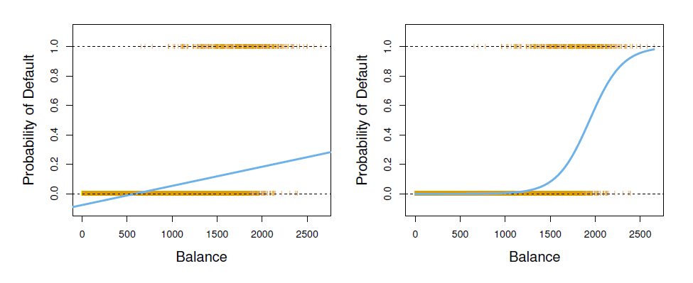

## Binary qualitative response

- The situation is better. For instance, perhaps there are only two possibilities for the patient’s medical condition: **stroke** and **drug overdose**. We could then potentially use the dummy variable approach? 

$Y = 0$ if stroke; $Y=1$ if drug overdose

* In the binary case it is not hard to show that even if we flip the above coding, linear regression will produce the same final predictions

* Regression by least squares is not completely unreasonable, but if we use linear regression, some of our estimates might be outside the [0, 1] interval, making them
hard to interpret as probabilities!

- To summarize, there are at least two reasons not to perform classification
using a regression method;
  * a regression method cannot accommodate a qualitative response with more than two classes
  * a regression method will not provide meaningful estimates of $Pr(Y|X)$, even with just two classes

## Logistic Regression

Recall the problem of considering the model $p(X) = \beta_0 + \beta_1 X$ to represent these probabilities !

- To avoid this problem, we must model $p(X)$ using a function that gives
outputs between 0 and 1 for all values of $X$

- We have lots of options indeed, but we are using the logistic function $p(X)=\frac{e^{\beta_0 + \beta_1X}}{1 + e^{\beta_0 + \beta_1X}}$ for this purpose.

- The logistic function will always produce an **S-shaped curve** of this form, and so regardless of the value of $X$, we will obtain a sensible prediction

## Relationship between least squares estimation

After a small derivation, 

$\frac{p(X)}{1-p(X)} = e^{\beta_0 + \beta_1X}$

where the left-hand side is called **odds**, can take any value between $[0,\infty)$

By taking the logarithm of both sides of;

$\log(\frac{p(X)}{1-p(X)}) = \beta_0 + \beta_1X$

- The left-hand side is called the **log odds** or **logit**.

- the logistic regression model has a **logit that is linear in X**.

## Important Notes 

- In a logistic regression model, increasing $X$ by one unit changes the log
odds by $\beta_1$.

- Since the relationship between $p(X)$ and $X$ is not a straight line,
$\beta_1$ does not correspond to the change in $p(X)$ associated with a one-unit
increase in $X$

- The amount that $p(X)$ changes due to a one-unit change in
$X$ depends on the current value of $X$.

- But regardless of the value of $X$, if $\beta_1$ is positive then increasing $X$ will be associated with increasing $p(X)$, and if $\beta_1$ is negative then increasing $X$ will be associated with decreasing $p(X)$

## Estimating the Regression Coefficients

The more general method of maximum likelihood is preferred, since it has better statistical properties. The basic intuition is,

- We seek estimates for $\beta_0$ and $\beta_1$ such that the predicted probability $\widehat{p}(x_i)$ of default for each individual, corresponds as closely as possible to the individual’s observed default status

- Equivalently, try to find $\widehat{\beta}_0$ and $\widehat{\beta}_1$ such that plugging these estimates into the model for $p(X)$, yields a number
close to **one** for all individuals who defaulted, and a number close to **zero** for all individuals who did not

This intuition can be formalized using a mathematical equation called a **likelihood function**

$l(\beta_0,\beta_1) = \prod_{i:y_i=1}p(x_i) \prod_{i':y_{i'} = 0}(1-p(x_i)$

- Here, the estimates are chosen to maximize this likelihood function!

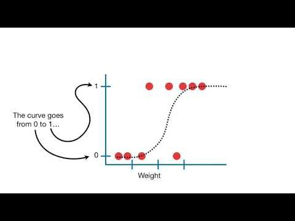{width=50%}

## Multiple Logistic Regression

Very similar to what we have done for multiple linear regression,

- It is the problem of predicting a binary response using multiple predictors

- One can generalize the log-odds ratio (logit function) as, 

$\log(\frac{p(X)}{1-p(X)}) = \beta_0 + \beta_1X_1 \ldots \beta_p X_p$

where $\mathbf{X} = (X_1,\ldots,X_p)$ are p-predictors. 

- Equivalently, we have,

$\widehat{p}(x) = \frac{e^{\widehat{\beta}_{0} + \widehat{\beta}_{1}X_1 + \ldots + \beta_p X_p}}{1 + e^{\widehat{\beta}_{0} + \widehat{\beta}_{1}X_1 + \ldots+ \beta_pX_p}}$

- For the parameter estimations, again we are using the maximum likelihood method to estimate. 

## Multinomial Logistic Regression

- Classifying the a response variable that has more than two classes, like **three categories** of medical condition in the emergency room: **stroke**, **drug overdose**, **epileptic seizure**.

- However, the logistic regression approach that we have seen in this section
only allows for K = 2 classes !

- But it is possible to extend the two-class logistic regression
approach to the setting of $K > 2$ classes. This extension is sometimes
known as **multinomial logistic regression**

## How it is possible ? 

- First select a single class to serve as the baseline; without loss of generality, you can select the $K$th class for this role, 

- We get the new model as, 

$P(Y= k | X=x) = \frac{e^{{\beta}_{k0} + {\beta}_{k1}x_1 + \ldots + \beta_{kp} x_p}}{1 + \sum_{l=1}^{K-1} e^{{\beta}_{l0} + {\beta}_{l1}x_1 + \ldots + \beta_{lp}x_p}}$

for $k = 1, \ldots, K-1$

- We know that, 

$P(Y= K | X=x) = \frac{1}{1 + \sum_{l=1}^{K-1} e^{{\beta}_{l0} + {\beta}_{l1}x_1 + \ldots + \beta_{lp}x_p}}$

and not hard to write that 

$log(\frac{P(Y= k | X=x)}{P(Y= K | X=x)}) = {\beta}_{k0} + {\beta}_{k1}x_1 + \ldots + \beta_{kp} x_p$

for $k = 1, \ldots, K-1$

- Here, the **log odds between any pair of classes** is linear in the features

- The decision to treat the $K$th class as the baseline is unimportant. 

- Suppose we fit two multinomial logistic regression models: one treating stroke as the baseline, another treating drug overdose as the baseline. The coefficient
estimates will differ between the two fitted models due to the differing
choice of baseline, but the fitted values (predictions), the log odds between
any pair of classes, and the other key model outputs will remain the same.

## Confusion Matrix Details

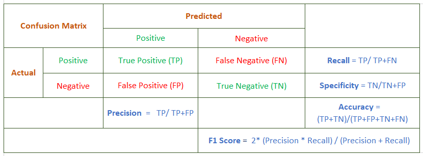{width=50%}

A confusion matrix is a useful tool for summarizing the performance of a classification algorithm. It is one of the easiest and most intuitive metrics used for finding the accuracy of a classification model, where the output can be of two or more categories.

- **TP — True Positives:** This block is the *intersection of true predictions with true labels*; which represents the data points that have a True label which was correctly predicted by True

- **FP — False Positives:** This block is the *intersection of True predictions with False real labels*, which represents data points that have a False real label but that has been predicted as True

- **FN — False Negatives:** This block is *the intersection of False predictions with True real labels*, that represents data points that have a True real label that has been incorrectly predicted as False

- **TN — True Negatives:** This block is *the intersection between False predictions and False real labels*, that represents data points that have a False real label that has been correctly classified as False

## Key definitions of Confusion Matrix

Five key terms to interpret the confusion matrix:

- **Recall/Sensitivity/True Positive Rate:** It is ratio of True Positive to Actual positive and can be used to minimize the False Negative.

- **Specificity/True Negative Rate:** It is ratio of True Negative to Actual Negative and can be used to minimize the False Positive.

- **Precision:** It is the ratio of True Positive to Predicted Positive.

- **Accuracy:** It is the ratio of all correct predictions to the Total Predictions.

- **F1 measure:** It calculates the harmonic mean of the precision and recall. This means that we will only have a *high F1 score* if *both precision and recall are high*.

REMARK: It is difficult to compare two models with different Precision and Recall. 
So to make a model comparison, one can use F-Score generally. 

## Impact of drawn sample on the results ?

- As you can see, for various models, we have one sample and partitioning the data into training and testing data sets. But, when the partitioning is changed, the resulting values are changed, right ?

- In that respect, one training set is not enough for general behavior of the parameter estimations. To overcome this issue, **Resampling methods** are an indispensable tool !

- Generally, **Resampling methods** involve repeatedly drawing samples from a training set and refitting a model of interest on each sample in order to obtain additional information about the fitted model

- Such an approach may allow us to obtain information that would not be available from fitting the model only once using the original training sample (ie. the variability of a linear regression fit)

- Resampling approaches can be computationally expensive, because they
involve fitting the same statistical method multiple times using different
subsets of the training data

- However, due to recent advances in computing power, the computational requirements of resampling methods generally are not prohibitive

- Basically, we will see two commonly used main approaches
  * cross-validation
  * bootstrap
  
## General Usage

- The process of evaluating a model's performance is known as model assessment, whereas the process of selecting the proper level of flexibility for a model is known as model selection

- For example, **cross-validation** can be used to estimate the test
error associated with a given statistical learning method in order **to evaluate
its performance**, or **to select the appropriate level of flexibility**
  * Often there is insufficient data to create a separate validation or test
set. In this instance **Cross-Validation** is useful !

- The **bootstrap** is used in several contexts, most commonly **to provide a measure of accuracy** of a parameter estimate or of a given statistical learning method.
  * Bootstrap is a general tool for assessing statistical accuracy !
  
## Key terms for Cross-Validation

- Recall, the distinction between the test error rate and the
training error rate: The test error is the average error that results from using
a statistical learning method to predict the response on a new observation—
that is, a measurement that was not used in training the method

- The test error can be easily calculated if a designated test set is available. Unfortunately, this is usually not the case

- In contrast, the training error can be easily calculated by applying the
statistical learning method to the observations used in its training. However, the training error rate often is quite different from the test error rate, and in particular the former can dramatically underestimate the latter

- In the absence of a very large designated test set that can be used to
directly estimate the test error rate, a number of techniques can be used
to estimate this quantity using the available training data

- Here, we will consider a class of methods that estimate the test error rate by **holding out a subset of the training observations** from the fitting process, and then applying the statistical learning method to those held out observations

- For simplicity, assume that we are interested in linear regression but in general the key concepts remain the same regardless of whether the response
is quantitative or qualitative

## To visualize

Resampling methods are empirical simulation systems that emulate the process of using some data for modeling and different data for evaluation. Most resampling methods are iterative, meaning that this process is repeated multiple times

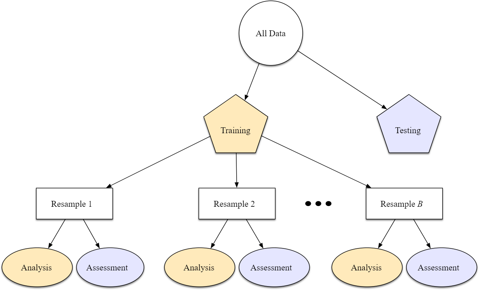{width=50%}

Source: https://www.tmwr.org/resampling.html#resampling-methods

## Validation set Approach and Drawbacks

- Suppose that we want to estimate the test error associated with fitting
a particular statistical learning method. The validation set approach, displayed in 
is a very simple strategy for this task

- It involves randomly dividing the available set of observations into two parts, a training set and a validation set or hold-out set. The model is fit on the training set, and the fitted model is used to predict the responses for the observations in the validation set.

- The resulting validation set error rate (typically MSE in the case of a quantitative
response) provides an estimate of the test error rate.

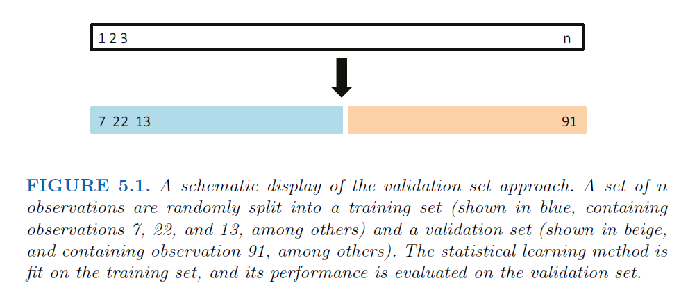{width=50%}

## An Example

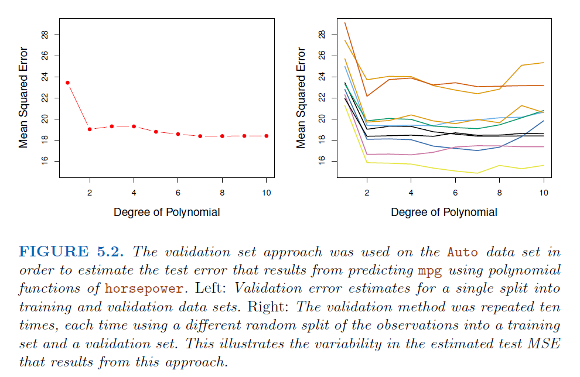{width=50%}


The validation set approach is conceptually simple and is easy to implement.
But it has two potential drawbacks:

- As is shown in the right-hand panel of Figure 5.2, the validation estimate
of the test error rate can be highly variable, depending on precisely
which observations are included in the training set and which
observations are included in the validation set

- In the validation approach, only a subset of the observations—those
that are included in the training set rather than in the validation
set—are used to fit the model. Since statistical methods tend to perform
worse when trained on fewer observations, this suggests that the
validation set error rate may tend to overestimate the test error rate
for the model fit on the entire data set

- For these reasons, we will look at other cross-validation alternatives below
  * **Leave-One-Out Cross-Validation (LOOCV)**
  * **k-Fold Cross-Validation (k-fold CV)**
  
## Leave-one-out cross-validation (LOOCV)

- Like the validation set approach, **LOOCV** involves splitting the set of
observations into two parts.

- However, instead of creating two subsets of comparable size, a single observation $(x_i, y_i)$ is used for the validation set, and the remaining observations $(x_j, y_j)$, 
$j = 1, 2, \ldots,i-1, i+1, \ldots, n$ are in the training set. 

- The statistical learning method is fit on the $n − 1$ training
observations, and a prediction $\widehat{y}_i$ is made for the excluded observation using 
its value $x_i$

- Since $(x_i, y_i)$ was not used in the fitting process, $MSE_i = (y_i − \widehat{y}_i)^2$ provides an approximately unbiased estimate for the test error but it is highly variable since it depends on a single observation

## Repeating LOOCV

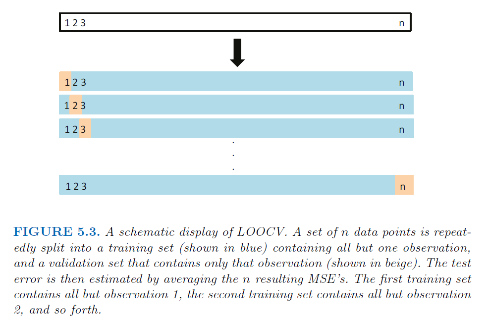{width=50%}

- Repeating this approach $n$ times produces $n$ squared errors, $MSE_1, \ldots, MSE_n$.

- The LOOCV estimate for the test MSE is the average of these n test error
estimates: $CV_{(n)} = \frac{1}{n}\sum_{i=1}^{n} MSE_i$

- LOOCV has a couple of major advantages over the validation set approach
  * First, it has far **less bias** since we repeatedly fit the statistical
learning method using training sets that contain $n−1$ observations,
almost as many as are in the entire data set
  * This is in contrast to the validation set approach, in which the training set is typically around half the size of the original data set
  * The **LOOCV** approach tends **not to overestimate** the test error rate as much as the validation set approach does
  * In contrast to the validation approach which will yield different results when applied repeatedly due to randomness in the training/validation set splits, 
**performing LOOCV multiple times will always yield the same results**: there is no randomness in the training/validation set splits

## The Auto data Example again

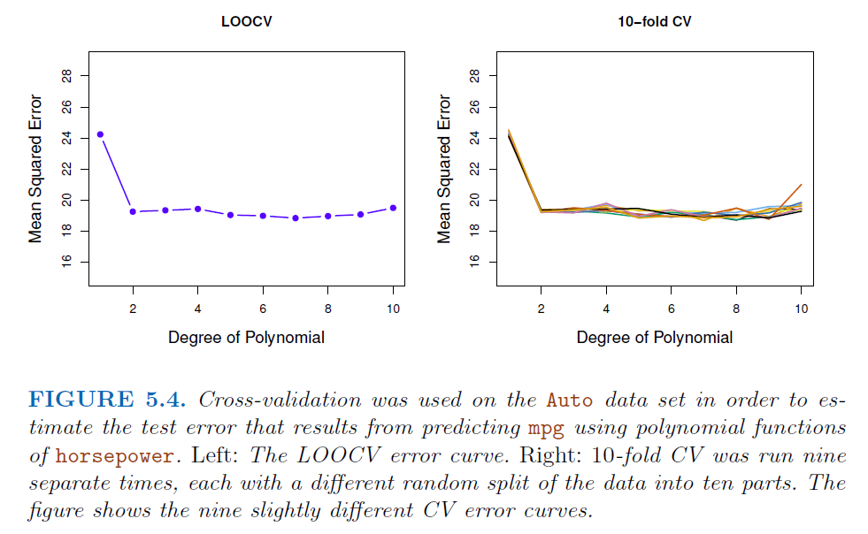{width=50%}

About computational cost: 

- **LOOCV** has the potential to be expensive to implement, since the model
has to be fit $n$ times. This can be very time consuming if $n$ is large, and if
each individual model is slow to fit

- **With least squares linear or polynomial regression, an amazing shortcut makes the cost of LOOCV the same as that of a single model fit!** and below equality holds

$CV_{(n)} = \frac{1}{n}\sum_{i=1}^{n} (\frac{y_i - \widehat{y}_i}{1-h_i})^2$

where $\widehat{y}_i$ is the ith fitted value, $h_i = \frac{1}{n} + \frac{(x_i - \bar{x})^2}{\sum_{i'=1}^{n}(x_{i'}- \bar{x})^2}$ is the leverage defined before! 
This is like the ordinary MSE, except the ith residual is divided by $1−h_i$. For the case of multiple linear regression, the leverage takes a slightly more complicated
form but $CV_{n}$ formula still holds

- Hence the residuals for high-leverage points are inflated in this formula by
exactly the right amount for this equality to hold.

- Please note that **the magic formula above does not hold in general**, in which case the model has to be refit $n$ times

## **k-Fold Cross-Validation (k-fold CV)**

- An alternative to LOOCV is k-fold CV. This approach involves randomly dividing the set of observations into k groups, or folds, of approximately equal size

- The first fold is treated as a validation set, and the method
is fit on the remaining $k − 1$ folds

- The mean squared error, $MSE_i$, is then computed on the observations in the held-out fold

- This procedure is repeated $k$ times; each time, a different group of observations is treated as a validation set

- This process results in k estimates of the test error and the the **k-fold CV** estimate is computed by averaging these values, 
$CV_{(k)} = \frac{1}{k}\sum_{i=1}^{k} MSE_i$

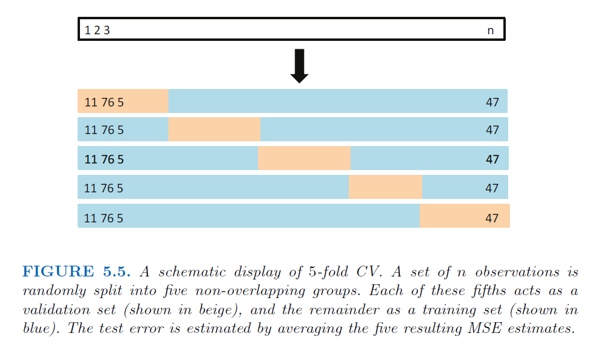{width=50%}

## Some Remarks

- It is not hard to see that **LOOCV** is a special case of **k-fold CV** in which 
$k = n$

- In practice, one typically performs **k-fold CV** using $k = 5$ or $k = 10$. 
The most obvious advantage is computational. **LOOCV** requires fitting the statistical learning method **n** times. This has the potential to be computationally expensive !!!

- Some statistical learning methods have computationally intensive fitting procedures, and so performing LOOCV may pose computational problems, especially if $n$ is extremely large

- There also can be other non-computational advantages to performing $5$-fold or $10$-fold CV, involving on **the bias-variance trade-off**

- For a real data, we do not know the true test MSE, and so it is difficult to determine the accuracy of the CV-estimate. However, if we examine simulated data, 
then we can compute the true test MSE, and can thereby evaluate the accuracy of our CV results

- When we **perform CV**, the goal might be to determine how well a given statistical learning procedure can be expected to perform on independent data; in this case, 
the actual estimate of the test MSE is of interest. But at other times we are interested only in the location of **the minimum point in the estimated test MSE** curve

## An example 

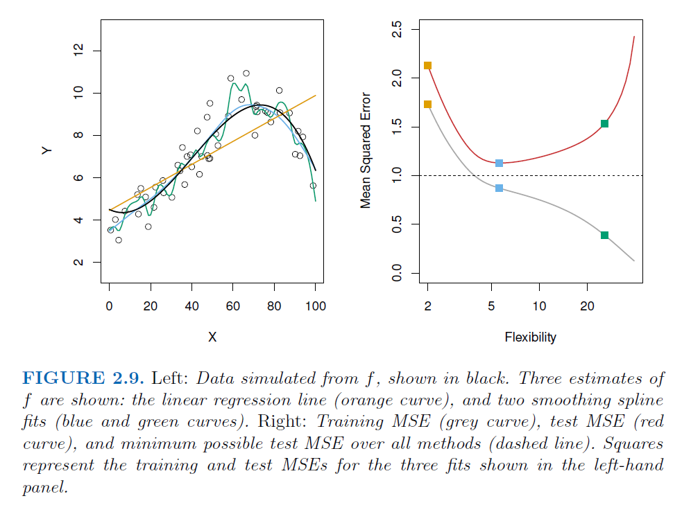{width=50%}

## Bias-Variance Trade-Off for k-Fold Cross-Validation

- k-fold CV with $k < n$ has a computational advantage to LOOCV. But putting computational issues aside, a less obvious but potentially more important advantage 
of k-fold CV is that it often gives more accurate estimates of the test error rate than does LOOCV. This has to do with a bias-variance trade-off.

- Previously, we have seen that validation set approach can
lead to overestimates of the test error rate, since in this approach the
training set used to fit the statistical learning method contains only half
the observations of the entire data set

- It is not hard to see that LOOCV will give approximately unbiased estimates of the test error, since each training set contains $n−1$ observations, which is almost as many as the number of observations in the full data set

- Performing k-fold CV ($k = 5$ or $k = 10$) will lead to an intermediate level of bias, since each training set contains approximately $(k − 1)n/k$ observations—
**fewer than in the LOOCV approach**, but **substantially more than in the
validation set approach**

- From the perspective of bias reduction, it is clear that LOOCV is to be preferred 
to k-fold CV. But, we have another concern, called the procedure’s variance. 

- LOOCV has higher variance than does k-fold CV with $k < n$. Why ? 

- When we perform LOOCV, we are averaging the outputs of $n$ fitted models, each of which is trained on an almost identical set of observations; so these outputs are highly (positively) correlated with each other

- When we perform k-fold CV with $k < n$, we are averaging the outputs of $k$ 
fitted models that are somewhat less correlated with each other, since the overlap between the training sets in each model is smaller.

- Since the mean of many highly correlated quantities has higher variance than does the mean of many quantities that are not as highly correlated, the test error 
estimate resulting from LOOCV tends to have higher variance than does the test error estimate resulting from k-fold CV

- **To summarize**, there is a bias-variance trade-off associated with the
choice of k in k-fold cross-validation. In general, k-fold CV using 
$k = 5$ or $k = 10$, as these values have been shown empirically to yield test error rate estimates that suffer **neither from excessively high bias nor from very high variance**

## To Visualize

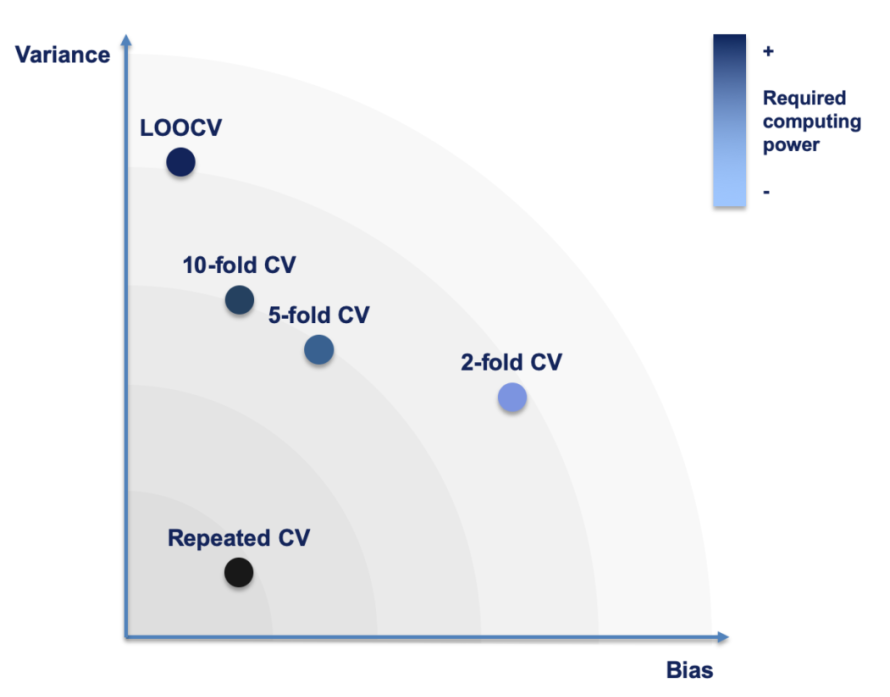{width=50%}

As a rule of thumb, with higher values for k, bias decreases and variance increases

Source: https://www.r-bloggers.com/2019/10/evaluating-model-performance-by-building-cross-validation-from-scratch/

What are the effects of changing k? Larger values result in resampling estimates with small bias but substantial noise. Smaller values of k have large bias but low noise.

Source: https://www.tmwr.org/resampling.html#resampling-methods

## CV on Classification

-  The use of cross-validation is possible in the
regression setting where the outcome Y is quantitative, and so have used
MSE to quantify test error but it is useful also when Y is qualitative.

- Now, rather than using MSE to quantify test error, we instead use the number
of misclassified observations

- For instance, in the classification setting, the
LOOCV error rate takes the form $CV_{(n)} = \frac{1}{n} \sum_{i=1}^{n} Err_i$ where 
$Err_i = I(y_i \neq \widehat{y}_i)$

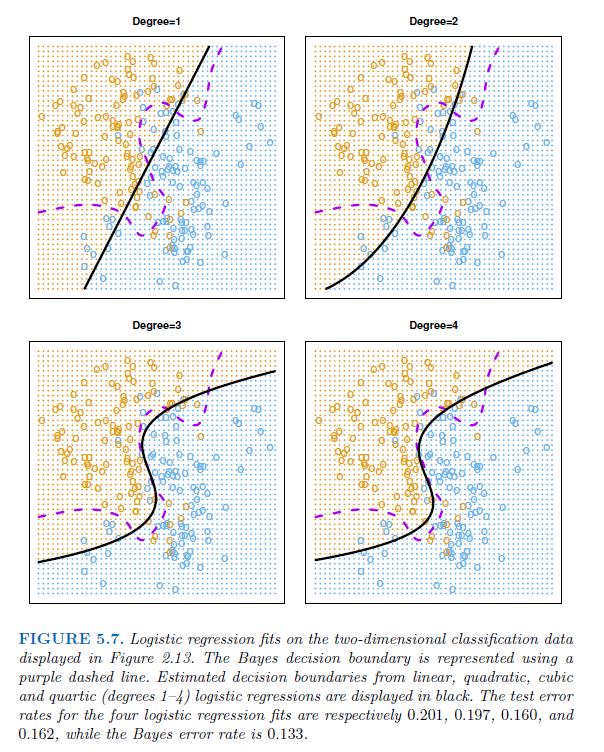{width=60%}

## Bootstrap

- The **bootstrap** is a widely applicable and extremely powerful statistical tool
that can be used to quantify the uncertainty associated with a given estimator
or statistical learning method

- As a simple example, the bootstrap can be used to estimate the standard errors of the coefficients from a linear regression fit.

- However, the power of the bootstrap lies in the fact that it can be easily applied to a wide range of statistical learning methods, including some for which a measure 
of variability is otherwise difficult to obtain and is not automatically output by
statistical software

## Main Mechanism

- Given a training set $z_i = (x_i, y_i)$ for $i=1, \ldots, n$, the basic idea
is to randomly draw datasets **with replacement** from **the training
data**, each sample the same size as the original training set.

- This is done repeatedly **B times**, producing B bootstrap datasets

- Then we refit the model to each of the bootstrap datasets, and
examine the behavior of the fits over the B replications.

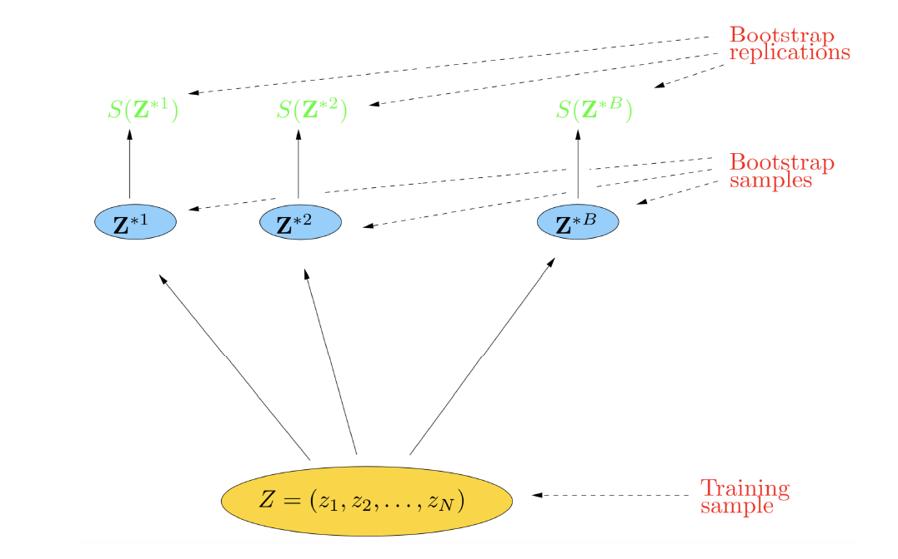{width=50%}

## Real versus Bootstrap World

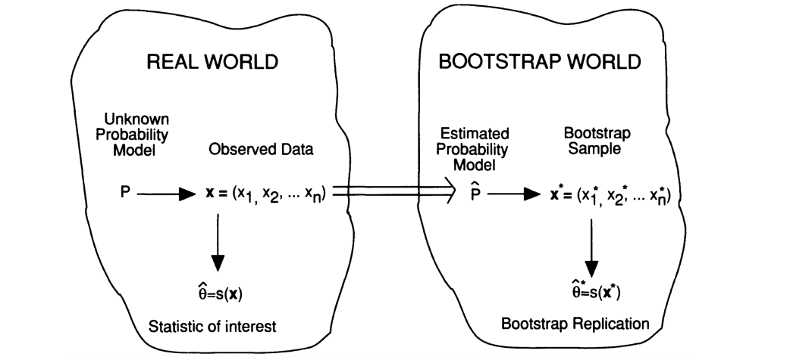

## Bootstrap Examples

- First, we wish to determine the best investment allocation under a simple model

- Then, we explore the use of the bootstrap to assess the variability
associated with the regression coefficients in a linear model fit

- Bootstrap most useful for estimating standard errors of predictions. We can also use modified versions of the bootstrap to estimate prediction error.

- We will stick to regression coefficients example in the Hands-on session for the method but summarize it with a general notation 

## ABC of Bootstrap methods 

- In practice, for real data, we cannot generate new samples from the original population. However, the bootstrap approach allows us to use a computer to emulate the process of obtaining new sample sets, so that we can estimate the variability of an estimation without generating additional samples.

- $S(z)$ is any quantity computed from the data z, for example, the
prediction at some input point. For the general distributional behavior of it, basicall we need mean and variance

- From the bootstrap sampling we can estimate any aspect of the
distribution of $S(z)$, for example its mean $\bar{S}^* = \frac{1}{B}\sum_{b=1}^{B}S(z^{*b})$ and variance $\widehat{Var}(S(z)) = \frac{1}{B-1} \sum_{b=1}^{B}(S(z^{*b})- \bar{S}^*)^2$

- Notice that, $\bar{S}^*$ and $\widehat{Var}(S(z))$ can be thought of as Monte Carlo
estimates of the mean and of the variance of $S(z)$ under resampling.


## Visualization

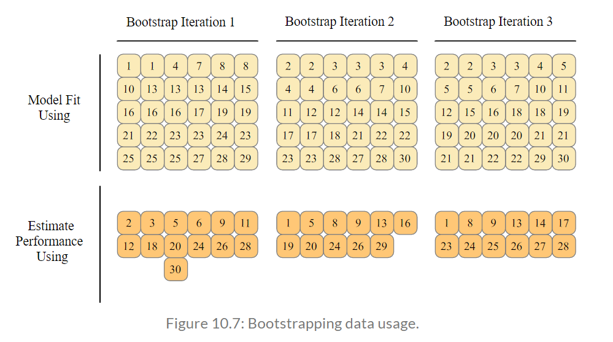{width=50%}

Source: https://www.tmwr.org/resampling.html#resampling-methods

## Hands-on session with R

- The Validation Set approach

- Leave-one-out Cross Validation (LOOCV)

- k-fold CV

- Bootstrap 

## The Validation approach

Explore the use of the validation set approach in order to estimate the
**test error rates** that result from fitting various linear models on the 
**Auto data set**.

REMARK: It is generally a good idea
to set a random seed by ` r set.seed()` when performing an analysis such as cross-validation that contains an element of randomness, so that the results obtained can be reproduced precisely at a later time.

```{r}
library(ISLR2)
# to split the set of observations sample()
# into two halves, by selecting a random subset of 196 observations out of
# the original 392 observations
set.seed(442)
train <- sample (392 , 196)

```

use the subset option in to fit a linear regression using only
the observations corresponding to the training set.

```{r}
lm.fit <- lm(mpg ~ horsepower , data = Auto , subset = train)
summary(lm.fit)
```

We now use the **predict()** function to estimate the response for **all 392
observations**, and we use the **mean()** function to calculate the MSE of the
196 observations in the validation set. Note that the -train index below
selects only the observations that are not in the training set

```{r}
attach(Auto)
mean(( mpg - predict(lm.fit , Auto))[-train]^2)
```

When we rerun, we get slightly different results now:

```{r}
train <- sample (392 , 196)
lm.fit <- lm(mpg ~ horsepower , data = Auto , subset = train)
summary(lm.fit)

mean(( mpg - predict(lm.fit , Auto))[-train ]^2)
```

Using this different split of the observations into a training set and a validation
set, we find that the validation set error rates as;

## Leave-One-Out Cross-Validation (LOOCV)

The LOOCV estimate can be automatically computed for any generalized
linear model using the **glm()** and **cv.glm()** functions. if we use **cv.glm()** to fit a model without passing in the family argument, then it performs linear regression, just like the **lm()** function.

```{r}
glm.fit <- glm(mpg ~ horsepower , data = Auto)
# Similar to 
# lm.fit <- lm(mpg ∼ horsepower , data = Auto)
coef(glm.fit)
```

The cv.glm() function is part of the boot library

```{r}
#install.packages("boot")
library(boot)
glm.fit <- glm(mpg ~ horsepower , data = Auto)
cv.err <- cv.glm(Auto , glm.fit)
cv.err$delta
```

Note that The **cv.glm()** function produces a list with several components. The two
numbers in the delta vector contain the cross-validation results. In this
case the numbers are identical (up to two decimal places)

We can repeat this procedure for increasingly complex polynomial fits.
To automate the process, we use the **for()** function to initiate a for loop
for loop which iteratively fits polynomial regressions for polynomials of order 
$i = 1, \ldots, 10$, computes the associated cross-validation error, and stores it in
the ith element of the vector cv.error


```{r}
# For different models starting with linear and polynomials
cv.error <- rep(0, 10)
for (i in 1:10) { glm.fit <- glm(mpg ~ poly(horsepower , i), data = Auto)
cv.error[i] <- cv.glm(Auto , glm.fit)$delta[1] }
cv.error
```

## k-Fold Cross-Validation

The **cv.glm()** function can also be used to implement k-fold CV. Below we
use $k = 10$, a common choice for k, on the Auto data set. We once again set
a random seed and initialize a vector in which we will store the CV errors
corresponding to the polynomial fits of orders one to ten

```{r}
set.seed (442)
cv.error.10 <- rep(0, 10)
for (i in 1:10) { glm.fit <- glm(mpg~poly(horsepower , i), data = Auto)
cv.error.10[i] <- cv.glm(Auto , glm.fit , K = 10)$delta[1] }
cv.error.10
```

Try for $k=5$ to see the impact of k here

```{r}
set.seed (442)
cv.error.5 <- rep(0, 10)
for (i in 1:10) { glm.fit <- glm(mpg ~ poly(horsepower , i), data = Auto)
cv.error.5[i] <- cv.glm(Auto , glm.fit , K = 5)$delta[1] }
cv.error.5
```

Notice that the computation time is shorter than that of LOOCV. (In principle, the computation time for LOOCV for a least squares linear model should be faster than for k-fold CV, due to the availability of the formula for LOOCV; however, unfortunately the **cv.glm()** function does not make use of this formula !

Note that the two numbers associated with delta are essentially the same when LOOCV 
is performed. When we instead perform k-fold CV, then the two numbers associated with delta differ slightly. The first is the standard k-fold CV estimate, whereas the second is a bias-corrected version. On this data set, the two estimates are very similar to each other.

## The Bootstrap

We illustrate the use of the bootstrap 

- Estimating the Accuracy of a Statistic of Interest

- Estimating the Accuracy of a Linear Regression Model

## Estimating the Accuracy of a Statistic of Interest

Performing a bootstrap analysis in R entails only two steps.
First, we must create a function that computes the statistic of interest.
Second, we use the boot() function, which is part of the boot library, to perform the bootstrap by repeatedly sampling observations from the data
set with replacement

```{r}
# The Portfolio data set in the ISLR2 package is simulated data of 100
# pairs of returns, for details check Section 5.2.

alpha.fn <- function(data , index) {
  X <- data$X[index]
  Y <- data$Y[index]
 (var(Y) - cov(X, Y)) / (var(X) + var(Y) - 2 * cov(X, Y))
}
```

This function returns, or outputs, an estimate for $\alpha = \frac{\sigma_Y^2 - Cov_{XY}}{\sigma_X^2 +\sigma_Y^2 - 2 Cov_{XY}}$ based on applying
$\widehat{\alpha} = \frac{\widehat{\sigma}_Y^2 - \widehat{Cov}_{XY}}{\widehat{\sigma}_X^2 + \widehat{\sigma}_Y^2 - 2 \widehat{Cov}_{XY}}$ to the observations indexed by the argument index. 
For instance, the following command tells R to estimate $\alpha$ using all 100 observations.

```{r}
alpha.fn(Portfolio , 1:100)
```

The next command uses the **sample()** function to randomly select 100 observations
from the range 1 to 100, with replacement. This is equivalent
to constructing a new bootstrap data set and recomputing $\widehat{\alpha}$ based on the new data set.

```{r}
set.seed(442)
alpha.fn(Portfolio , sample (100 , 100, replace = T))
```

Note that the **boot()** function automates this approach. 
Below we produce $R = 1000$ bootstrap estimates for $\alpha$.

```{r}
boot(Portfolio , alpha.fn, R = 1000)
```

## Estimating the Accuracy of a Linear Regression Model

The bootstrap approach can be used to assess the variability of the coefficient
estimates and predictions from a statistical learning method. Here
we use the bootstrap approach in order to assess the variability of the
estimates for $\beta_0$ and $\beta_1$, the intercept and slope terms for the linear regression model.

We first create a simple function, **boot.fn()**, which takes in the **Auto data**
set as well as a set of indices for the observations, and returns the intercept
and slope estimates for the linear regression

```{r}
boot.fn <- function(data, index){
 coef(lm(mpg ~ horsepower , data = data , subset = index))
}
boot.fn(Auto , 1:392)
```

The **boot.fn()** function can also be used in order to create bootstrap estimates
for the intercept and slope terms by randomly sampling from among
the observations with replacement

```{r}
set.seed (442)
boot.fn(Auto , sample (392 , 392, replace = T))
```

we use the **boot()** function to compute the standard errors of 1,000
bootstrap estimates for the intercept and slope terms

```{r}
boot(Auto , boot.fn, 1000)
# Compare with the summary results
summary(lm(mpg ~ horsepower , data = Auto))$coef
```

## Quadratic fit 

Below we compute the bootstrap standard error estimates and the standard
linear regression estimates that result from fitting the quadratic model
to the data

```{r}
boot.fn <- function(data , index)
  coef(lm(mpg ~ horsepower + I(horsepower^2), data = data , subset = index))

set.seed (442)
boot(Auto , boot.fn, 1000)

# Compare with

summary(lm(mpg ~ horsepower + I(horsepower^2), data = Auto))$coef
```

## Use of caret package for resampling

```{r warning=F, message=F}
# tidyverse for easy data manipulation and visualization
# caret for easily computing cross-validation methods
library(tidyverse)
library(caret)

# Data example is 

# Load the data
data("swiss")
# Inspect the data
sample_n(swiss, 3)
```

## The Validation set Approach

The process works as follow:

- Build (train) the model on the training data set
- Apply the model to the test data set to predict the outcome of new unseen observations
- Quantify the prediction error as the mean squared difference between the observed and the predicted outcome values.

```{r}
# Split the data into training and test set
set.seed(442)
training.samples <- swiss$Fertility %>%
  createDataPartition(p = 0.8, list = FALSE)

train.data  <- swiss[training.samples, ]
test.data <- swiss[-training.samples, ]

# Build the model, multiple linear regression here
model <- lm(Fertility ~., data = train.data)

# Make predictions and compute the R2, RMSE and MAE
predictions <- model %>% predict(test.data)
data.frame( R2 = R2(predictions, test.data$Fertility),
            RMSE = RMSE(predictions, test.data$Fertility),
            MAE = MAE(predictions, test.data$Fertility))
```

RECALL: Note that, 

- the validation set method is only useful when you have a large data set that can be partitioned. 

- A disadvantage is that we build a model on a fraction of the data set only, possibly leaving out some interesting information about data, leading to higher bias.

- Therefore, the test error rate can be highly variable, depending on which observations are included in the training set and which observations are included in the validation set.

## Leave one out cross validation - LOOCV

This method works as follow:

- Leave out one data point and build the model on the rest of the data set

- Test the model against the data point that is left out at step 1 and record the test error associated with the prediction

- Repeat the process for all data points

- Compute the overall prediction error by taking the average of all these test error estimates recorded at step 2.

```{r}
# Define training control
train.control <- trainControl(method = "LOOCV")

# Train the model
model <- train(Fertility ~., data = swiss, method = "lm",
               trControl = train.control)

# Summarize the results
print(model)
```

RECALL

- The advantage of the LOOCV method is that we make use all data points reducing potential bias.

- However, the process is repeated as many times as there are data points, resulting to a higher execution time when n is extremely large.

- Additionally, we test the model performance against one data point at each iteration. This might result to higher variation in the prediction error, if some data points are outliers

## K-fold cross-validation

The k-fold cross-validation method evaluates the model performance on different subset of the training data and then calculate the average prediction error rate. The algorithm is as follow:

- Randomly split the data set into k-subsets (or k-fold)

- Reserve one subset and train the model on all other subsets

- Test the model on the reserved subset and record the prediction error

- Repeat this process until each of the k subsets has served as the test set.

- Compute the average of the k recorded errors. This is called the cross-validation error serving as the performance metric for the model.

- Typical question, is how to choose right value of k? 
  * In practice, one typically performs k-fold cross-validation using $k = 5$ or 
$k = 10$, as these values have been shown empirically to yield test error rate estimates that suffer neither from excessively high bias nor from very high variance. 

```{r}
# Define training control
set.seed(123) 
train.control <- trainControl(method = "cv", number = 10)

# Train the model
model <- train(Fertility ~., data = swiss, method = "lm",
               trControl = train.control)

# Summarize the results
print(model)
```

- K-fold cross-validation (CV) is a robust method for estimating the accuracy of a model.

- The most obvious advantage of k-fold CV compared to LOOCV is computational. A less obvious but potentially more important advantage of k-fold CV is that it often gives more accurate estimates of the test error rate than does LOOCV (James et al. 2014).

- Lower value of K is more biased and hence undesirable. 

- On the other hand, higher value of K is less biased, but can suffer from large variability. 

- Notice that a smaller value of k (say $k = 2$) always takes us towards validation set approach, whereas a higher value of k (say $k = n$) leads us to LOOCV approach.

## For further examples

To READ

- http://www.sthda.com/english/articles/38-regression-model-validation/157-cross-validation-essentials-in-r/

- http://www.sthda.com/english/articles/38-regression-model-validation/156-bootstrap-resampling-essentials-in-r/

- http://www.sthda.com/english/articles/38-regression-model-validation/157-cross-validation-essentials-in-r/#cross-validation-methods


TO WATCH

- https://www.youtube.com/watch?v=fSytzGwwBVw (00:00-05:20 minutes)

- https://www.youtube.com/watch?v=Xz0x-8-cgaQ
