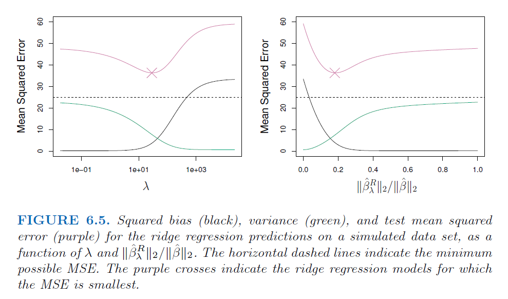
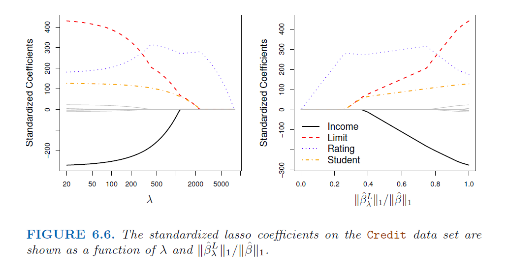
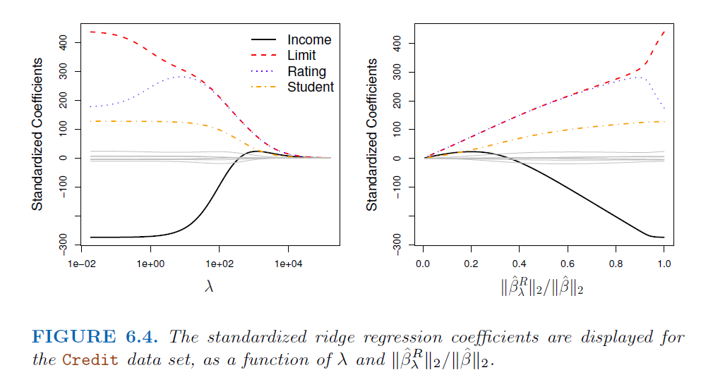
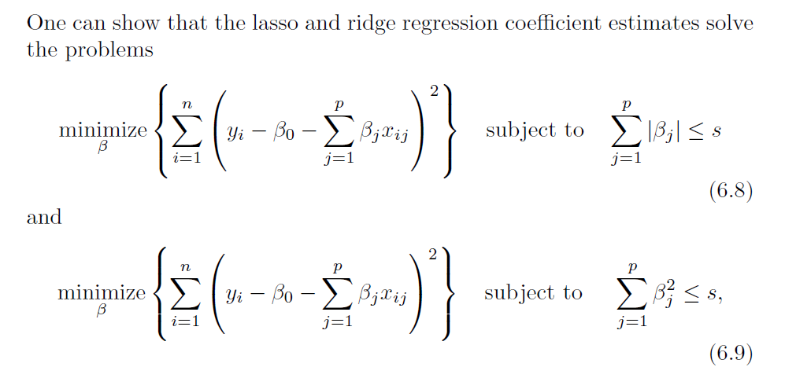
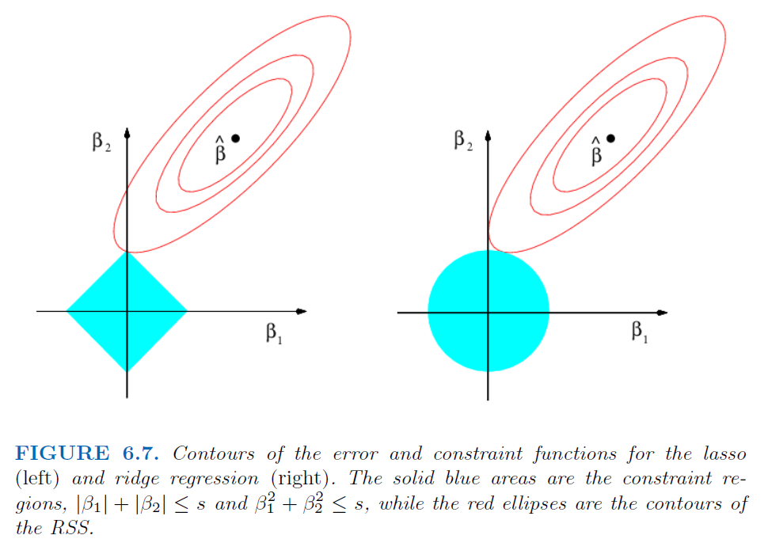
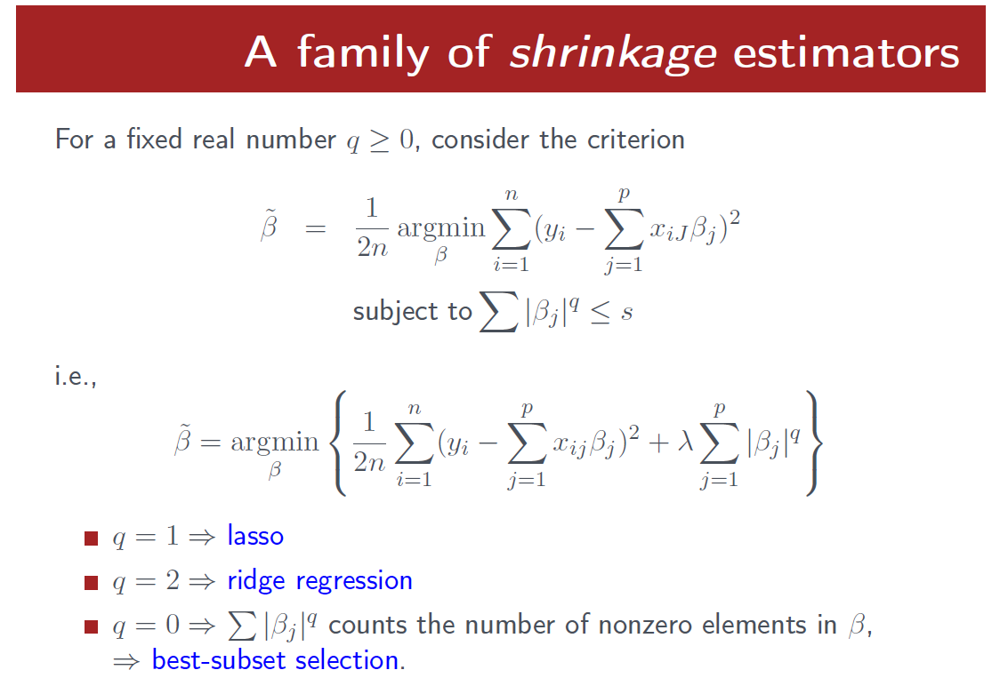
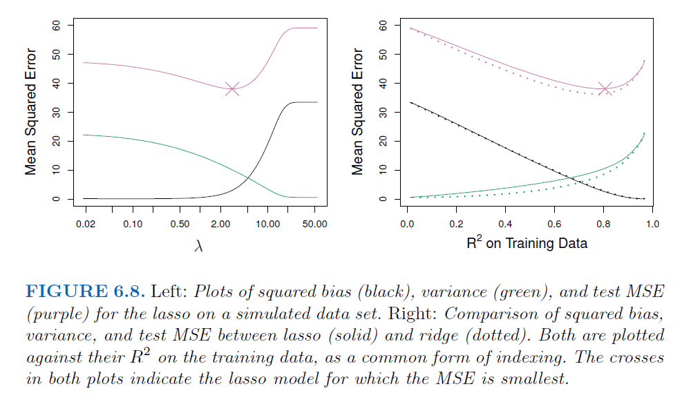
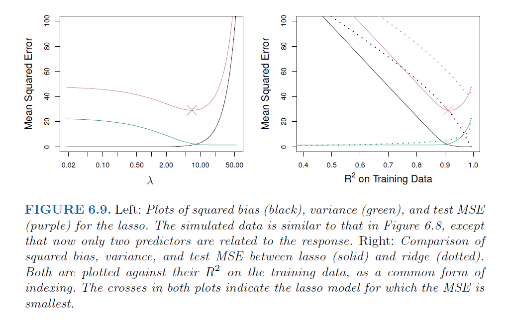
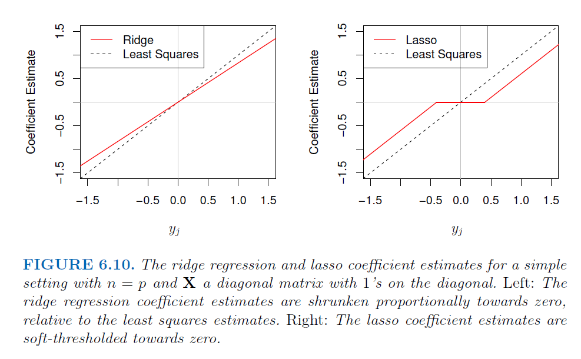
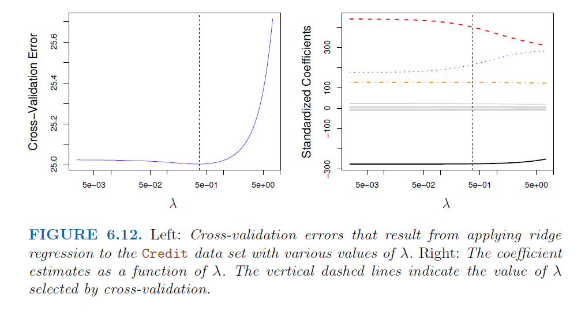

```{r setup, include=FALSE, fig.height=4, fig.width= 4, fig.align= 'center'}
knitr::opts_chunk$set(echo = T)
```

## Three important classes

- **Subset Selection:** This approach involves identifying a subset of the p
predictors that we believe to be related to the response. We then fit
a model using least squares on the reduced set of variables.

- **Shrinkage:** This approach involves fitting a model involving all p predictors.
However, the estimated coefficients are shrunken towards zero relative to the least squares estimates. This shrinkage (regularization) has the effect of reducing variance and can also perform variable selection.

- **Dimension Reduction:** This approach involves projecting the $p$ predictors
into an $M$-dimensional subspace, where $M < p$. This is achieved by computing $M$ different linear combinations, or projections, of the variables. Then these $M$ projections are used as predictors to fit a linear regression model by least squares

For today, our main focus will be the regularization !!!

## Subset Selection

These include best subset and stepwise model selection procedures:

- To perform best subset selection, we fit a separate least squares regression
best subset for each possible combination of the p predictors. Equivalently, fitting $p$ models that contain exactly one predictor, ${p \choose 2} = \frac{p(p-1)}{2}$ models that contain exactly two predictors

- The problem of selecting the best model from among the $2^p$ possibilities
considered by best subset selection is not trivial

- For computational reasons, best subset selection cannot be applied with
very large $p$. 

- Best subset selection may also suffer from statistical problems when $p$ is large. 
- The larger the search space, the higher the chance of finding
models that look good on the training data, even though they might not
have any predictive power on future data. 

- Thus an enormous search space can lead to overfitting and high variance of the coefficient estimates.

Mainly we have,

* Forward Stepwise Selection
* Backward Stepwise Selection
* Hybrid Approaches

## Choosing the Optimal Model

STORY: The training set MSE is generally an underestimate of the test $MSE$. This is because when we fit a model to the training data using least squares, we specifically estimate the regression coefficients such that the training $RSS$ (but
not the test $RSS$) is as small as possible. In particular, the training error
will decrease as more variables are included in the model, but the test error
may not !

Fortunately, a number of techniques for adjusting the training error for the
model size are available;

- Mallow's $C_p = \frac{RSS + 2d\widehat{\sigma}^2}{n}$ where $\widehat{\sigma}^2$ is an estimate of the variance of the error $\epsilon$ associated with each response measurement. This is the estimate of test MSE for a fitted least squares model containing $d$ predictors. Typically $\sigma^2$ is estimated using the full model containing all predictors

- if $\widehat{\sigma}^2$ is an unbiased estimate of $\sigma^2$, then $C_p$ is an unbiased estimate of test MSE. Here, the $C_p$ statistic tends to take on a small value for models with a low test error, so when determining which of a set of models is best, we choose the model with the lowest $C_p$ value !

- $AIC = \frac{RSS + 2d\widehat{\sigma}^2}{n}$ is the Akaike information criterion

- $BIC = \frac{RSS + log(n)d\widehat{\sigma}^2}{n}$ is the Bayesian information criterion. 

- Like $C_p$, the $AIC$ and $BIC$ will tend to take on a small value for a model with a low test error, and so generally we select the model that has the lowest AIC / BIC value

- $Adjusted R^2 = 1- \frac{RSS/(n-d-1)}{TSS/(n-1)}$ is the adjusted $R^2$ statistic, as another popular approach for selecting among a set of models that contain different numbers of variables

- A large value of adjusted $R^2$ indicates a model with a small test error. 

## Moving Beyond Linearity

- **Polynomial regression** extends the linear model by adding extra predictors,
obtained by raising each of the original predictors to a power. This approach provides a simple way to provide a nonlinear fit to data.

- **Step functions** cut the range of a variable into $K$ distinct regions in
order to produce a qualitative variable. This has the effect of fitting
a piecewise constant function.

- **Regression splines** are more flexible than polynomials and step functions,
and in fact are an extension of the two. They involve dividing the range of X into 
K distinct regions. Within each region, a polynomial function is fit to the data. Provided that the interval is divided into enough regions, this can produce an extremely flexible fit

- **Smoothing splines** are similar to regression splines, but arise in a
slightly different situation. Smoothing splines result from minimizing
a residual sum of squares criterion subject to a smoothness penalty.

- **Local regression** is similar to splines, but differs in an important way.
The regions are allowed to overlap, and indeed they do so in a very
smooth way.
 
- **Generalized additive models (GAMs)** allow us to extend the methods above to
deal with multiple predictors.


## Regularization (Shrinkage) Time 

Recall: "This approach involves fitting a model involving all p predictors.
However, the estimated coefficients are shrunken towards zero relative to the least squares estimates. This shrinkage (regularization) has the effect of reducing variance and can also perform variable selection."

- As an alternative, we can fit a model containing all p predictors using a technique
that constrains or regularizes the coefficient estimates, or equivalently, that
shrinks the coefficient estimates towards zero.

- It may not be immediately obvious why such a constraint should improve the fit, 
but it turns out that shrinking the coefficient estimates can significantly reduce their variance.

The two best-known techniques for shrinking the regression coefficients
towards zero; 

- Ridge 

- LASSO

## Ridge Regression

Recall the definition of RSS from least squares, estimates of $\beta_i$s for $i=0, \ldots, p$ that minimizes, 

$RSS = \sum_{i=1}^{n}(y_i - \beta_0 - \sum_{j=1}^{p}\beta_j x_{ij})$

Ridge regression is very similar to least squares, except that the coefficients
are estimated by minimizing a slightly different quantity. Here, the ridge regression coefficient estimates  $\widehat{\beta}^R$ are the values that minimize,

$\sum_{i=1}^{n}(y_i - \beta_0 - \sum_{j=1}^{p}\beta_j x_{ij}) + \lambda \sum_{j=1}^{p}\beta_j^2 = RSS + \lambda \sum_{j=1}^{p}\beta_j^2$

where $\lambda \geq 0$ is a tuning parameter, to be determined separately


## Main Properties

Above equation trades off two different criteria;

- As with least squares, ridge regression seeks coefficient estimates that fit the data well, by making the RSS small.

- However, the second term, called **shrinkage penalty** is small when $\beta_i$s are close to zero, and so it has the effect of shrinking the estimates of $\beta_j$ towards zero

- The tuning parameter $\lambda$ serves to control
the relative impact of these two terms on the regression coefficient estimates.

- When $\lambda=0$, the penalty term has no effect, and ridge regression
will produce the least squares estimates

- As $\lambda \rightarrow \infty$, the impact of
the shrinkage penalty grows, and the ridge regression coefficient estimates
will approach zero

- Unlike least squares, which generates only one set of coefficient
estimates, ridge regression will produce a different set of coefficient
estimates for each value of $\lambda$

- Selecting a good value for $\lambda$ is critical; again where the CV comes 
into play !

- Note that the shrinkage penalty is applied to $\beta_j$s, but
not to the intercept, $\beta_0$. We do not want to shrink the
intercept, which is simply a measure of the mean value of the response

## Why Does Ridge Regression Improve Over Least Squares?

- Ridge regression’s advantage over least squares is rooted in the bias-variance
trade-off.

- As $\lambda$ increases, 
  * the flexibility of the ridge regression fit decreases,
  * leading to decreased variance 
  * but increased bias

## An example ($p=45$, $n=50$)



- At the least squares coefficient estimates, which correspond
to ridge regression with $\lambda= 0$, the variance is high but there is no bias. 

- But as $\lambda$ increases, the shrinkage of the ridge coefficient estimates leads to a substantial reduction in the variance of the predictions, at the expense of a
slight increase in bias

- The minimum MSE is achieved at approximately $\lambda= 30$

- The right-hand panel of Figure 6.5 displays the same curves as the left hand
panel, this time plotted against the $l_2$ norm of the ridge regression
coefficient estimates divided by the $l_2$ norm of the least squares estimates.
Now as we move from left to right, the fits become more flexible, and so
the bias decreases and the variance increases.

## Some Remarks

- In situations where the relationship between the response
and the predictors is close to linear, the least squares estimates will have
low bias but may have high variance. This means that a small change in
the training data can cause a large change in the least squares coefficient
estimates.

- When the number of variables $p$ is almost as large as the number of observations 
$n$, as in the example above, the least squares estimates will be extremely variable

- If $p > n$, then the least squares estimates do not even have a unique solution, whereas ridge regression can still perform well by trading off a small increase in bias for a large decrease in variance

- Hence, ridge regression works best in situations where the least squares estimates have high variance

- Ridge regression also has substantial computational advantages over best
subset selection. For any fixed value of $\lambda$, ridge regression
only fits a single model, and the model-fitting procedure can be performed quite quickly

## The Lasso, why ?

- Ridge regression does have one obvious disadvantage. Unlike best subset,
forward stepwise, and backward stepwise selection, which will generally
select models that involve just a subset of the variables, ridge regression
will include all p predictors in the final model

- The penalty term will shrink all of the coefficients towards zero, but it will not set any of them exactly to zero (unless $\lambda \rightarrow \infty$)

- This may not be a problem for prediction accuracy, but it can create a challenge in model interpretation in settings in which the number of variables p is quite large

- Ridge regression will always generate a model involving all possible predictors. Increasing the value of $\lambda$ will tend to reduce the magnitudes of the coefficients, but will not result in exclusion of any of the variables.

## New penalty term

The LASSO is a relatively recent alternative to ridge regression that overcomes 
this disadvantage;

$\sum_{i=1}^{n}(y_i - \beta_0 - \sum_{j=1}^{p}\beta_j x_{ij}) + \lambda \sum_{j=1}^{p} |\beta_j| = RSS + \lambda \sum_{j=1}^{p} |\beta_j|$

- The only difference is that the $\beta_j^2$ term in the ridge
regression penalty has been replaced by $|\beta_j|$ in the lasso penalty. This means, lasso uses $l_1$ penalty term rather than $l_2$ like ridge does

- $l_1$ norm of a coefficient is $||\beta||_1 = |\beta_j|$

- In the case of the lasso, the $l_1$ penalty has the effect of forcing some of the coefficient estimates to be exactly equal to zero when the tuning parameter $\lambda$ is sufficiently large

- Hence, much like best subset selection, the lasso performs variable selection

- As a result, models generated from the lasso are generally much easier to interpret than 
those produced by ridge regression !

## An Example



## Recall Ridge graphically !



## Another Formulation for Ridge and the Lasso



- For every value of $\lambda$, there is some $s$ such that
the Equations (6.8) and (6.9) will give the same lasso or ridge coefficient estimates, comparable to previous definitions !

## Visualize for $p=2$



- Equation (6.8) indicates that the lasso coefficient estimates have
the smallest $RSS$ out of all points that lie within the diamond defined by
$|\beta_1| + |\beta_2| \leq s$, where there is a budget s

- Note that when $s$ is extremely large, then this budget is not very restrictive, and so
the coefficient estimates can be large. 

- In fact, if $s$ is large enough that the least squares solution falls within the budget, 
then (6.8) will simply yield the least squares solution

## Generalization



- Generally, by regularizing (shrinking, dampening, controlling) the estimator in some way, its variance will be reduced; if the corresponding increase in bias is small, this will be worthwhile

## The Variable Selection Property of the Lasso

- Why is it that the lasso, unlike ridge regression, results in coefficient estimates
that are exactly equal to zero?

- Figure 6.7 illustrates the situation. The least squares solution is marked as $\widehat{\beta}$, while the blue diamond and circle represent the lasso and ridge regression constraints in (6.8) and (6.9), respectively.

- If $s$ is sufficiently large (means $\lambda = 0$), then the constraint regions will contain $\widehat{\beta}$, and so the ridge regression and lasso estimates will be the same as the
least squares estimates

- In Figure 6.7 the least squares estimates lie outside of the diamond and the circle, and so the least squares estimates are not the same as the lasso and ridge regression estimates

- Each of the ellipses centered around $\widehat{\beta}$ represents a contour: this means that all of the points on a particular ellipse have the same $RSS$ value. As the ellipses expand away from the least squares coefficient estimates, the $RSS$ increases

- The lasso and ridge regression coefficient estimates are given by the first point at which 
an ellipse contacts the constraint region. Since ridge regression has a circular
constraint with no sharp points, this intersection will not generally occur on an axis, and so the ridge regression coefficient estimates will be exclusively non-zero. However, the lasso constraint has corners at each of the axes, and so the ellipse will often intersect the constraint region at an axis

## Comparing the Lasso and Ridge Regression

- It is clear that the lasso has a major advantage over ridge regression, in
that it produces simpler and more interpretable models that involve only a
subset of the predictors. 

- Which method leads to better prediction accuracy?

## Ridge outperforms lasso



- In this example, the lasso and ridge regression result in almost identical biases. 
- However, the variance of ridge regression is slightly lower than the variance of the lasso.
Consequently, the minimum MSE of ridge regression is slightly smaller than that of the lasso

## Lasso outperforms Ridge



- It illustrates a similar situation, except that now the response is a
function of only 2 out of 45 predictors. Now the lasso tends to outperform
ridge regression in terms of bias, variance, and MSE


## Which one ? 

STORY: These two examples illustrate that neither ridge regression nor the lasso
will universally dominate the other. In general, one might expect the lasso
to perform better in a setting where a relatively small number of predictors
have substantial coefficients, and the remaining predictors have coefficients
that are very small or that equal zero. Ridge regression will perform better
when the response is a function of many predictors, all with coefficients of
roughly equal size. However, the number of predictors that is related to the
response is never known a priori for real data sets.

- A technique such as cross-validation can be used in order to determine which approach is better on a particular data set

- As with ridge regression, when the least squares estimates have excessively
high variance, the lasso solution can yield a reduction in variance
at the expense of a small increase in bias, and consequently can generate
more accurate predictions. Unlike ridge regression, the lasso performs
variable selection, and hence results in models that are easier to interpret.

## A Simple Special Case (when $n=p$)

- To get more intuition, assume that $\mathbf{X}$ is a diagonal matrix with 1’s on the diagonal and 0’s 
in all off-diagonal elements

- Assume also that we are performing regression without an intercept. With these assumptions, the usual least squares problem simplifies for finding $\beta_i$s for $i=1,\ldots,p$

$\sum_{j=1}^{p} (y_j - \beta_j)^2$



## Selecting the Tuning Parameter

- Just as the subset selection approaches considered before, we require
a method to determine which of the models under consideration is best

- Cross-validation provides a simple way to tackle this problem. We choose a grid of 
$\lambda$ values, and compute the cross-validation error for each value of $\lambda$

- We then select the tuning parameter value for which the cross-validation error
is smallest

- Finally, the model is re-fit using all of the available observations
and the selected value of the tuning parameter

## Ridge example 



## Hands on session in R

- We will use the glmnet package in order to perform ridge regression and
the lasso

- We will now perform ridge regression and the lasso in order to predict Salary on
the Hitters data

```{r}
library(ISLR2)
data(Hitters)
x <- model.matrix(Salary ~ ., Hitters)[, -1]
y <- Hitters$Salary 
y <- y[is.na(y) == FALSE]
#y <- which(y == NA)
```

- The `model.matrix()` function is particularly useful for creating x; not only
does it produce a matrix corresponding to the 19 predictors but it also
automatically transforms any qualitative variables into dummy variables

## Ridge Regression

- The glmnet() function has an alpha argument that determines what type
of model is fit. If $\alpha=0$ then a ridge regression model is fit, and if 
$\alpha=1$ then a lasso model is fit.

```{r}
library(glmnet)
grid <- 10^seq(10, -2, length = 100)
ridge.mod <- glmnet(x, y, alpha = 0, lambda = grid)
```


```{r}
plot(ridge.mod)
```

Note that by default, the glmnet() function standardizes the
variables so that they are on the same scale. To turn off this default setting,
use the argument `standardize = FALSE`. Associated with each value of $\lambda$ is a vector of ridge regression coefficients,
stored in a matrix that can be accessed by coef().

```{r}
dim(coef(ridge.mod))
```

We expect the coefficient estimates to be much smaller, in terms of $l_2$ norm,
when a large value of $\lambda$ is used, as compared to when a small value of 
$\lambda$ is used

```{r}
ridge.mod$lambda[50]
coef(ridge.mod)[, 50]
sqrt(sum(coef(ridge.mod)[-1, 50]^2))
```

## Prediction 

We can use the predict() function for a number of purposes

```{r}
predict(ridge.mod , s = 50, type = "coefficients")[1:20, ]
```


## Again, first partitioning

```{r}
set.seed(442)
train <- sample (1: nrow(x), nrow(x) / 2)
test <- (-train)
y.test <- y[test]
```


Next we fit a ridge regression model on the training set, and evaluate
its MSE on the test set, using $\lambda = 4$. Note the use of the predict()
function again. This time we get predictions for a test set, by replacing
type="coefficients" with the newx argument


```{r}
ridge.mod <- glmnet(x[train , ], y[train], alpha = 0, lambda = grid, 
                    thresh = 1e-12)

ridge.pred <- predict(ridge.mod , s = 4, newx = x[test , ])
mean(( ridge.pred - y.test)^2)
```


Note that if we had instead simply fit a model
with just an intercept, we would have predicted each test observation using
the mean of the training observations

```{r}
mean(( mean(y[train ]) - y.test)^2)
```

We could also get the same result by fitting a ridge regression model with
a very large value of $\lambda$

```{r}
ridge.pred <- predict(ridge.mod , s = 1e10 , newx = x[test , ])
mean(( ridge.pred - y.test)^2)
```

So fitting a ridge regression model with specific $\lambda$ here leads to a much lower test MSE than fitting a model with just an intercept

## Simple Comparison

```{r}
ridge.pred <- predict(ridge.mod , s = 0, newx = x[test , ],
exact = T, x = x[train , ], y = y[train ])
mean (( ridge.pred - y.test)^2)

lm(y ~ x, subset = train)
predict(ridge.mod , s = 0, exact = T, type = "coefficients", x = x[train, ], 
        y = y[train])[1:20, ]
```

## CV on Ridge

```{r}
cv.out <- cv.glmnet(x[train , ], y[train], alpha = 0)
plot(cv.out)
bestlam <- cv.out$lambda.min
bestlam
```

Therefore, we see that the value of $\lambda$ that results in the smallest crossvalidation error


```{r}
ridge.pred <- predict(ridge.mod , s = bestlam ,newx = x[test , ])
mean((ridge.pred - y.test)^2)
```

Finally, we refit our ridge regression model on the full data set,
using the value of $\lambda$ chosen by cross-validation, and examine the coefficient
estimates.

```{r}
out <- glmnet(x, y, alpha = 0)
predict(out, type = "coefficients", s = bestlam)[1:20, ]
```


## The Lasso

We now ask whether the lasso can yield either a more accurate or a more interpretable
model than ridge regression. In order to fit a lasso model, we once again
use the `glmnet()` function; however, this time we use the argument alpha=1.

```{r}
lasso.mod <- glmnet(x[train , ], y[train], alpha = 1, lambda = grid)
plot(lasso.mod)
```

We now
perform cross-validation and compute the associated test error.

```{r}
set.seed(1)
cv.out <- cv.glmnet(x[train , ], y[train], alpha = 1)
plot(cv.out)
bestlam <- cv.out$lambda.min
lasso.pred <- predict(lasso.mod , s = bestlam , newx = x[test , ])
mean((lasso.pred - y.test)^2)
```

This is substantially lower than the test set MSE of the null model and of
least squares, and very similar to the test MSE of ridge regression with λ
chosen by cross-validation

## Coefficients ?

the lasso has a substantial advantage over ridge regression in
that the resulting coefficient estimates are sparse. Here we see that 8 of the 19 coefficient estimates are exactly zero

```{r}
out <- glmnet(x, y, alpha = 1, lambda = grid)
lasso.coef <- predict(out , type = "coefficients", s = bestlam)[1:20, ]
lasso.coef

lasso.coef[lasso.coef != 0]
```

## For further investigation 

Open Source

- https://bradleyboehmke.github.io/HOML/regularized-regression.html

Some videos on Ridge and Lasso

- https://www.youtube.com/watch?v=Q81RR3yKn30

- https://www.youtube.com/watch?v=NGf0voTMlcs

- https://www.youtube.com/watch?v=Xm2C_gTAl8c

