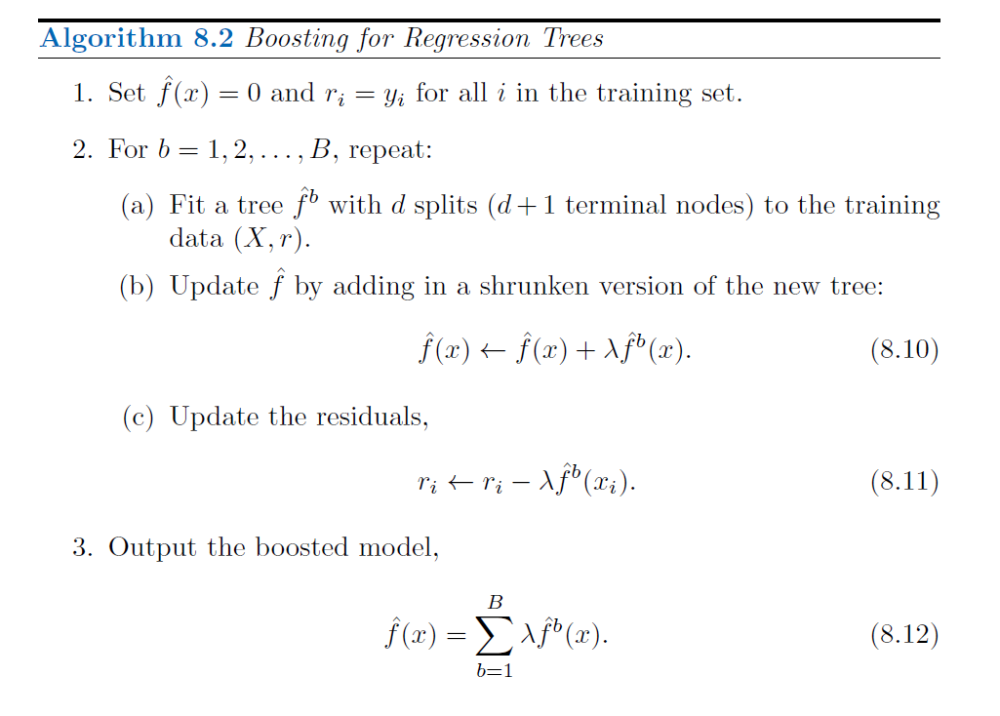

```{r setup, include=FALSE, fig.height=4, fig.width= 4, fig.align= 'center'}
knitr::opts_chunk$set(echo = T)
```

## ABC of Tree-Based Methods

- Main focus will be **tree-based methods for regression and classification**

- General idea is for **stratifying or segmenting the predictor space** into
a number of simple regions

- To make a prediction for a given observation, we typically use **the mean or the mode response value** for the training observations in the region to which it belongs.

- Since the set of splitting rules used to segment the predictor space can be summarized in
a tree, these types of approaches are known as **decision tree methods**

For today, we will have just a **general overview** !

## More Properties

- Tree-based models are a class of nonparametric algorithms that work by partitioning the feature space into a number of smaller (non-overlapping) regions with similar response values using a set of splitting rules. 

- Predictions are obtained by fitting a simpler model (e.g., a constant like the average response value) in each region. Such divide-and-conquer methods can produce simple rules that are easy to interpret and visualize with tree diagrams

<!-- - Tree-based methods are **simple and useful for interpretation** -->

- However, they typically are not competitive with the best supervised learning approaches,
such as; regularization, in terms of prediction accuracy

- Each of tree based methods involve producing multiple trees which are then combined to yield a single consensus prediction

- We will see that **combining a large number of trees can often result in dramatic improvements in prediction accuracy**, at the expense of some loss in interpretation.

## Tree based tools in general

- Simple Decision Trees
  * **Regression trees** (might be a competitor for linear regression)
  * **Classification Trees** (might be a competitor for logistic regression)
  * In general they are called as **CART algorithms**

- Bagging

- Random forests

- Boosting

- Gradient Boosting

- eXtreme Gradient Boosting (XGBoost)

- Bayesian additive regression trees

## General Overview


Source: https://gunjanagicha.medium.com/tree-based-methods-7ed6ff5db85d

## Areas of applications

- **Marketing and Sales**: Decision Trees play an important role in a decision-oriented sector like marketing

- **Reducing Churn Rate**: Banks make use of machine learning algorithms like Decision Trees to retain their customers. It is always cheaper to keep customers than to gain new ones

- **Anomaly & Fraud Detection**: Industries like finance and banking suffer from various cases of fraud 

- **Medical Diagnosis**: Classification trees identifies patients who are at risk of suffering from serious diseases such as cancer and diabetes

Source: https://data-flair.training/blogs/r-decision-trees/

## OK, What is a Decision Tree ? 


- In essence, our tree is a set of rules that allows us to make predictions by asking simple yes-or-no questions about each feature

## A numerical One


## Model Basics

- There are many methodologies for constructing decision trees but the most well-known is the **classification and regression tree (CART) algorithm** proposed in Breiman (1984)

<!-- - The most basic type of tree-structure model is a **decision tree or CART** (classification and regression tree).  -->

- A more optimized version of CARTs are **conditional inference trees (CITs)** - although CART and CITs are commonly treated as one and the same thing although CITs differ from CARTs in that they provide more accurate variable importance measures. 

- Like random forests, inference trees are non-parametric and thus do not rely on distributional requirements (or at least on fewer). 

- The tree structure represents **recursive partitioning of the data** to minimize residual deviance

- Several advantages have been associated with using tree-based models:

## Advantages

1. Tree-structure models are very useful because they can deal with **different types of variables** and provide a **very good understanding of the structure** in the data.

2. Tree-structure models have been deemed particularly interesting for linguists because they can handle **moderate sample sizes** and many **high-order interactions** better then regression models shows that there can be issues especially when dealing with small data samples, single trees (rather than forests), and data where the variance is predictable based on a single interaction (as shown by Gries (2021), chapter 7).

3. Tree-structure models are (supposedly) better at **detecting non-linear or non-monotonic relationships** between predictors and dependent variables.

4. Tree-structure models are **easy to implement** and do not require the model selection, validation, and diagnostics associated with regression models.

5. Tree-structure models can be **used as variable-selection procedure** which informs about which variables have any sort of significant relationship with the dependent variable and can thereby inform model fitting

## Disadvantages

Gries (2021) admits that tree-based models can be very useful but there are some issues that but some serious short-comings of tree-structure models remain under-explored

1. Tree-structure models only inform about the importance of a variable but not if the variable is important as a main effect or as part of interactions (or both)! The importance only shows that there is some important connection between the predictor and the dependent variable.

2. Simple tree-structure models have been shown to **fail in detecting the correct predictors** if the variance is solely determined by a single interaction (Gries 2021, chap. 7.3). This failure is caused by the fact that the predictor used in the first split of a tree is selected as the one with the strongest main effect (Boulesteix et al. 2015, 344). This issue can, however, be avoided by hard-coding the interactions as predictors plus using ensemble methods such as random forests rather than individual trees (see Gries 2021, chap. 7.3).

3. Another shortcoming is that **tree-structure models partition the data** (rather than “fitting a line” through the data which can lead to more coarse-grained predictions compared to regression models when dealing with numeric dependent variables (again, see Gries 2021, chap. 7.3).

4. Boulesteix et al. (2015), 341 state that **high correlations between predictors can hinder the detection of interactions when using small data sets**. However, regression do not fare better here as they are even more strongly affected by (multi-)collinearity (see Gries (2021), chapter 7.3).

5. Tree-structure models are **bad a detecting interactions when the variables have strong main effects**. (It is common when dealing with linguistic data (Wright, Ziegler, and König 2016))

Source: https://slcladal.github.io/tree.html

## Construction of Trees

- We will denote the feature space by $\mathbf{X}$. Normally it is a multidimensional Euclidean space. However, sometimes some variables may be categorical such as gender. **CART has the advantage of treating real variables and categorical variables in a unified manner**.

- The input vector $X \in \mathbf{X}$ is indicated by $X_{1:p}$ contains p features. 

- Tree-structured classifiers are constructed by repeated splits of the space $X$ into smaller and smaller subsets, beginning with $\mathbf{X}$ itself.

- Necessary terms: **node**, **terminal node (leaf node)**, **parent node**, **child node**.

- One thing that we need to keep in mind is that the **tree represents the recursive splitting of the space**. Therefore, every node of interest corresponds to one region in the original space. **Two child nodes will occupy two different regions** and if we put the two together, we get the same region as that of the parent node.

- In the end, **every leaf node is assigned with a class and a test point is assigned with the class of the leaf node** it lands in.

## Terminology


## Partitioning


- As illustrated above, CART uses binary recursive partitioning (it’s recursive because each split or rule depends on the the splits above it)

- The objective at each node is to find the "best" feature ($X_i$) to partition the remaining data into one of two regions such that the overall error between the actual response and the predicted value is minimized !

Possible Additional Notation;

- A node is denoted by $t$. We will also denote the left child node by $t_L$ and the right one by $t_R$.

- Denote the collection of all the nodes in the tree by $T$ and the collection of all the leaf nodes by $\tilde{T}$.

- A split will be denoted by $s$. The set of splits is denoted by $S$.

## The Three Elements

<!-- The construction of a tree involves the following three general elements: -->
- **The selection of the splits**, i.e., how do we decide which node (region) to split and how to split it? (Having found the best feature/split combination, the data are partitioned into two regions)

- If we know how to make splits or 'grow' the tree, how do we decide when to declare a node terminal and stop splitting? (This process is continued until a suitable stopping criterion is reached (e.g., a maximum depth is reached or the tree becomes "too complex")

- We have to assign each terminal node to a class. How do we assign these class labels?

- NOTE THAT If we grow an overly complex tree, we tend to overfit to our training data resulting in poor generalization performance. 

- How deep (i.e., complex) should we make the tree?
  * There is a balance to be achieved in the depth and complexity of the tree to optimize predictive performance on future unseen data. 
  * To find this balance, we have two primary approaches: (1) early stopping and 
(2) pruning.
  
- For our course we will mainly look at the Pruning ! 
For details of both approaches please have a look at the source available here (https://bradleyboehmke.github.io/HOML/DT.html)

## An Example from Scratch ! (Classification Tree) 

{width=50%}

Key: Gini Impurity

## Finally !

{width=50%}

## Beyond CART, what we have? 

- An ensemble method is an approach that combines many simple “building block” models in order to obtain a single and potentially very powerful model. 

- These simple building block models are sometimes known as weak learners, since they may lead to mediocre predictions on their own.

- Now lets discuss briefly what is bagging, random forests, boosting, and Bayesian additive regression trees. 

- These are ensemble methods for which the simple building block is a regression or a classification tree.

## Bagging ?

- It is defined based on the use of **bootstrap** in a completely different context, ie. in order to improve statistical learning methods such as decision trees

- **Bootstrap aggregation**, or **bagging**, is a general-purpose procedure for reducing the variance of a statistical learning method; we introduce it here because it is
particularly useful and frequently used in the context of decision trees

- A natural way to reduce the variance and increase the test set accuracy
of a statistical learning method is to take many training sets from the population, 
build a separate prediction model using each training set, and average the resulting predictions

- In this approach we generate **B different bootstrapped training data sets**. 
We then train our method on the $b$'th bootstrapped training set and finally average
all the predictions, to get the final prediction. 

## Random Forests ? 

- Random forests provide **an improvement over bagged trees** by way of a
small tweak that decorrelates the trees

- As in **bagging**, we build a number of decision trees **on bootstrapped training samples**

- But when building these decision trees, each time a split in a tree is considered, a random sample of $m$ predictors is chosen as split candidates from the full set of $p$ predictors.

- The split is allowed to use only one of those $m$ predictors. A fresh sample of
$m$ predictors is taken at each split, and typically we choose $m \approx \sqrt{p}$ —that
is, the number of predictors considered at each split is approximately equal to the square root of the total number of predictors

- In other words, in building a random forest, at each split in the tree, the algorithm is **not even allowed to consider a majority of the available predictors**. This may sound crazy, but it has a clever rationale

- Suppose that there is one very strong predictor in the data set, along with a number
of other moderately strong predictors. Then in the collection of bagged trees, most or all of the trees will use this strong predictor in the top split. Consequently, all of the bagged trees will look quite similar to each other. Hence the **predictions from the bagged trees will be highly correlated**

- Unfortunately, **averaging many highly correlated quantities does not lead to as large of a reduction in variance as averaging many uncorrelated quantities**

- Random forests overcome this problem by **forcing each split to consider only a subset of the predictors**. Therefore, on average $(p − m)/p$ of the splits will not even consider the strong predictor, and so other predictors will have more of a chance. 

- We can think of this process as **decorrelating the trees**, thereby making the average of the **resulting trees less variable** and hence **more reliable**

## Boosting ? 

- Another approach for improving the predictions resulting from a decision tree

- Like bagging, boosting is a general approach that can be applied to many statistical learning methods for regression or classification.

- Recall that bagging involves creating multiple copies of the original training
data set using the bootstrap, fitting a separate decision tree to each copy, and then combining all of the trees in order to create a single predictive model

- Each tree is built on a bootstrap data set, independent of the other trees

- Boosting works in a similar way, except that the trees are grown sequentially : each tree is grown using information from previously grown trees

- **Boosting does not involve bootstrap sampling; instead each tree is fit on a modified version of the original data set**

## Main Algorithm



## Important Remarks

- The number of trees B. **Unlike bagging and random forests, boosting can overfit if B is too large**, although this overfitting tends to occur slowly if at all. We use **cross-validation to select B**.

- The **shrinkage parameter λ**, a small positive number. This controls the rate at which boosting learns. **Typical values are 0.01 or 0.001**, and the right choice can depend on the problem. Very small λ can require using a very large value of B in order to achieve good performance.

- The number d of splits in each tree, which controls the complexity of the boosted ensemble. Often d = 1 works well, in which case each tree is a stump, consisting of a single split. In this case, the boosted ensemble is fitting an additive model, since each term involves only a
single variable

## Gradient Boosting ?

Basically, **Gradient Boosting = Gradient Descent + Boosting.**

- Gradient boosting machine (GBM) is an additive modeling algorithm that gradually builds a composite model by iteratively adding $M$ weak sub-models based on the performance of the prior iteration’s composite

- The idea is to **fit a weak model**, then **replace the response values with the residuals from that model**, and **fit another model**.

- Adding the residual prediction model to the original response prediction model produces a more accurate model.

- GBM repeats this process over and over, running new models to predict the residuals of the previous composite models, and adding the results to produce new composites

- **With each iteration, the model becomes stronger and stronger**. The successive trees are usually weighted to slow down the learning rate

- For more; https://bookdown.org/mpfoley1973/supervised-ml/decision-trees.html#gradient-boosting

## XGBoost ? 

- XGBoost stands for **Extreme Gradient Boosting**.

- Both **XGboost and GBM follows the principle of gradient boosting**. There are however, the difference in modeling details. Specifically, XGboost used a more regularized model formalization to control over-fitting, which gives it better performance.

- XGBoost is a specific implementation of the Gradient Boosting method which delivers more accurate approximations by using the strengths of second order derivative of the loss function, L1 and L2 regularization and parallel computing. 

## Bayesian Additive Regression Trees (BART) ? 

- Finally, (BART) is another ensemble method that uses decision trees as its building blocks.

- Recall that bagging and random forests make predictions from an average of regression trees, each of which is built using a random sample of data and/or predictors. Each tree is built separately from the others. By contrast, boosting uses a weighted sum of trees, each of which is constructed by fitting a tree to the residual of the current fit

- BART is related to both approaches: each tree is constructed in a random manner as in bagging and random forests, and each tree tries to capture signal not yet accounted for by the current model, as in boosting

- The main **novelty in BART** is **the way in which new trees** are generated

- Please look at the pages 349-351 for other details.

## Next Episode in ADA442 ? 

- Regression trees

- Classification trees


## Some sources on Tree-based Methods

To read

- https://online.stat.psu.edu/stat508/lesson/11

- https://bookdown.org/mpfoley1973/supervised-ml/decision-trees.html#regression-tree

- https://data-flair.training/blogs/r-decision-trees/

- https://xgboost.readthedocs.io/en/latest/R-package/index.html

To watch

- https://www.youtube.com/watch?v=_L39rN6gz7Y

- https://www.youtube.com/watch?v=g9c66TUylZ4

- https://www.youtube.com/watch?v=7VeUPuFGJHk


