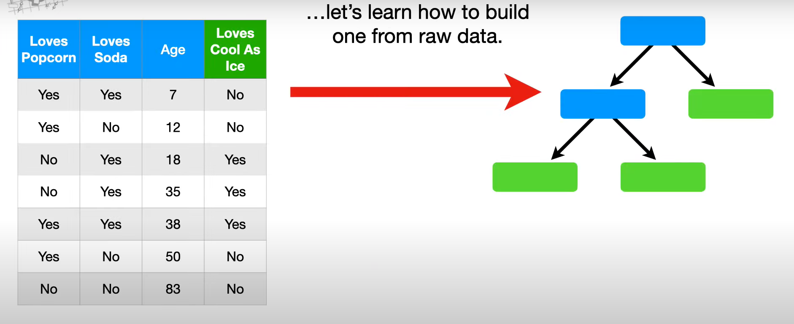
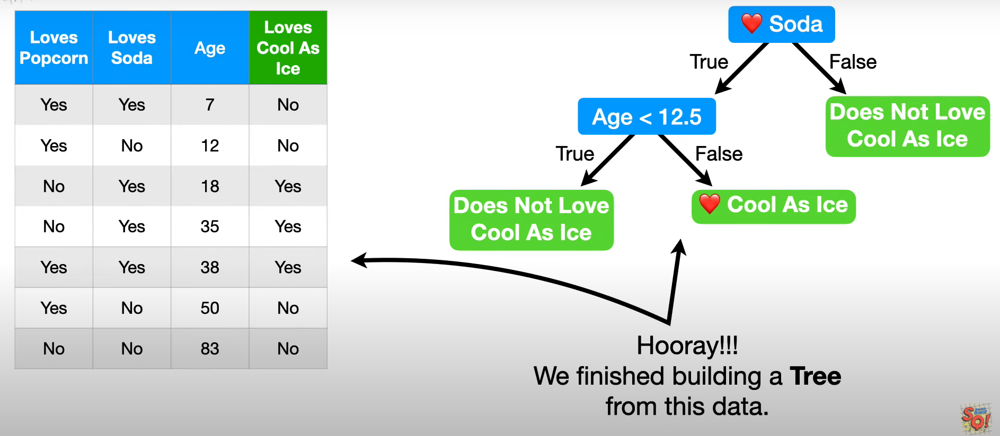
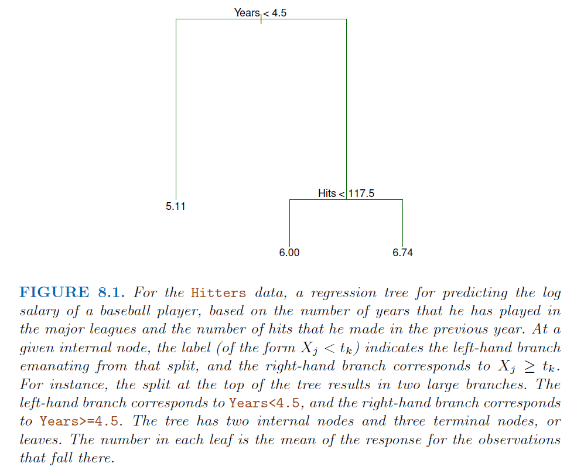
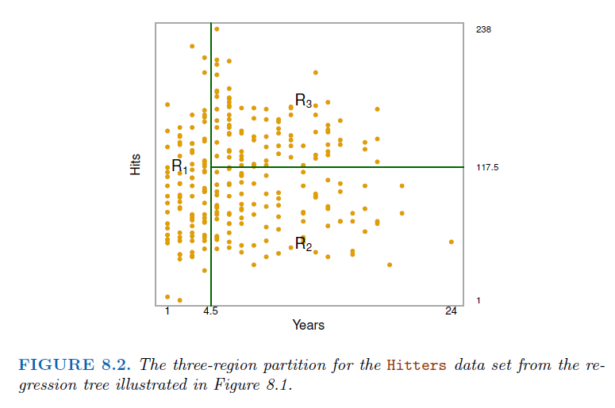
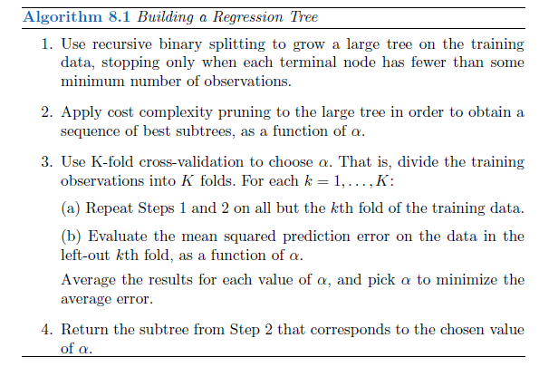
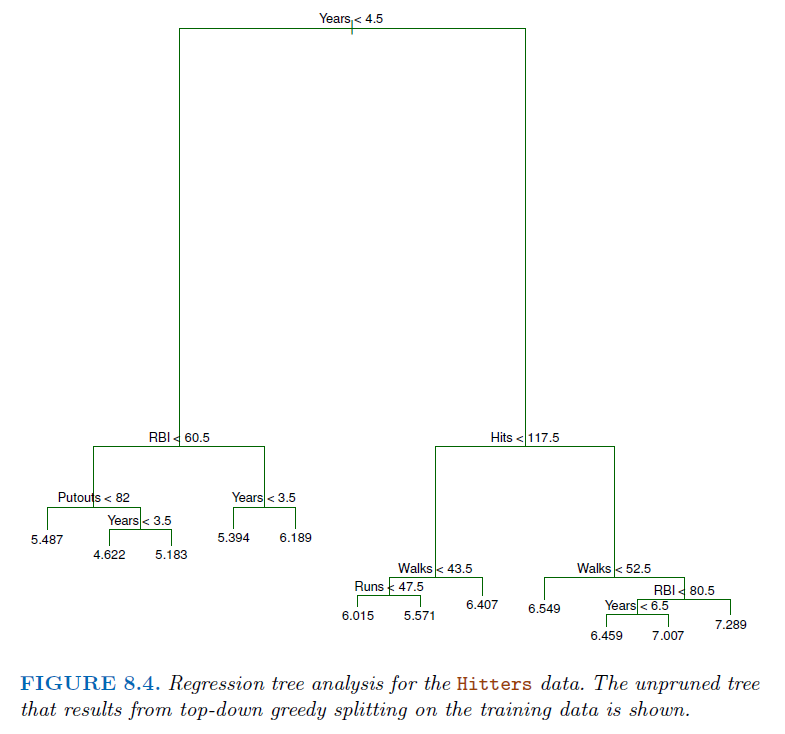
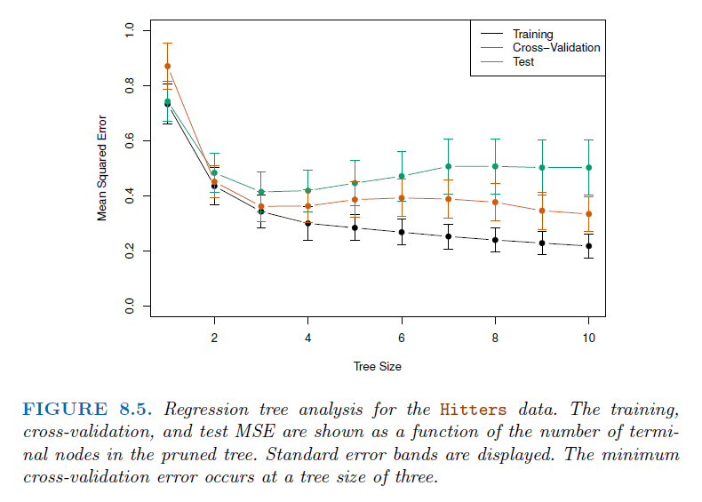
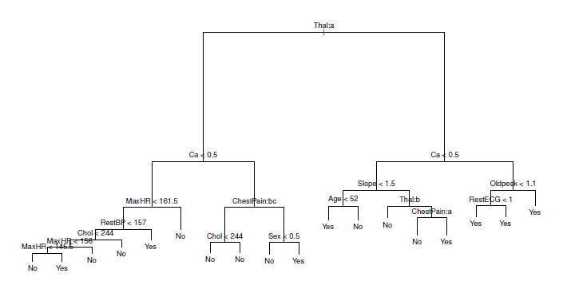
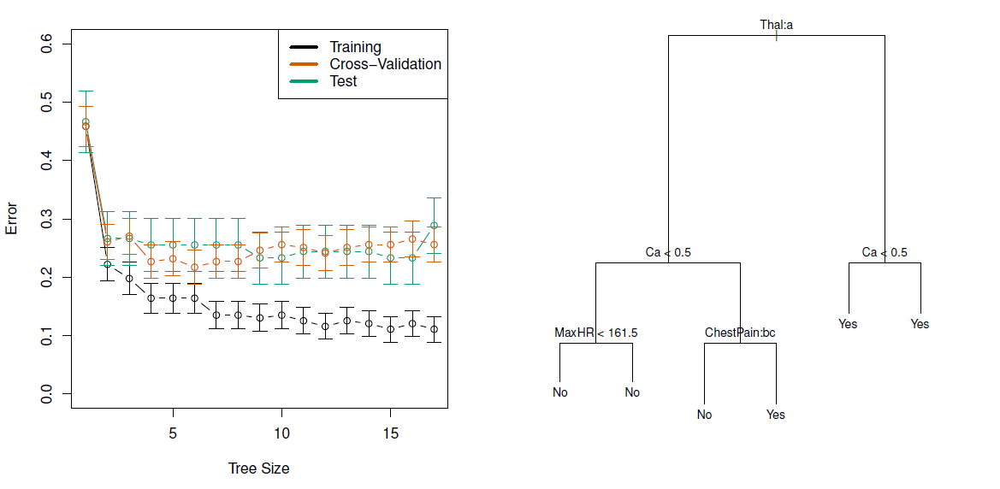
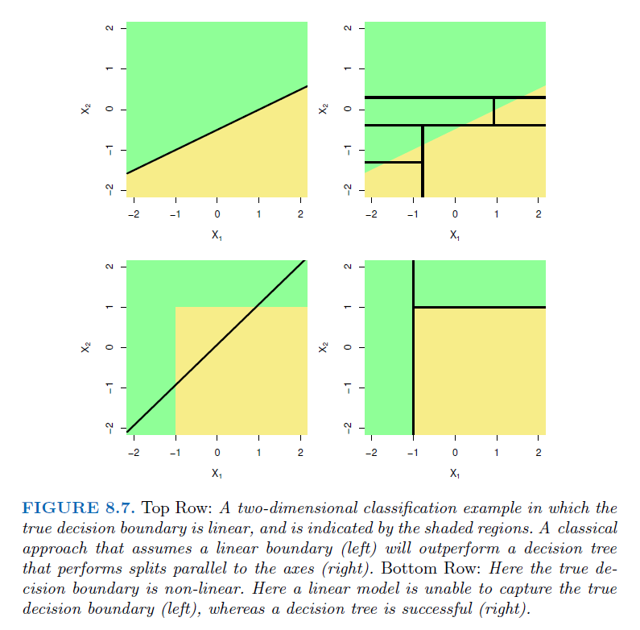

```{r setup, include=FALSE, fig.height=4, fig.width= 4, fig.align= 'center'}
knitr::opts_chunk$set(echo = T)
```

## Tree based tools in general

- Simple Tree based models
  * **Regression trees** (might be a competitor for linear regression)
  * **Classification Trees** (might be a competitor for logistic regression)
  * In general they are called as **CART algorithms**

- Bagging

- Random forests

- Boosting

- Gradient Boosting

- eXtreme Gradient Boosting (XGBoost)

- Bayesian additive regression trees

## Construction of Trees

- We will denote the feature space by $\mathbf{X}$. Normally it is a multidimensional Euclidean space. However, sometimes some variables may be categorical such as gender. **CART has the advantage of treating real variables and categorical variables in a unified manner**.

- The input vector $X \in \mathbf{X}$ is indicated by $X_{1:p}$ contains p features. 

- Tree-structured classifiers are constructed by repeated splits of the space $X$ into smaller and smaller subsets, beginning with $\mathbf{X}$ itself.

- Necessary terms: **node**, **terminal node (leaf node)**, **parent node**, **child node**.

- One thing that we need to keep in mind is that the **tree represents the recursive splitting of the space**. Therefore, every node of interest corresponds to one region in the original space. **Two child nodes will occupy two different regions** and if we put the two together, we get the same region as that of the parent node.

- In the end, **every leaf node is assigned with a class and a test point is assigned with the class of the leaf node** it lands in.

## Illustration


## An Example from Scratch ! (Classification Tree) 

{width=50%}

Key: Gini Impurity

## Finally !

{width=50%}

For details, please have a look at the recorded videos for Week 8 !!!

## Regression Trees

**Predicting Baseball Players’ Salaries** Using Regression Trees example is considered for the motivation,

- We use the Hitters data set to predict a baseball player’s Salary based on
Years and Hits

- We first remove observations that are missing Salary values, and log-transform Salary so
that its distribution has more of a typical bell-shape

- It consists of a series of splitting rules, starting at the top of the tree.

## Fitted Regression tree



- The top split assigns observations having Years<4.5 to the left branch

- Both Years and Hits are integers in these data; the **tree()** function in R labels
the splits at the midpoint between two adjacent values

## Splitting Details



Overall, the tree stratifies or segments the players into three regions of predictor space: 
- players who have played for four or fewer years, 

- players who have played for five or more years and who made fewer than 118 hits last year, 

- and players who have played for five or more years and who made at least 118 hits last year

## Some details and Interpretation

- In keeping with the tree analogy, the regions $R_1$, $R_2$, and $R_3$ are known
as terminal nodes or leaves of the tree

- As is the case for Figure 8.1, decision trees are typically drawn upside down, in the sense that the leaves are at the bottom of the tree

- The points along the tree where the predictor space is split are referred to as internal nodes (by $Years<4.5$ and $Hits<117.5$)

- We refer to the segments of the trees that connect the nodes as branches

- Years is the most important factor in determining Salary, and players with
less experience earn lower salaries than more experienced players

- Given that a player is less experienced, the number of hits that he made in the
previous year seems to play little role in his salary

- But among players who have been in the major leagues for five or more years, the number of hits made in the previous year does affect salary, and players who made more
hits last year tend to have higher salaries

## Prediction via Stratification of the Feature Space

Roughly speaking, there are two steps.

- We divide the predictor space — that is, the set of possible values
for $X_1, X_2, \ldots, X_p$ — into J distinct and non-overlapping regions,
$R_1,R_2, \ldots, R_J$.

- For every observation that falls into the region $R_j$, we make the same
prediction, which is simply the mean of the response values for the
training observations in $R_j$

- We obtain two regions, $R_1$ and $R_2$, and that the response mean of the training observations in the first region is 10, while the response mean of the training observations 
in the second region is 20. Then for a given observation $X = x$, if $x \in R_1$ we will predict
a value of 10, and if $x \in R_2$ we will predict a value of 20.

Next Question: How do we construct the regions $R_1, \ldots, R_J$ ?

## About Finding regions

- In theory, the regions could have any shape. However, we choose to divide the predictor space into high-dimensional rectangles, or boxes, for simplicity and for ease of interpretation of the resulting predictive model.

- The goal is to find boxes $R_1, \ldots, R_J$ that minimize the RSS, given by

$\sum_{j=1}^{J} \sum_{i \in R_j}^{}(y_i - \hat{y}_{R_j})^2$ where $\hat{y}_{R_j}$ is the mean response for the training observations within the $j$'th box

- Unfortunately, it is computationally infeasible to consider every
possible partition of the feature space into J boxes

- For this reason, we take a top-down, greedy approach that is known as **recursive binary splitting**
  * It is top-down because it begins at the top of the tree (at which point all observations belong to a single region) and then successively splits the predictor space; each split is indicated via two new branches further down on the tree
  * It is greedy because at each step of the tree-building process, the best split is made at that particular step, rather than looking ahead and picking a split that will lead to a better tree in some future step
 
## Steps of recursive binary splitting

- We first select the predictor $X_j$ and the cutpoint $s$ such that splitting the predictor space into the regions ($\{ X |X_j <s\}$ and $\{ X |X_j \geq s\}$) leads to the greatest possible reduction in RSS

- The notation $\{ X |X_j <s\}$ means that the region of predictor space in which $X_j$ takes on a value less than $s$

- That is, we consider all predictors $X_1, \ldots, X_p$, and all possible values of the cutpoint $s$ for each of the predictors, and then choose the predictor and cutpoint such that the resulting tree has the lowest RSS.

- In greater detail, for any $j$ and $s$, we define the pair of half-planes, 

$R_1(j,s) = \{ X |X_j <s\}$ and  $R_2(j,s) = \{ X |X_j \geq s\}$

and we seek the value of $j$ and $s$ that minimize the equation

$\sum_{x_i \in R_1(j,s)}^{}(y_i - \hat{y}_{R_1})^2 + \sum_{x_i \in R_2(j,s)}^{}(y_i - \hat{y}_{R_2})^2$ 

where $\hat{y}_{R_1}$, $\hat{y}_{R_2}$ is the mean response for the training observations in 
$R_1(j,s)$, $R_2(j,s)$ respectively

- Finding the values of $j$ and $s$ can be done quite quickly, especially when the number of features $p$ is not too large.

- Next, we repeat the process, looking for the best predictor and best
cutpoint in order to split the data further so as to minimize the RSS within
each of the resulting regions. However, this time, instead of splitting the
entire predictor space, we split one of the two previously identified regions.
We now have three regions

- Again, we look to split one of these three regions further, so as to minimize the RSS. The process continues until a stopping criterion is reached; for instance, we may continue until no region contains more than five observations

- Once the regions $R_1, \ldots, R_J$ have been created, we predict the response for a given test observation using the mean of the training observations in the region to which that test observation belongs

## Tree Pruning

- The process described above may produce good predictions on the training
set, but is likely to overfit the data, leading to poor test set performance.

- This is because the resulting tree might be too complex. A smaller tree
with fewer splits (that is, fewer regions $R_1, \ldots, R_J$) might lead to lower
variance and better interpretation at the cost of a little bias. 

- One possible alternative to the process described above is to build the tree only so long
as the decrease in the RSS due to each split exceeds some (high) threshold.

- This strategy will result in smaller trees, but is too short-sighted since a
seemingly worthless split early on in the tree might be followed by a very
good split—that is, a split that leads to a large reduction in RSS later on.

- Therefore, a better strategy is to grow a very large tree $T_0$, and then
prune it back in order to obtain a sub-tree

**Question:** How do we determine the best way to prune the tree?

**Goal:** is to select a sub-tree that leads to the lowest test error rate.

## How to prune ? 

- Given a sub-tree, we can estimate its test error using cross-validation or the validation set approach. 

- However, estimating the cross-validation error for every possible subtree would be too
cumbersome, since there is an extremely large number of possible subtrees.

- Instead, we need a way to select a small set of sub-trees for consideration

- Cost complexity pruning—also known as weakest link pruning—gives us a way to do just this

- Rather than considering every possible sub-tree, we consider a sequence of trees indexed by a nonnegative tuning parameter $\alpha$. For each value of $\alpha$ there corresponds a subtree $T \subset T_0$ such that 

$\sum_{m=1}^{|T|} \sum_{x_i \in R_m}^{} (y_i - \hat{y}_{R_m})^2 + \alpha |T|$

is as small as possible.

<!-- ## How to ?  -->
- Here $|T|$  indicates the number of terminal nodes of the tree T, $R_m$ is the rectangle corresponding to the $m$'th terminal node, and $\hat{y}_{R_m}$ is the predicted response
associated with $R_m$ — that is, the mean of the training observations in $R_m$.

- The tuning parameter $\alpha$ controls a trade-off between the subtree’s complexity
and its fit to the training data. 

- When $\alpha=0$, then the subtree T will simply equal $T_0$, because it just measures the training error. 

- However, as $\alpha$ increases, there is a price to pay for having a tree with
many terminal nodes, and so the quantity above will tend to be minimized for a smaller subtree

- It turns out that as we increase $\alpha$ from zero, branches get pruned from the tree in a nested and predictable fashion, so obtaining the whole sequence of subtrees as a function of
$\alpha$ is easy. We can select a value of $\alpha$ using a validation set or using cross-validation. We then return to the full data set and obtain the subtree corresponding 
to $\alpha$. 

## Main Scheme



For Hitters Data 

- We randomly divided the data set in half, yielding 132 observations in the training set
and 131 observations in the test set. 

- We then built a large regression tree on the training data and varied $\alpha$ in order to create subtrees with different numbers of terminal nodes. 

- Finally, we performed six-fold cross validation in order to estimate the cross-validated MSE of the trees as a function of $\alpha$.

## Unprunned Tree



## CV details 



- The CV error is a reasonable approximation of the test error: the CV error takes on its
minimum for a three-node tree, while the test error also dips down at the
three-node tree

- Note that although CV error is computed as a function of $\alpha$, it is convenient to display the result as a function of $|T|$, the number of leaves; this is based on the relationship between $\alpha$ and $|T|$ in the original tree grown to all the training data.

## Classification Trees

- A classification tree is very similar to a regression tree, except that it is
used to predict a qualitative response rather than a quantitative one. 

- Recall that for a regression tree, the predicted response for an observation is
given by the mean response of the training observations that belong to the
same terminal node. 

- In contrast, for a classification tree, we predict that each observation belongs to the most commonly occurring class of training observations in the region to which it belongs. 
- In interpreting the results of a classification tree, we are often interested not only in the class prediction corresponding to a particular terminal node region, but also in the class
proportions among the training observations that fall into that region

- Just as in the regression setting, we use recursive binary splitting to grow a classification tree. However, in the classification setting, RSS cannot be used as a criterion for making the binary splits.

## Mathematical Notation

A natural alternative to RSS is the classification error rate. Since we plan to assign an observation in a given region to the most commonly occurring class of training observations in that region, the classification error rate is simply the fraction of the training observations in that region that do not belong to the most common class

$E = 1 - max_k(\hat{p}_{mk})$

Here $\hat{p}_{mk}$ represents the proportion of training observations in the $m$'th
region that are from the $k$'th class. However, it turns out that classification error is **not sufficiently sensitive for tree-growing**, and in practice two other measures are preferable.

- Gini Index

- Entropy

## Other measures

- The Gini index is defined by

$G = \sum_{k=1}^{K} \hat{p}_{mk}(1-\hat{p}_{mk})$ 

a measure of total variance across the K classes. 

- It is not hard to see that the Gini index takes on a small value if all of the $\hat{p}_{mk}$’s are close to zero or one. 

- For this reason the Gini index is referred to as a measure of node purity—a small value indicates that a node contains predominantly observations from a single class

- An alternative to the Gini index is entropy, given by

$D = - \sum_{k=1}^{K} \hat{p}_{mk}\log(\hat{p}_{mk})$

Since $0 ≤ \hat{p}_{mk} ≤ 1$, it follows that $0 ≤ −\hat{p}_{mk} log(\hat{p}_{mk})$

- One can show that the entropy will take on a value near zero if the $\hat{p}_{mk}$s are all near zero or near one

- Therefore, like the Gini index, the entropy will take on a small value if the $m$'th node is pure. In fact, it turns out that the Gini index and the entropy are quite similar numerically.

- While Building Trees, either the Gini index or the entropy are typically used to evaluate the quality of a particular split, since these two approaches are more sensitive to node purity than is the classification error rate.

- Any of these three approaches might be used when pruning the tree, but the classification error rate is preferable if prediction accuracy of the final pruned tree is the goal

## An Example 



## CV for Pruning



## Trees Versus Linear Models

- Regression and classification trees have a very different flavor from the more
classical approaches for regression and classification

- In particular, linear regression assumes a model of the form

$F(X) = \beta_0 + \sum_{j=1}^{p}X_j\beta_j$

whereas regression trees assume a model of the form

$F(X) = \sum_{m=1}^{M}c_m I_{X \in R_m}$

where $R_1 \ldots, R_m$ represent a partition of feature space.

Which model is better?

## Depends on the problem at hand

- If the relationship between the features and the response is well approximated by a linear model, then an approach such as linear regression will likely work well, and will outperform a method such as a regression tree that does not exploit this linear structure

- If instead there is a highly nonlinear and complex relationship between the features and the response as indicated, then decision trees may outperform classical approaches

## Visualization 



## Hands on session in R

- Regression trees

- Classification trees

## Fitting Classification Trees

The tree library is used to construct classification and regression trees.

```{r}
# install.packages("tree")
library(tree)
```

We first use classification trees to analyze the Carseats data set. In these
data, Sales is a continuous variable, and so we begin by recoding it as a
binary variable. We use the ifelse() function to create a variable, called
High, which takes on a value of Yes if the Sales variable exceeds 8, and
takes on a value of No otherwise

```{r, warning=F, message=F}
library(ISLR2)
attach(Carseats)
High <- factor(ifelse(Sales <= 8, "No", "Yes"))
High
```

```{r}
Carseats <- data.frame(Carseats , High)
```

## Fitting 

We now use the tree() function to fit a classification tree in order to predict.
High using all variables but Sales. The syntax of the tree() function is quite
similar to that of the lm() function.

```{r,warning= F}
tree.carseats <- tree(High ~. -Sales, Carseats)
# tree.carseats
summary(tree.carseats)
```

One of the most attractive properties of trees is that they can be
graphically displayed. We use the plot() function to display the tree structure,
and the text() function to display the node labels

```{r}
plot(tree.carseats)
text(tree.carseats , pretty = 0)
```

## Performance

In order to properly evaluate the performance of a classification tree on
these data, we must estimate the test error rather than simply computing
the training error. We split the observations into a training set and a test
set, build the tree using the training set, and evaluate its performance on the
test data. The predict() function can be used for this purpose. In the case
of a classification tree, the argument type = "class" instructs R to return
the actual class prediction

```{r}
set.seed(442)

train <- sample (1:nrow(Carseats), 200)
Carseats.test <- Carseats[-train, ]
# testing part
High.test <- High[-train]
tree.carseats <- tree(High ~. - Sales, Carseats, subset = train)

tree.pred <- predict(tree.carseats , Carseats.test , type = "class")
table(tree.pred, High.test)

```

Note that, if you re-run the predict() function then you might get slightly different
results, due to "ties"

## Pruning or not 

The function cv.tree() performs cross-validation in order to determine the optimal level of tree complexity; cost complexity pruning is used in order to select a sequence of trees for consideration. We use the argument FUN = prune.misclass in order to indicate that we want the
classification error rate to guide the cross-validation and pruning process,
rather than the default for the cv.tree() function, which is deviance

```{r}
set.seed(442)

cv.carseats <- cv.tree(tree.carseats , FUN = prune.misclass)
names(cv.carseats)
```

Despite its name, dev corresponds to the number of cross-validation errors.
<!-- The tree with 9 terminal nodes results in only 74 cross-validation errors -->

```{r}
par(mfrow = c(1, 2))

plot(cv.carseats$size , cv.carseats$dev, type = "b")
plot(cv.carseats$k, cv.carseats$dev, type = "b")
```

## Pruning or not

We now apply the prune.misclass() function in order to prune the tree to
obtain the nine-node tree

```{r}
prune.carseats <- prune.misclass(tree.carseats , best = 9)

plot(prune.carseats)
text(prune.carseats , pretty = 0)
```

How well does this pruned tree perform on the test data set?

```{r}
tree.pred <- predict(prune.carseats, Carseats.test, type = "class")
table(tree.pred , High.test)
```

## Playing with best input ?

If we increase the value of best, we obtain a larger pruned tree with lower
classification accuracy

```{r}
prune.carseats <- prune.misclass(tree.carseats , best = 14)
plot(prune.carseats)
text(prune.carseats , pretty = 0)

tree.pred <- predict(prune.carseats, Carseats.test, type = "class")
table(tree.pred , High.test)
# Compute model accuracy rate on test data
mean(tree.pred == Carseats.test$High)
```


## Some sources on Tree-based Methods

Packages

- https://cran.r-project.org/web/packages/tree/tree.pdf

- https://cran.r-project.org/web/packages/rpart/rpart.pdf

Further

- https://online.stat.psu.edu/stat508/lesson/11

- https://bookdown.org/mpfoley1973/supervised-ml/decision-trees.html#regression-tree

- https://data-flair.training/blogs/r-decision-trees/

- https://www.youtube.com/watch?v=_L39rN6gz7Y

- https://www.youtube.com/watch?v=g9c66TUylZ4

- https://www.youtube.com/watch?v=D0efHEJsfHo

Applications

- https://rpubs.com/minma/cart_with_rpart

- http://www.sthda.com/english/articles/35-statistical-machine-learning-essentials/141-cart-model-decision-tree-essentials/


