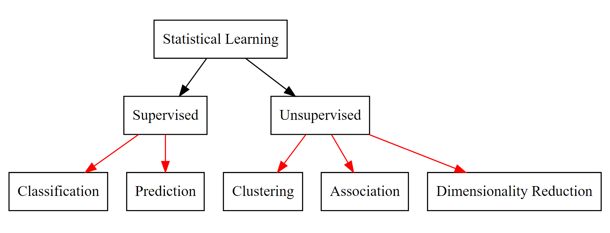
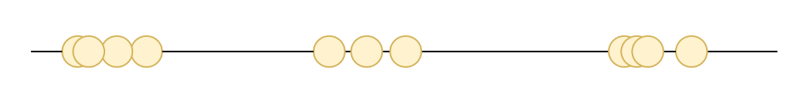
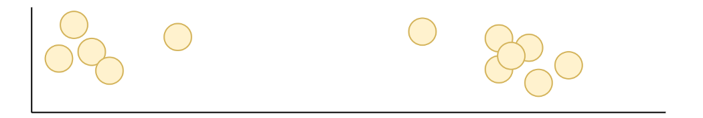
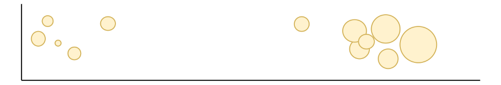
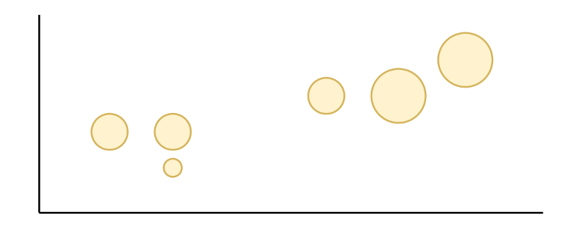
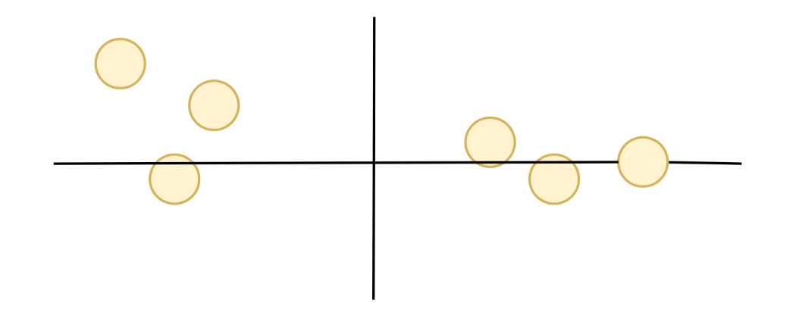
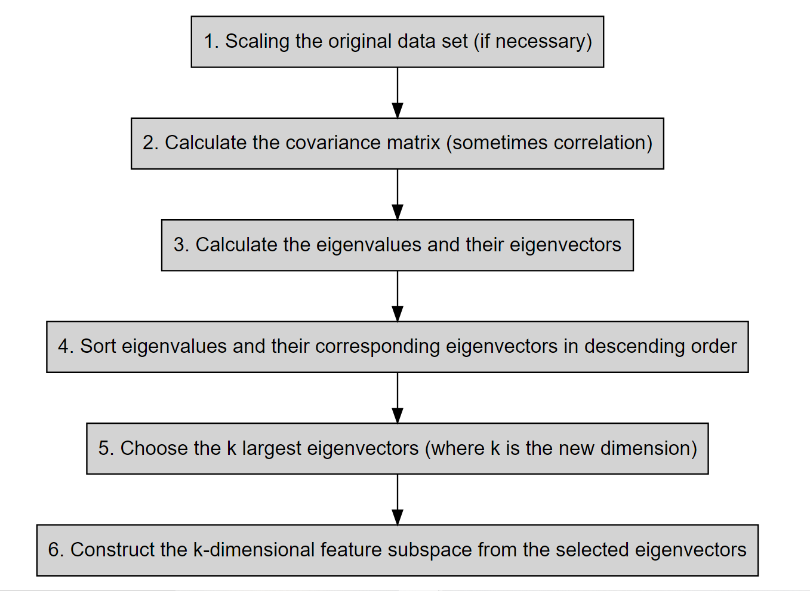
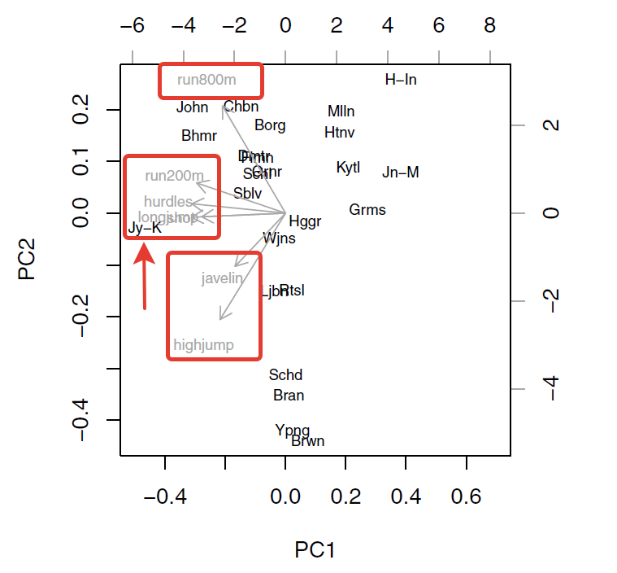
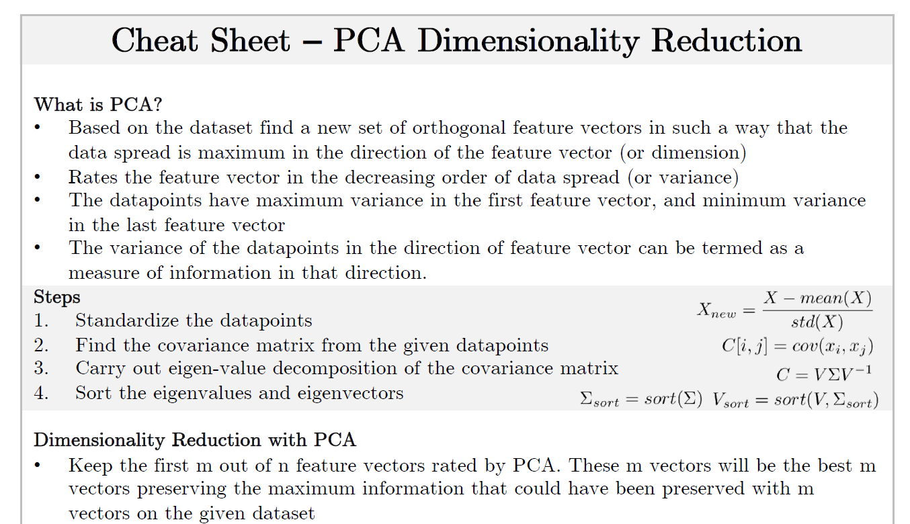

```{r setup, include=FALSE}
knitr::opts_chunk$set(echo = FALSE)
```

## The Big Picture

{width=75%}

## ABC of Unsupervised Learning

In unsupervised learning, no labels are provided, and the learning algorithm focuses solely on detecting structure in unlabelled input data. One generally differentiates between

- **Dimensionality reduction**, where the goal is to identify patterns in the features of the data. Dimensionality reduction is often used to facilitate visualisation of the data, as well as a pre-processing method before supervised learning.

- **Clustering**, where the goal is to find homogeneous subgroups within the data; the grouping is based on distance between observations.

Unsupervised Learning presents specific challenges and benefits:

* there is **no single goal**
* there is generally **much more unlabelled data available than labelled data**.

## Introduction

- As an unsupervised learning method, we are solely interested in **discovering interesting properties about the measurements** on $X_1, X_2, \ldots, X_p$ (feature space)

- These types of tools is often performed as **part of an exploratory data analysis**

- It is hard to assess the results obtained from unsupervised learning methods,
since there is **no universally accepted mechanism** and most importantly we don’t know the true answer (compared to supervised one)

- However, techniques for unsupervised learning are of **growing importance** in a number of diverse research fields

- We are **compressing the large amount of data sets** into a smaller one **without loosing too much information**

- Here, Principal Components Analysis (PCA) tool can be used for 
  * **data visualization** or 
  * **data pre-processing** before supervised techniques are applied
  
## Main Motivation

What happens when the given data set has too many variables ?

1. Do you want to reduce the number of variables, but aren’t able to identify variables to completely remove from consideration ?

2. Do you want to ensure your variables are independent of one another ?

"How do I take all of the variables I’ve collected and focus on only a few of them?" 

- In technical terms, you want to "reduce the dimension of your feature space." This technique is called "dimensionality reduction." 

- Most of the techniques to achieve the dimensionality reduction fall into two main classes:

1. Feature Elimination
2. **Feature Extraction**

Generally, **PCA** is one of the simplest and most robust ways of doing such dimensionality reduction

## Brief Summary

- PCA is one of the oldest of multivariate techniques, originally introduced by Pearson (1901) and independently by Hotelling (1933).

- But still alive since it is beneficial for displaying multivariate data in a lower dimensional space and exploiting a kind of simplification for other analyses

- A basic understanding of some **linear algebra** and **statistics** is essential to make it easy to understand PCA such as;
  * **vectors**
  * **eigenvectors**
  * **eigenvalues**
  * **variance**
  * **covariance**

- At a certain level, PCA is related to the mathematical technique, called **Singular Value Decomposition (SVD)**.

\textcolor{red}{ALERT: PCA is useful whenever the original variables are correlated; if the original variables are independent of one another a PCA cannot lead to any simplification}

## Geometrically Speaking

{width=50%}

{width=50%}


{width=50%}

What if we have $5$-dimension or more like $10$ or $100$ dimensions ? 

- Not just for the clustering, also visualization is a big problem

For further look at the geometry;

[https://setosa.io/ev/principal-component-analysis/](https://setosa.io/ev/principal-component-analysis/)

[https://www.youtube.com/watch?v=FgakZw6K1QQ](https://www.youtube.com/watch?v=FgakZw6K1QQ)

## Consider a simple 3D case (Recall Gene Data)

{width=50%}

{width=50%}

What if you had more than 3 dimensions, say 100 ?

- Calculate the **explained variance** of each PC by **comparing eigenvalues** and decide how many PCs to keep

- By definition, $PC_2$ explains less variance than $PC_1$, and $PC_3$ explains less variance than $PC_2$.

## Behind the Scenes ? 

{width=100%}

## Principal Component Analysis (PCA)

The basic goal of PCA is to describe variation in a set of correlated variables $\mathbf{X}^T = (X_1, \ldots, X_p)$ in terms of a new set of uncorrelated variables $\mathbf{Y}^T = (Y_1, \ldots, Y_p)$. Here, each of $y_i$ is a linear combination of $x$ variables, like

$$y_1 = w_{11}x_1 + \ldots + w_{1p}x_p$$
where the sample variance is largest for $y_1$ so it is our $PC_1$. Here, $y_1$ accounts for as much as possible variation in the original data amongst all linear combinations of $\mathbf{x}$

- By following the same process, one can obtain the all principal components, 
ie. $PC_i$ as $y_i$ for $i=1,\ldots, p$

- As a rule of thumb again (hopefully), the first few components will cover the substantial proportion of the variance in the original values. 

- We need a restriction on the set of coefficients, a sensible one is that the sum of squares of the coefficients should take the $w_1^T w_1 = \sum_{i=1}^{p} w_{1i}^2 = 1$ (normalized)

- $w_1^T$ refers to the loadings (loading coefficients) of $PC_1$  

## To find coefficients of $y_1$

- Choose the elements of the vector $w_1^T = (w_{11}, \ldots, w_{1p})$ so as to maximise the variance of $y_1$ subject to the sum of squares constraint, 
$w_1^T w_1 =1$

- The sample variance of $y_1$, as a linear function of $x$ variables given by $w_1^T S w_1$ where $S_{p \times p}$ stands for the sample covariance matrix of $\mathbf{x}$. 
- The method of **Lagrange multipliers** is used can be used to maximise a function of several variables subject to one or more constraints (for details, check Morrison (1990) and Jolliffe (2002))

- Lagrange multiplier method results in the solution of $w_1$ as the eigenvector (characteristic vector) of the $S$, corresponding to this matrix's largest eigenvalue (characteristic root)

- For $S_{p \times p}$ the corresponding eigenvalues $\lambda$ and eigenvectors $\gamma$ satisfy $$S \gamma = \lambda \gamma$$

## What about the second PC ? 

$$y_2 = w_{21}x_1 + \ldots + w_{2p}x_p = w_2^T \mathbf{x}$$

with $w_2^T = (w_{21}, \ldots, w_{2p})$ and having the largest variance subject to;

$w_2^T w_2 = \sum_{i=1}^{p} w_{2i}^2 = 1$ and $w_2^T w_1 = 0$

- Note that second constraint ensures that $y_2$ and $y_1$ are uncorrelated (orthogonal)

## 2D Example

Consider **headsize** data example for bivariate case! (You can look at the details of the data set from here https://astrostatistics.psu.edu/su07/R/html/boot/html/frets.html)

```{r, echo=F, warning=F, message=F}
library(tidyverse)
library(boot)
colnames(frets) = c("headlength1", "headbreadth1", "headlength2", "headbreadth2")
glimpse(frets)

```

Note that, the **head lengths** and **head breadths** (in millimetres) for each of the first two adult sons in **25 families**. But the focus is only **head lengths** !

```{r echo=T}
# Mean vector and the covariance matrix
head_dat <- frets[, c("headlength1", "headlength2")]
colMeans(head_dat)
cov(head_dat) # or var(head_dat)
```

Now, PC of this 2D data can be extracted from their covariance matrix by following;

```{r echo=T}
head_pca <- princomp(x = head_dat)
head_pca

summary(head_pca, loadings = T)
```

Here, 

- $PC_1$ accounts for a proportion of $0.86$ of the total variance in the original
variables. $PC_2$ stands for the remaining $0.14$ proportion of the total variance. 

- The obtained new variables are $y_1 = 0.693 x_1 + 0.721 x_2$ and $y_2 = 0.721 x_1 -0.693 x_2$

What is the mathematics behind it ? 

## PCA for bivariate data

- Assume that we have two variables $x_1, x_2$ (already scaled) and they have covariance matrix as $S = \left(\begin{array}{cccc}1 & s \\ s & 1 \end{array}\right)$.

- Then, we have, $det(S-\lambda I) = 0$ leading to a quadratic equation for finding eigenvalues

- Solve the formula $(1-\lambda)^2 - s^2 = 0$ and get the eigenvalues as 
$\lambda_1 = 1 + s$ and $\lambda_2 = 1 - s$. Note that, sum of the eigenvalues are $trace(S) = 2$. 

- Then, the corresponding eigenvector for $\lambda_1$ is obtained via solving 
$S \mathbf{w_1} = \lambda_1 \mathbf{w_1}$, that results in the equations;

$$\begin{array}{lll} (1+s)w_{11} & = & w_{11} + s w_{12} \\ (1+s)w_{12} & = & s w_{11} + w_{12}\\ \end{array}$$

- Results in $w_{11} = w_{12}$ and with the help of $w_1^T w_1 = 1$ we get $w_{11} = w_{12} = \frac{1}{\sqrt{2}}$

## PCA for bivariate data

- Similarly, one can derive, $w_{21} = \frac{1}{\sqrt{2}}$ and $w_{22} = - \frac{1}{\sqrt{2}}$

- Two orthogonal PCs are $y_1 = \frac{1}{\sqrt{2}} (x_1 + x_2)$ and $y_2 = \frac{1}{\sqrt{2}} (x_1 - x_2)$

- Note that, if $s < 0$, the order of eigenvalues and PCs is reversed ! If $s=0$, both $\lambda_1 = \lambda_2 = 1$ and any two right-angle solution could be chosen two represent two PCs!

- As further points; (i) it is customary to choose $w_{i1} > 0$ in $\mathbf{w}_i$ and (ii) the coefficients do not depend on $s$ whereas the proportion of variance explained by each does change with $s$. 

## More General (p-dimensional)

Suppose that we have a random vector $\textbf{X} = \left(\begin{array}{c} X_1\\ X_2\\ \vdots \\X_p\end{array}\right)$

with sample variance-covariance matrix $\text{var}(\textbf{X}) = \Sigma = \left(\begin{array}{cccc}\sigma^2_1 & \sigma_{12} & \dots &\sigma_{1p}\\ \sigma_{21} & \sigma^2_2 & \dots &\sigma_{2p}\\ \vdots & \vdots & \ddots & \vdots \\ \sigma_{p1} & \sigma_{p2} & \dots & \sigma^2_p\end{array}\right)$

We have the linear combinations as,

$\begin{array}{lll} Y_1 & = & w_{11}X_1 + w_{12}X_2 + \dots + w_{1p}X_p \\ Y_2 & = & w_{21}X_1 + w_{22}X_2 + \dots + w_{2p}X_p \\ & & \vdots \\ Y_p & = & w_{p1}X_1 + w_{p2}X_2 + \dots + w_{pp}X_p\end{array}$

where $Y_i$ is a function of our random data having the population variance as 

$\text{var}(Y_i) = \sum\limits_{k=1}^{p}\sum\limits_{l=1}^{p}w_{ik}w_{il}\sigma_{kl} = \mathbf{w}^T_i\Sigma\mathbf{w}_i$

and $(Y_i, Y_j)$ pair has the population covariance

$\text{cov}(Y_i, Y_j) = \sum\limits_{k=1}^{p}\sum\limits_{l=1}^{p}w_{ik}w_{jl}\sigma_{kl} = \mathbf{w}^T_i\Sigma\mathbf{w}_j$

with the loading coefficients defined as $\mathbf{w}_i = \left(\begin{array}{c} w_{i1}\\ w_{i2}\\ \vdots \\ w_{ip}\end{array}\right) = (w_{i1}, \ldots, w_{ip})^T$

## Notation for any PC

Select the values of $\mathbf{w}_i = (w_{i1}, \ldots, w_{ip})^T$ to maximize,

$\text{var}(Y_i) = \sum\limits_{k=1}^{p}\sum\limits_{l=1}^{p}w_{ik}w_{il}\sigma_{kl} = \mathbf{w}^T_i\Sigma\mathbf{w}_i$

subject to the following list of constraints,

$$\mathbf{w}^T_i\mathbf{w}_i = \sum\limits_{j=1}^{p}w^2_{ij} = 1$$

$$\text{cov}(Y_j, Y_i) = \sum\limits_{k=1}^{p}\sum\limits_{l=1}^{p}w_{jk}w_{il}\sigma_{kl} = \mathbf{w}^T_j\Sigma\mathbf{w}_i = 0$$

for $j = 1, \ldots, i-1$ for ensuring to get uncorrelated PCs.

## How do we apply PCA ?

{width=60%}

## Another Example 

```{r, echo= T, warning=F, message=F}
#load data
data("USArrests")
# dimension of the data set
dim(USArrests)
#view first six rows of data
head(USArrests)

#perform PCA
results <- prcomp(USArrests, scale = TRUE)
summary(results)
```

```{r}
#calculate total variance explained by each principal component
var_explained = results$sdev^2 / sum(results$sdev^2)

#create scree plot
library(ggplot2)

qplot(c(1:4), var_explained) + 
  geom_line() + 
  xlab("Principal Component") + 
  ylab("Variance Explained") +
  ggtitle("Scree Plot") +
  ylim(0, 1) + theme_bw()
```


## Interpretation

- If the $p$ eigenvalues of $S$ are denoted by $\lambda_{1:p}$, it can be shown that the variance of the $i$th principal component is given by $\lambda_i$

- The total variance of the $p$ PCs will equal the total variance of the original
variables so that $\sum_{i=1}^{p} \lambda_i = s_1^2 + \ldots s_p^2 = trace(S)$ where $s_i^2$ is the sample variance of $x_i$

- Here, the $i$th PC denotes a proportion $P_i$ of the total variation of the original data,  $P_i = \frac{\lambda_i}{\sum_{i=1}^{p} \lambda_i}$

- Similarly, if we focus on the first $m$ PCs, where $m < p$, we have 
$P^{(m)} = \frac{\sum_{i=1}^{m} \lambda_i}{\sum_{i=1}^{p} \lambda_i}$

- If the observations fit exactly into a subspace of $m$-dimensions, it migth be an indication for the presence of $p-m$ zero eigenvalues of the $S$. This would imply the presence of $p-m$ linear relationships between the variables (sometimes referred to as **structural relationships**)

## About Next Steps

Now, we will dive more into,

- When PCs should be extracted from correlation matrix rather than covariance ?

- Importance of rescaling of PCs 

- Some practical representation of PCs like **biplot**

- More examples on different data sets

## Correlation versus Covariance matrix

- One of the important issues about PCA is being not scale invariant that results in some problems. 

- When are considering a set of multivariate data where the variables are of completely
different types, such as length, temperature, blood pressure, or anxiety rating, the structure of the PCs derived from the covariance matrix will depend upon the essentially **arbitrary choice of units of measurement**
  * ie. changing the length from centimetres to inches will alter the derived components
  * if there exists large differences among the variances of the original variables, then those whose variances are largest will tend to dominate the early components

- This brings us to the fact that PCs should be extracted from the sample covariance matrix when all the original variables **roughly on the same scale**. But this is not so common so to overcome this issue, we need to stick to the use of Correlation Matrix ($\mathbf{R}$)

- Since, extracting the components as the eigenvectors of $\mathbf{R}$ is equivalent to calculating the PCs from the original variables after standardising each of them to have a unit variance

REMARK: There is rarely any simple correspondence between the
components derived from $\mathbf{S}$ and those derived from $\mathbf{R}$. For this reason, choosing to work with $\mathbf{R}$ rather than with $\mathbf{S}$ involves a definite but arbitrary decision to make variables **equally important**.

## Importance of rescaling

- The coefficients of the PCs derived as described before are often rescaled so that they are correlations or covariances between the original variables and the derived components.

- This is important and useful for interpreting the coefficients obtained in PCA

The covariance of $i$th with component $j$th is given as $Cov(x_i, y_j) = \lambda_j w_{ji}$ and the corresponding correlation is defined by $r_{(x_i, y_j)} = \frac{\lambda_j w_{ji}}{\sqrt{Var(x_i) Var(y_j)}} = \frac{\lambda_j w_{ji}}{s_i\sqrt{\lambda_j}} = \frac{w_{ji}\sqrt{\lambda_j}}{s_i}$

- Note that when the PCs are extracted by using correlation matrix, we have $r_{(x_i, y_j)}=w_{ji}\sqrt{\lambda_j}$ where the sample st.dev. is unity ($s_i = 1$) 

- The derived rescaled coefficients from a PCA of a correlation matrix are analogous to factor loadings, that we will talk about later

## About the Number of Components

- The question is how many components do we need at the end ?
  * Retain just enough components to explain some specified large percentage
of the total variation of the original variables. (around  $70\% - 90\%$), but smaller values are possible if $p \uparrow$ or $n \uparrow$
  * Exclude those principal components whose eigenvalues are less than the average, given by $\sum_{i=1}^{p} \frac{\lambda_i}{p}$ where the $\sum_{i=1}^{p} \lambda_i = trace(S)$
  * When the components are extracted from the correlation matrix $R$, $trace(R) = p$, and the average variance is therefore one can exclude the components with eigenvalues less than
one (Kaiser, 1958) or a more appropriate procedure is to exclude components extracted
from a $R$ whose $\lambda_i < 0.7$ (Jollie, 1972)
  * Cattell (1966) suggested the examination of the plot of $(\lambda_i, i)$ the so called 
*scree diagram*. The number of components selected is the value of $i$ corresponding to an **elbow** in the curve (a change of slope from **steep** to **shallow**)
  * A modification of the **scree digram** described for the log-eigenvalue diagram consisting of a plot of $(\log(\lambda_i), i)$ (Farmer, 1971)
  
## Calculating PCA scores

- After deciding the number of PCs, say m, principal components to adequately represent
our data, one can calculate the scores on each of these components for each individual in our sample

Suppose we have derived PCs from $S$ matrix, then the $m$ PCs scores for individual $i$ with original $p\times 1$ vector of variable values $x_i$ are obtained as;

$\left(\begin{array}{cccc} y_{i1} = \mathbf{w}_1^T \mathbf{x}_i \\ y_{i2} = \mathbf{w}_2^T \mathbf{x}_i \\ \vdots \\ y_{im} = \mathbf{w}_m^T \mathbf{x}_i \end{array}\right)$

- If the components are derived from the correlation matrix ($\mathbf{R}$), then $x_i$ would
contain individual $i$'s standardised scores for each variable

- The PCs scores calculated as above have variances equal to $\lambda_j$ for 
$j = 1, \ldots, m$ and the scores with mean zero and variance equal to unity can be defined as 
$$\mathbf{z} = \Lambda_{m}^{-1} W_{m}^T \mathbf{x}$$ where 

- $\Lambda_{m}$ is an $m\times m$ diagonal matrix with $\lambda_{1:m}$ on the main diagonal,

- $W_{m} = (w_1, \ldots, w_m)$ and $\mathbf{x}$ is the $p \times 1$ vector of standardised scores

- Note that the first $m$ PCs scores are the same whether we retain all possible $p$ components or just the first $m$ of them.

## About biplot and its importance

- A **biplot** is a graphical representation of the information in an $n\times p$ data matrix including the information about the variances and covariances of the variables and the distances

- PCs scores and loading vectors are on different scales, but we can rescale these two and overlay them on one single plot (this is biplot).

- The technique is based on the singular value decomposition of a matrix (see Gabriel 1971). 
- In general, this plot can be obtained from eigenvalues and eigenvectors of the covariance matrix as,

$\mathbf{X}_2 = (p_1, p_2) \left(\begin{array}{cccc}\sqrt{\lambda_1} & 0 \\ 0 & \sqrt{\lambda_2} \end{array}\right) \left(\begin{array}{cccc} \gamma_1^T \\ \gamma_2^T\end{array}\right)$

where $\mathbf{X}_2$: rank two approximation of the data matrix $\mathbf{X}$, $\lambda_1, \lambda_2$: the first two eigenvalues of the matrix $n\mathbf{S}$, $\gamma_1, \gamma_2$: the corresponding eigenvectors with the definition of $p_i$'s as follows;

$p_i = \frac{1}{\lambda_i} \mathbf{X}\gamma_i$ for $i=1,2$

- Equivalently saying, the biplot is the plot of the n rows of $\sqrt{n} (p_1, p_2)$ and the $p$-rows of $n^{-1/2} (\lambda_1 \gamma_1, \lambda_2 \gamma_2)$ represented as vectors.

- The distance between the points representing the units reflects the generalised distance between the units, the length of the vector from the origin to the coordinates representing
a particular variable denotes the variance of that variable, and the correlation of two variables is showed by the angle between the two corresponding vectors for the two variables (the smaller the angle, the greater the correlation)

## biplot Example

{width=40%}
Source: The biplot for the heptathlon data omitting the PNG competitor (Everitt, B., and Hothorn, T)

Note that, 

- The orientation (direction) of the vector, with respect to the principal component space, in particular, its angle with the principal component axes: the more parallel to a principal component axis is a vector, the more it contributes only to that PC.

- The length in the space; the longer the vector, the more variability of this variable is represented by the two displayed principal components; short vectors are thus better represented in other dimension.

- The angles between vectors of different variables show their correlation in this space: small angles represent high positive correlation, right angles represent lack of correlation, opposite angles represent high negative correlation.

## Interpretations: 

1. The plot above shows that the winner of the gold medal, *Jackie Joyner-Kersee*

2. The results of the 200 m, the hurdles and the long jump are highly correlated, as are 
the results of the javelin and the high jump

3. The 800 m time has relatively small correlation with all the other events and is almost uncorrelated with the high jump and javelin results

4. Additionally, roughly speaking, 200 m, the hurdles and the long jump are the most important variables in $PC_1$.

5. The $PC_1$ largely separates the competitors by their overall score, with the second indicating which are their best events; 
  * ie., John, Chbn, and Bhmr are placed near the end of the vector of the 800 m event since it indicates roughly, the event in which they give their best performance
  
## Quick reminder 

PCA ADVANTAGES

- Useful for dimension reduction for high-dimensional data analysis
- Helps reduce the number of predictor items using principal components
- Helps to make predictor items independent & avoid multicollinearity problem
- Allows interpretation of many variables using a 2-dimensional biplot

PCA DISADVANTAGES

- Data standardization is a must before doing PCA
- Prediction models are less interpretable.
- Trade-off between Information Loss and the dimensionality reduction (the number of PCs should be selected carefully)

## Cheat Sheet for PCA

{width=50%}

## Hands on with R

The data set example for eight blood chemistry variables measured on 72 patients in
a clinical trial (Jolliffe, 2002)

```{r}
bc <- c(
 0.290,           
 0.202,  0.415,       
-0.055,  0.285,  0.419,       
-0.105, -0.376, -0.521, -0.877,      
-0.252, -0.349, -0.441, -0.076,  0.206,
-0.229, -0.164, -0.145,  0.023,  0.034,  0.192,
 0.058, -0.129, -0.076, -0.131,  0.151,  0.077,  0.423)
blood_sd <- c(rblood = 0.371, plate = 41.253,  wblood = 1.935,
              neut = 0.077, lymph = 0.071, bilir = 4.037,
              sodium = 2.732, potass = 0.297)
blood_corr <- diag(length(blood_sd)) / 2
blood_corr[upper.tri(blood_corr)] <- bc

blood_corr <- blood_corr + t(blood_corr)
blood_cov <- blood_corr * outer(blood_sd, blood_sd, "*")
```

```{r}
# Correlation matrix
blood_corr
# Covariance matrix
blood_cov
```

Note that there are considerable differences between these standard deviations

## PCA with Covariance matrix

```{r}
blood_pcacov <- princomp(covmat = blood_cov)
summary(blood_pcacov, loadings = TRUE)

```

```{r}
results <- prcomp(bc, scale = TRUE)
summary(results)

results <- prcomp(bc)
summary(results, loadings = TRUE)

```

## PCA with Correlation matrix

```{r}
blood_pcacor <- princomp(covmat = blood_corr)
summary(blood_pcacor, loadings = TRUE)
```

```{r}
plot(blood_pcacor$sdev^2, xlab = "Component number",
 ylab = "Component variance", type = "l", main = "Scree diagram")
```

```{r}
blood_pcacor <- prcomp(bc)
summary(blood_pcacor)
```


## Another Example

**USArrests data set**, which is part of the base R package. The rows of the data set contain the 50 states, in alphabetical order.

```{r}
states <- row.names(USArrests)
states

names(USArrests)

apply(USArrests , 2, mean)
apply(USArrests , 2, var)
```

REMARK: If we failed to scale the variables before performing PCA, then most of the principal components that we observed would be driven by the Assault variable

## Perform PCA using the prcomp() function

```{r}
pr.out <- prcomp(USArrests , scale = TRUE)
names(pr.out)

summary(pr.out)
# The center and scale components correspond to the means and standard
# deviations of the variables
pr.out$center
pr.out$scale

# The rotation matrix provides the principal component loadings
pr.out$rotation
```

Note that there are four distinct PCs. This is natural since there are in general 
$min(n − 1, p)$ informative PCs in a data set with $n$ observations and $p$ variables

```{r}
# That is, the kth column is the kth principal component score vector
dim(pr.out$x)
head(pr.out$x)
```

## Both scree and biplot

```{r}
# Scree plot 
plot(pr.out)
# biplot 
biplot(pr.out , scale = 0)
```

## About explained variance

The prcomp() function also outputs the standard deviation of each principal
component and the corresponding explained variance by each PC

```{r}
pr.out$sdev
pr.var <- pr.out$sdev^2
```

To compute the proportion of variance explained by each PC, simply we have a division to get

```{r}
pve <- pr.var / sum(pr.var)
pve
```

We can plot the PVE explained by each component, as well
as the cumulative PVE, as follows

```{r}
par(mfrow = c(1, 2))
plot(pve , xlab = "Principal Component",
ylab = "Proportion of Variance Explained", ylim = c(0, 1),
type = "b")

plot(cumsum(pve), xlab = "Principal Component",
ylab = "Cumulative Proportion of Variance Explained",
ylim = c(0, 1), type = "b")
```

## To watch PCA in youtube 

- https://www.youtube.com/watch?v=FgakZw6K1QQ&t=92s

- https://www.youtube.com/watch?v=oRvgq966yZg


## List of Sources

- Everitt, B., and Hothorn, T. (2011). An Introduction to Applied Multivariate Analysis with R. Springer.

- James, G., Witten, D., Hastie, T., Tibshirani, R. (2021). An Introduction to Statistical Learning with Applications in R. Springer

Further examples in R

- https://rdrr.io/cran/MVA/src/demo/Ch-PCA.R

- https://www.math.hkbu.edu.hk/~hpeng/Math3806/PrincipalComponent.html

- https://lgatto.github.io/IntroMachineLearningWithR/unsupervised-learning.html#principal-component-analysis-pca

- https://bradleyboehmke.github.io/HOML/pca.html

- https://www.geo.fu-berlin.de/en/v/soga/Geodata-analysis/Principal-Component-Analysis/principal-components-basics/Interpretation-and-visualization/index.html#:~:text=Interpreting%20Biplots,in%20a%20single%20biplot%20display.&text=The%20plot%20shows%20the%20observations,principal%20components%20(synthetic%20variables).


