```{r setup, include=FALSE}
knitr::opts_chunk$set(echo = T)
```

## The Big Picture

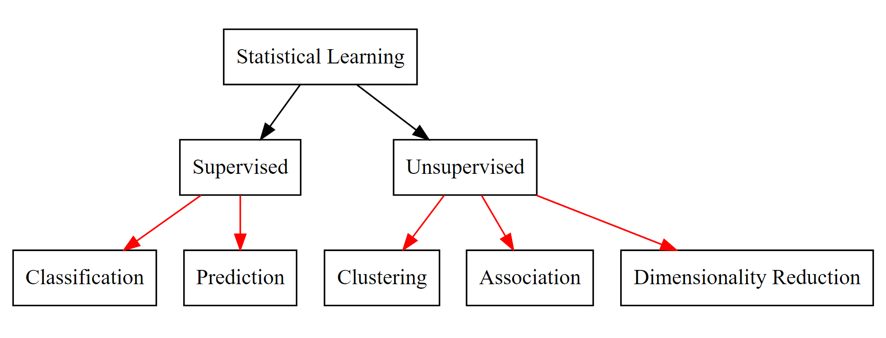{width=75%}

## Clustering ?

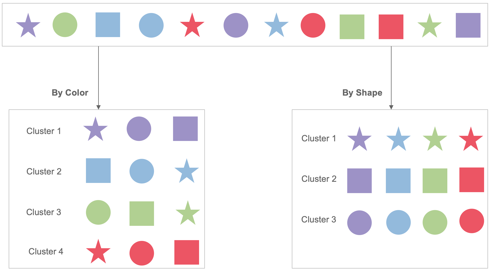{width=50%}

What else can you suggest ?? 

## Some types of Clustering

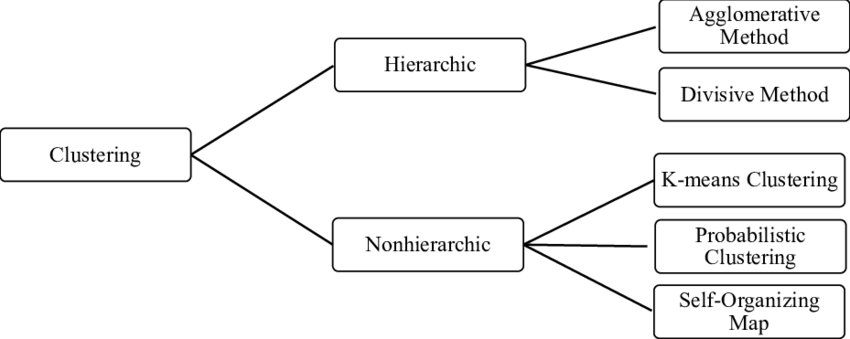

Source: https://www.researchgate.net/publication/336903036_Clustering_analysis_application_on_Industry_40-driven_global_indexes

## Where we can use ? 

1. Identifying Fake News

2. Spam filter

3. Marketing and Sales

4. Classifying network traffic

5. Identifying fraudulent or criminal activity 

6. Document analysis

7. Fantasy Football and Sports 

For further readings about these; 

https://datafloq.com/read/7-innovative-uses-of-clustering-algorithms/6224

## ABC of Clustering Algorithms

- Clustering refers to a **very broad set of techniques** for finding **subgroups, or
clusters**, in a data set

- When we cluster the observations of a data set, we seek **to partition them into distinct groups so that the observations within each group are quite similar to each other**, while observations in different groups are quite different from each other

- Of course, to make this concrete, we must define **what it means for two or more observations to be similar or different**

- Indeed, this is often a **domain-specific consideration** that must
be made based on knowledge of the data being studied


## Breast Cancer example

- Suppose that we have a set of n observations, each with p
features. The n observations could correspond to tissue samples for patients
with breast cancer, and the p features could correspond to measurements
collected for each tissue sample; these could be clinical measurements, such
as tumor stage or grade, or they could be gene expression measurements

- We may have a reason to believe that there is some heterogeneity among
the n tissue samples; for instance, perhaps there are a few different unknown
subtypes of breast cancer

- Clustering could be used to find these subgroups

- This is an unsupervised problem because we are trying to discover
structure—in this case, distinct clusters—on the basis of a data set.

## PCA versus Clustering 

- Both clustering and PCA seek to simplify the data via a small number of summaries, but their mechanisms are different:
  * PCA looks **to find a low-dimensional representation** of the observations
that explain a good fraction of the variance
  * Clustering looks **to find homogeneous subgroups** among the observations.
 
- Since clustering is popular in many fields, there exist a great number of clustering methods; our main interest is 
  * **K-means clustering**: we seek to partition the observations into a pre-specified        number of clusters 
  * **Hierarchical clustering**: we do not know in advance how many clusters we want; 
  in fact, we end up with a tree-like visual representation of the observations, called       **dendrogram**

- There are advantages and disadvantages to each of these clustering approaches, which we highlight

## K-Means Clustering

- K-means clustering is a **simple and elegant** approach for partitioning a
data set into **K distinct, non-overlapping clusters**

- To perform K-means clustering, we must first specify the desired **number of clusters K**; then the K-means algorithm will assign each observation to exactly one of the K
clusters

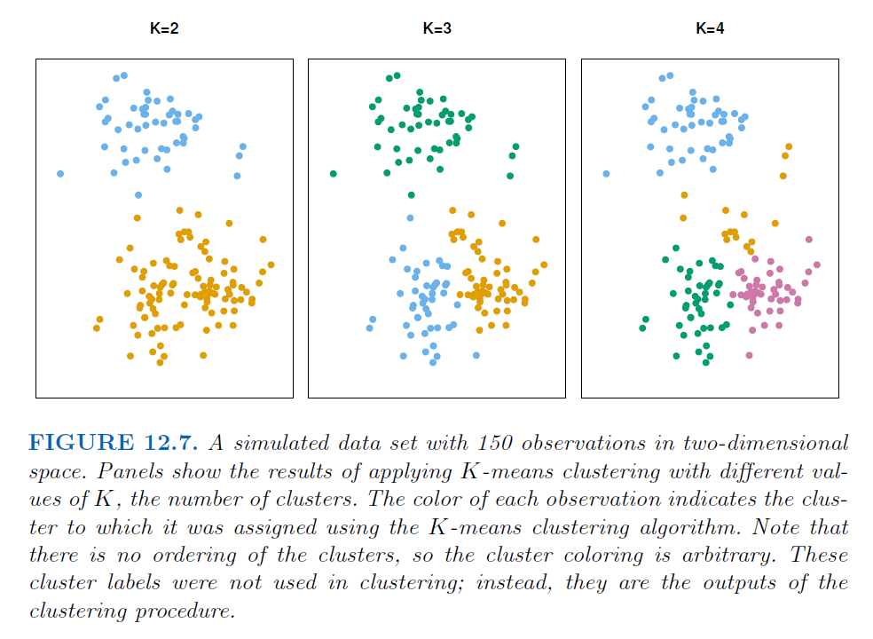

## General Mechanism

- The K-means clustering procedure results from a simple and intuitive
mathematical problem

- Let $C_1, \ldots, C_K$ denote sets containing the indices of the observations in each cluster. These sets satisfy two properties;
  * $C_1 \cup C_2 \ldots \cup C_K = (1, \ldots, n)$. Here, each observation belongs to at least one of the K clusters.
  * $C_k \cap C_{k'} = \emptyset$ for all $k \neq k'$. Here, the clusters are nonoverlapping: no observation belongs to more than one cluster
 
- For instance, if the $i$'th observation is in the $k$'th cluster, then $i \in C_k$

## How to find ? 

- The idea behind K-means clustering is that a good clustering is one for which the
within-cluster variation is as small as possible

- The within-cluster variation for cluster $C_k$ is a measure $W(C_k)$ of the amount by which the observations within a cluster differ from each other

- In words, this formula says that we want to partition the observations into
$K$ clusters such that the total within-cluster variation, summed over all $K$
clusters, is as small as possible

$minimize_{C_1, \ldots, C_k} (\sum_{k=1}^{K} W(C_k))$

## How to proceed 

- Solving the above problem seems like a reasonable idea, but in order to make it
actionable we need to define the **within-cluster variation**. 

- There are many possible ways to define this concept, but by far the most common choice
involves squared **Euclidean distance**

$W(C_k) = \frac{1}{|C_k|} \sum_{i,i' \in C_k} \sum_{j=1}^{p} (x_{ij} - x_{i'j})^2$

where $|C_k|$ denotes the number of observations in the $k$'th cluster

- In other words, the within-cluster variation for the kth cluster is the sum of all of
the pairwise squared Euclidean distances between the observations in the
k'th cluster, divided by the total number of observations in the kth cluster

- Note that, when we combine above to equations, the resulting equation is the optimization problem that defines K-means clustering

$minimize_{C_1, \ldots, C_k} (\sum_{k=1}^{K} \frac{1}{|C_k|} \sum_{i,i' \in C_k} \sum_{j=1}^{p} (x_{ij} - x_{i'j})^2) (12.7)$

- This is in fact a very difficult problem to solve precisely, since there are almost $K^n$ ways to partition $n$ observations into $K$ clusters. This is a huge number unless $K$ and $n$ are tiny! Fortunately, a very simple algorithm can be shown to provide a local optimum - a pretty good solution - to the K-means optimization problem

## Main Algorithm

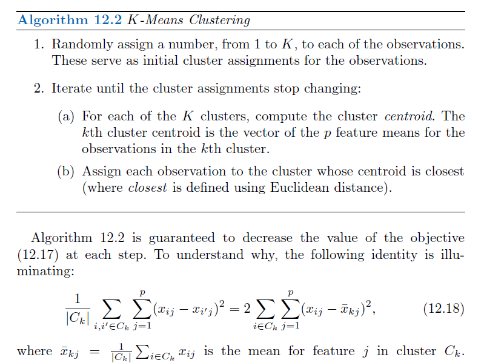

- In Step 2(a) the cluster means for each feature are the constants that
minimize the sum-of-squared deviations, and in Step 2(b), reallocating the
observations can only improve (12.18). 

- This means that as the algorithm is run, the clustering obtained will continually improve until the result no longer changes; the objective of (12.17) will never increase. 

- When the result no longer changes, a local optimum has been reached


## How it works ? 

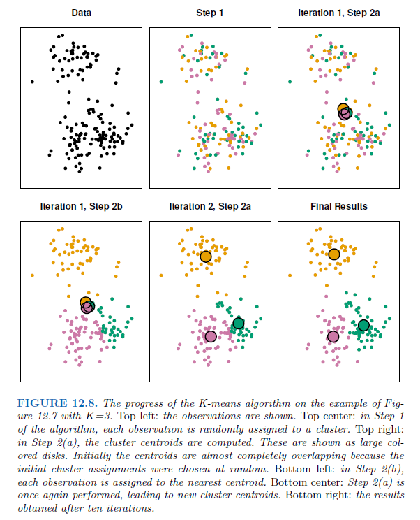

## Some Questions 

- Because the K-means algorithm finds a local rather than a global optimum,
the results obtained will depend on the initial (random) cluster assignment
of each observation in Step 1 of Algorithm 12.2. 

- For this reason, it is important to run the algorithm multiple times from different random initial configurations. 

- Then one selects the best solution, i.e. that for which the objective (12.17) is smallest. 
- Figure 12.9 shows the local optima obtained by running K-means clustering six times using six different initial

## Final Visualization

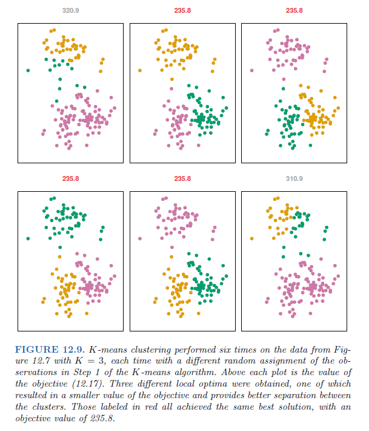

## Hierarchical Clustering

- **One potential disadvantage** of K-means clustering is that it requires us to
pre-specify the **number of clusters**.

- Hierarchical clustering is an **alternative approach** which does not require that we commit to a particular choice of K

- Hierarchical clustering has an added advantage over K-means clustering in that it results in an attractive tree-based representation of the observations, called a dendrogram

- We describe bottom-up or agglomerative clustering, as the most common type of hierarchical clustering, and refers to the fact that a dendrogram  (generally depicted as an upside-down tree) is built starting from the leaves and combining clusters up to the trunk

- Focus on the questions of how to interpret a dendrogram and then discuss how hierarchical clustering is actually performed—that is, how the dendrogram is built.

## Hierarchical clustering algorithms

Hierarchical clustering can be divided into two main types:

* **Agglomerative clustering**: Commonly referred to as AGNES (AGglomerative NESting) works in a bottom-up manner. That is, each observation is initially considered as a single-element cluster (leaf). At each step of the algorithm, the two clusters that are the most similar are combined into a new bigger cluster (nodes). This procedure is iterated until all points are a member of just one single big cluster (root). The result is a tree which can be displayed using a dendrogram.

* **Divisive hierarchical clustering**: Commonly referred to as DIANA (DIvise ANAlysis) works in a top-down manner. DIANA is like the reverse of AGNES. It begins with the root, in which all observations are included in a single cluster. At each step of the algorithm, the current cluster is split into two clusters that are considered most heterogeneous. The process is iterated until all observations are in their own cluster.

REMARK: Agglomerative clustering is good at identifying small clusters. Divisive hierarchical clustering, on the other hand, is better at identifying large clusters.

## Visualize 


## Interpreting a Dendrogram

We begin with the simulated data set consisting of 45 observations in two-dimensional space. The data were generated from a three-class model; the true class labels for each observation are shown in distinct colors.

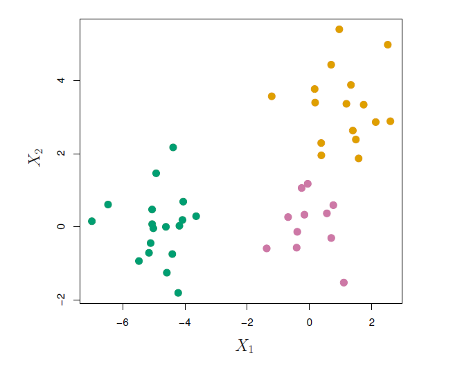

## Interpret the Dendogram ?

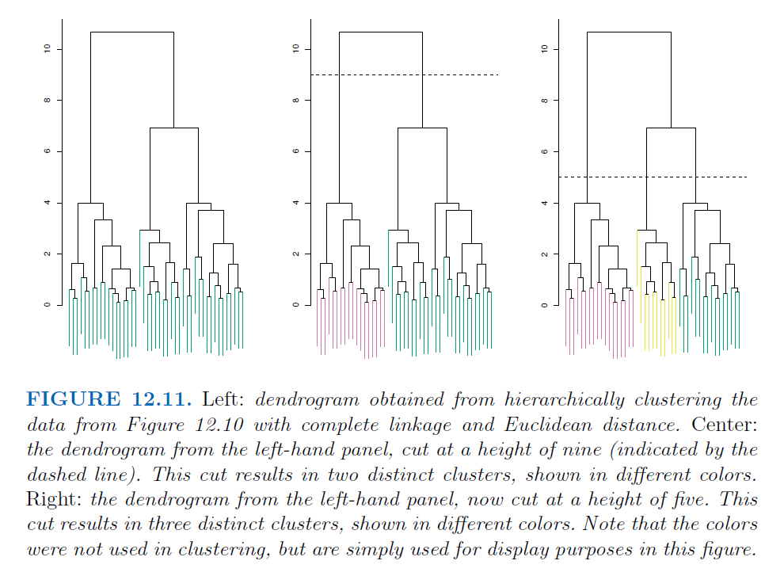

- Each leaf of the dendrogram represents one of the 45 observations

- As we move up the tree, some leaves begin to fuse into branches

- These correspond to observations that are similar to each other

- The earlier (lower in the tree) fusions occur, the more similar the groups of observations are to each other

## Be Careful !!!

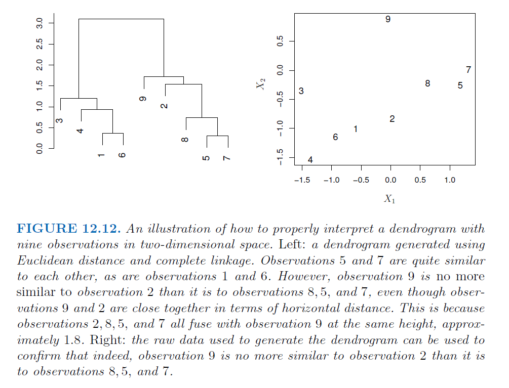

## Remarks

- One can see that observations 5 and 7 are quite similar to
each other, since they fuse at the lowest point on the dendrogram. Observations
1 and 6 are also quite similar to each other

- However, it is tempting but incorrect to conclude from the figure that observations 9 and 2 are quite similar to each other on the basis that they are located near each
other on the dendrogram. In fact, based on the information contained in
the dendrogram, observation 9 is no more similar to observation 2 than it
is to observations 8, 5, and 7

- To put it mathematically, there are $2^{n−1}$ possible reorderings of the dendrogram, where $n$ is the number of leaves. This is because at each of the $n − 1$ points where
fusions occur, the positions of the two fused branches could be swapped without affecting the meaning of the dendrogram

- Therefore, we cannot draw conclusions about the similarity of two observations based on their proximity along the horizontal axis

- Rather, we draw conclusions about the similarity of two observations based on the location on the vertical axis where branches containing those two observations first are fused

- In other words, the height of the cut to the dendrogram serves
the same role as the K in K-means clustering: it controls the number of
clusters obtained

- One single dendrogram can be used to obtain any number of clusters. In practice, people often look at the dendrogram and select by eye a sensible number of clusters, based on the heights of the fusion and the number of clusters desired.

## Interesting story ? 

- The term hierarchical refers to the fact that clusters obtained by cutting
the dendrogram at a given height are necessarily nested within the clusters
obtained by cutting the dendrogram at any greater height. 

- However, on an arbitrary data set, this assumption of hierarchical structure might be
unrealistic. 

- For instance, suppose that our observations correspond to a group of men and women, evenly split among Americans, Japanese, and French. We can imagine a scenario in which the best division into two groups might split these people by gender, and the best division into three groups might split them by nationality. 

- In this case, the true clusters are not nested, in the sense that the best division into three groups does not result from taking the best division into two groups and splitting up one of those groups. 

- Consequently, this situation could not be well-represented by hierarchical clustering. Due to situations such as this one, hierarchical clustering can sometimes yield worse (i.e. less accurate) results than Kmeans clustering for a given number of clusters

## General Mechanism

- The hierarchical clustering dendrogram is obtained via an extremely simple
algorithm based on a some sort of dissimilarity measure between
each pair of observations. Most often, Euclidean distance is used. 

- The algorithm proceeds iteratively. 

- Starting out at the bottom of the dendrogram, each of the $n$ observations is treated as its own cluster. The two clusters that are most similar to each other are then fused so that there now are $n−1$ clusters

- Next the two clusters that are most similar to each other are fused again, so that there now are $n − 2$ clusters

- The algorithm proceeds in this fashion until all of the observations belong to one single cluster, and the dendrogram is complete

- The fundamental question in hierarchical clustering is: **How do we measure the dissimilarity between two clusters of observations?**

## The Hierarchical Clustering Algorithm

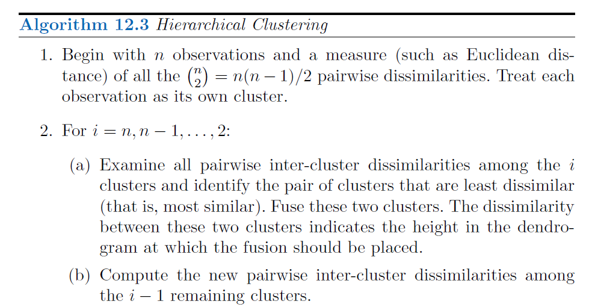

- We have a concept of the dissimilarity between pairs of observations, but
how do we define the dissimilarity between two clusters if one or both of
the clusters contains multiple observations? 

- The concept of dissimilarity between a pair of observations needs to be extended to a pair of groups of observations. 

- This extension is achieved by developing **the notion of linkage**, which defines the **dissimilarity between two groups of observations**

- The four most common types of linkage - *complete*, *average*, *single*,
and *centroid*.

## To open a paranthesis 

In order to group points into clusters, we need to know about their distance between each other.

- **Intracluster distance:** Distance between two point in the same cluster.

- **Intercluster distance:** Distance between two points in the different clusters.

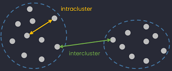

Source: https://dinhanhthi.com/metrics-for-clustering/

## Summary for Linkage

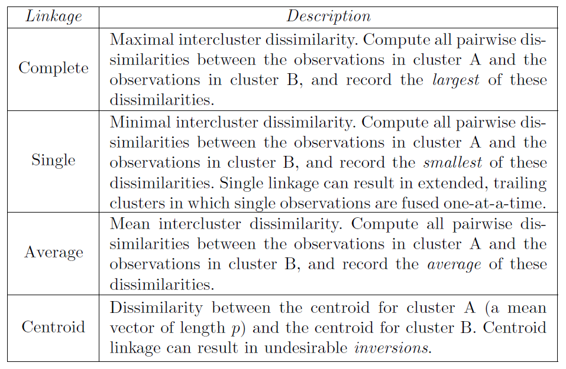

## To Visualize

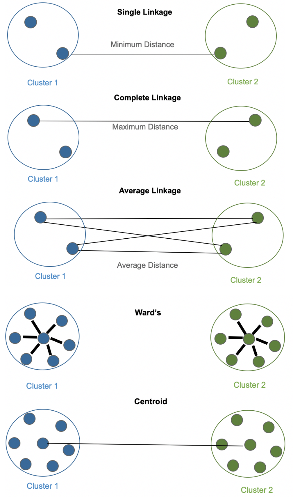

## Some Notes on linkage

- Average, complete, and single linkage are most popular among statisticians

- **Average and complete linkage** are generally preferred over single linkage, as they tend to yield more balanced dendrograms

- Centroid linkage is often used in genomics, but suffers from a major drawback in that an inversion can occur, whereby two clusters are fused at a height below either of the individual clusters in the dendrogram

- Generally, The dissimilarities computed in Step 2(b) of the hierarchical clustering algorithm will depend on the **type of linkage** used, as well as on the choice of dissimilarity measure

- Hence, the **resulting dendrogram** typically depends quite strongly on the type of linkage used

## An Example

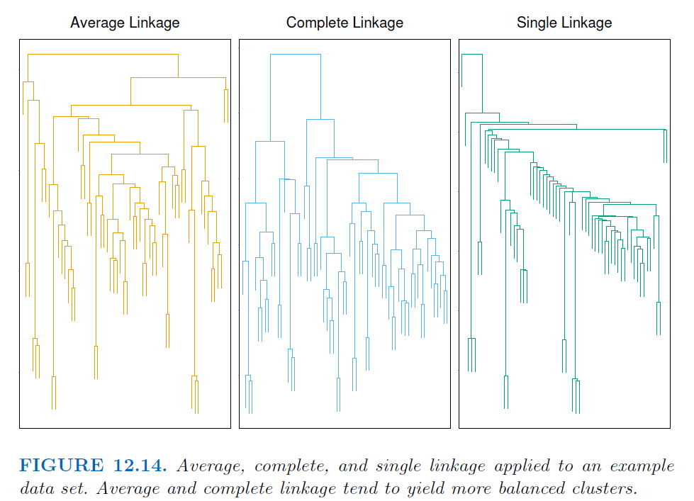


## Choice of Dissimilarity Measure

- The examples in this chapter have used **Euclidean distance** as the
dissimilarity measure. 

- But sometimes **other dissimilarity measures** might
be preferred. For example, correlation-based distance considers two observations
to be similar if their features are highly correlated, even though the observed values may be far apart in terms of Euclidean distance. 

- This is an unusual use of correlation, which is normally computed between variables;
here it is computed between the observation profiles for each pair of observations

- **Correlation-based distance focuses on the shapes of observation profiles rather than their magnitudes**

- The choice of dissimilarity measure is very important, as it has a strong
effect on the resulting dendrogram. In general, careful attention should be
paid to the type of data being clustered and the scientific question at hand.
These considerations should determine what type of dissimilarity measure
is used for hierarchical clustering

- In addition to carefully selecting the dissimilarity measure used, one must
also consider whether or not the variables should be scaled to have standard
deviation one before the dissimilarity between the observations is
computed

## An Example

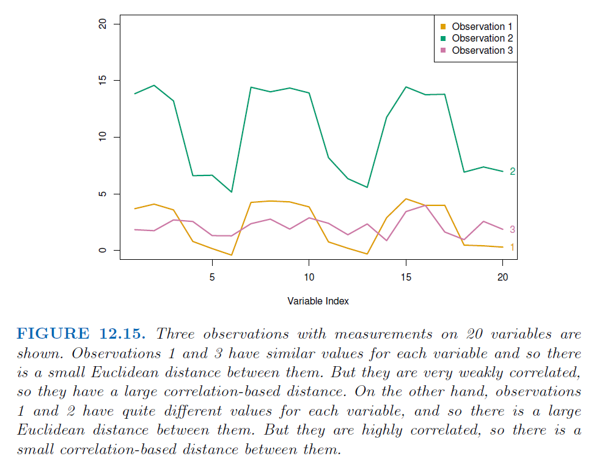

## Practical Issues in Clustering

- Clustering can be a very useful tool for data analysis in the unsupervised
setting. However, there are a number of issues that arise in performing
clustering

- In order to perform clustering, some decisions must be made.
  * Should the observations or features first be standardized in some way? For instance, maybe the variables should be scaled to have standard deviation one.

- In the case of K-means clustering, how many clusters should we look
for in the data?

- In the case of hierarchical clustering
  * What dissimilarity measure should be used?
  * What type of linkage should be used?
  * Where should we cut the dendrogram in order to obtain clusters?
 
- Each of these decisions can have a strong impact on the results obtained.
In practice, we try several different choices, and look for the one with
the most useful or interpretable solution!

## Validating the Clusters Obtained

- Any time clustering is performed on a data set we will find clusters. 

- But we really want to know whether the clusters that have been found represent
true subgroups in the data, or whether they are simply a result of clustering
the noise. 

- For instance, if we were to obtain an independent set of observations,
then would those observations also display the same set of clusters? This is a hard question to answer. 

- There exist a number of techniques for assigning a p-value to a cluster in order to assess whether there is more evidence for the cluster than one would expect due to chance. 

- However, there has been no consensus on a single best approach.

## Other Considerations in Clustering

- Both K-means and hierarchical clustering will assign each observation to
a cluster. However, sometimes this might not be appropriate. 

- For instance, suppose that most of the observations truly belong to a small number of
(unknown) subgroups, and a small subset of the observations are quite
different from each other and from all other observations. 

- Then since K-means and hierarchical clustering force every observation into a cluster, 
the clusters found may be heavily distorted due to the presence of outliers that
do not belong to any cluster. 

- Mixture models are an attractive approach for accommodating the presence of such outliers

- In addition, clustering methods generally are not very robust to perturbations
to the data. For instance, suppose that we cluster $n$ observations,
and then cluster the observations again after removing a subset of the $n$
observations at random. One would hope that the two sets of clusters obtained
would be quite similar, but often this is not the case!

## A Tempered Approach to Interpreting the Results of Clustering

- We have described some of the issues associated with clustering. However,
clustering can be a very useful and valid statistical tool if used properly. 

- We mentioned that small decisions in how clustering is performed, such as how
the data are standardized and what type of linkage is used, can have a large
effect on the results. Therefore, we recommend performing clustering with
different choices of these parameters, and looking at the full set of results
in order to see what patterns consistently emerge. 

- Since clustering can be non-robust, we recommend clustering subsets of the data in order to get a sense of the robustness of the clusters obtained. 

- Most importantly, we must be careful about how the results of a clustering analysis are reported. These results should not be taken as the absolute truth about a data set. 

- Rather, they should constitute a starting point for the development of a scientific
hypothesis and further study, preferably on an independent data set

## Alternatives ?

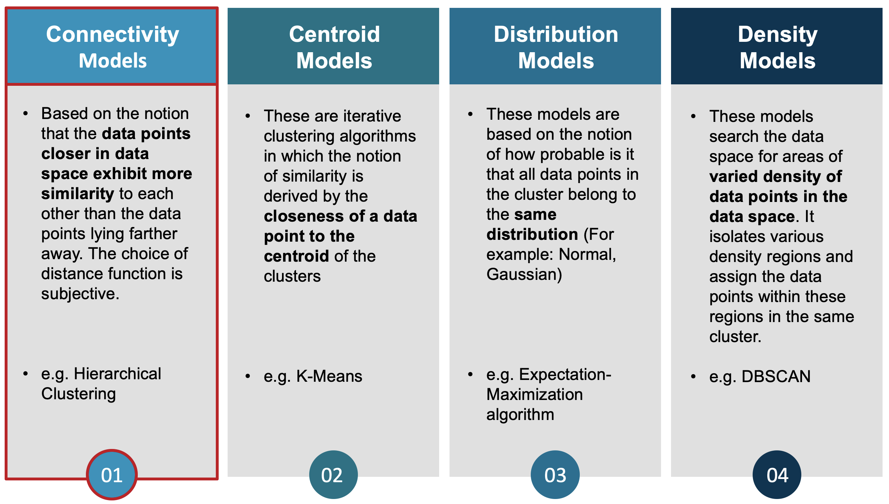{width=50%}

Source: https://github.com/kavana-r/RLadies_Hierarchical_Clustering

## Hands on with R

The function kmeans() performs K-means clustering in R. We begin with
a simple simulated example in which there truly are two clusters data: the first 25 observations have a mean shift relative to the next 25
observations

```{r}
set.seed(442)
x <- matrix(rnorm(50 * 2), ncol = 2)
x[1:25, 1] <- x[1:25, 1] + 3
x[1:25, 2] <- x[1:25, 2] - 4
head(x)
dim(x)
```

We now perform K-means clustering with K = 2

```{r}
km.out <- kmeans(x, 2, nstart = 20)
km.out
km.out$cluster
km.out$iter
```

We can plot the data, with each observation colored according to its cluster
assignment

```{r}
plot(x[,1], x[,2])
par(mfrow = c(1, 2))
plot(x, col = (km.out$cluster + 1), main = "K-Means Clustering Results with K = 2",
xlab = "", ylab = "", pch = 20, cex = 2)
```

Note that, if there were more than two variables then we could instead perform PCA
and plot the first two principal components score vectors

## More Realistic

However, for real data, in general we do not know
the true number of clusters. We could instead have performed K-means
clustering on this example with K = 3

```{r}
set.seed(442)
km.out <- kmeans(x, 3, nstart = 20)
km.out
```

When K = 3, K-means clustering splits up the two clusters

```{r}
plot(x, col = (km.out$cluster + 1),
main = "K-Means Clustering Results with K = 3",
xlab = "", ylab = "", pch = 20, cex = 2)
```

```{r}
# set.seed(442)
km.out1 <- kmeans(x, 1, nstart = 20)
km.out1$tot.withinss
km.out1$totss

km.out2 <- kmeans(x, 2, nstart = 20)
km.out2$tot.withinss
km.out2$totss

km.out3 <- kmeans(x, 3, nstart = 20)
km.out3$tot.withinss
km.out3$totss

```


To run the **kmeans()** function in R with multiple initial cluster assignments,
we use the **nstart** argument. If a value of nstart greater than one
is used, then K-means clustering will be performed using multiple random
assignments in Step 1 of Algorithm 12.2, and the kmeans() function will
report only the best results.

```{r}
set.seed(442)
km.out <- kmeans(x, 3, nstart = 20)
km.out$tot.withinss

km.out <- kmeans(x, 2, nstart = 20)
km.out$tot.withinss
```

Note that **km.out$tot.withinss** is the total within-cluster sum of squares,
which we seek to minimize by performing K-means clustering

The individual within-cluster sum-of-squares are contained in the
vector km.out$withinss

```{r}
km.out$withinss
```

Important Notes;

- It is strongly recommended always running K-means clustering with a large
value of nstart, such as 20 or 50, since otherwise an undesirable local
optimum may be obtained !

- When performing K-means clustering, in addition to using multiple initial
cluster assignments, it is also important to set a random seed using the
**set.seed()** function. This way, the initial cluster assignments in Step 1 can
be replicated, and the K-means output will be fully reproducible

## Hierarchical Clustering

The **hclust()** function implements hierarchical clustering in R. Focus on 
clustering dendrogram using complete, single, and average linkage
clustering, with Euclidean distance as the dissimilarity measure

The dist() function is used to compute the 50 × 50 inter-observation Euclidean distance matrix.

```{r}

hc.complete <- hclust(dist(x), method = "complete")
hc.average <- hclust(dist(x), method = "average")
hc.single <- hclust(dist(x), method = "single")
```


We can now plot the dendrograms obtained using the usual plot() function

```{r}
par(mfrow = c(1, 3))
plot(hc.complete , main = "Complete Linkage", xlab = "", sub = "", cex = .9)
plot(hc.average , main = "Average Linkage", xlab = "", sub = "", cex = .9)
plot(hc.single, main = "Single Linkage", xlab = "", sub = "", cex = .9)
```

To determine the cluster labels for each observation associated with a
given cut of the dendrogram, we can use the **cutree()** function

```{r}
cutree(hc.complete , 2)

cutree(hc.average , 2)

cutree(hc.single, 2)
```

The second argument to cutree() is the number of clusters we wish to
obtain. For this data, complete and average linkage generally separate the
observations into their correct groups. However, single linkage identifies one
point as belonging to its own cluster. A more sensible answer is obtained
when four clusters are selected, although there are still two singletons.

```{r}
cutree(hc.single, 4)
```

## Tabulate results of k-means and hierarchical 

```{r}
km.clusters <- km.out$cluster
hc.clusters <- cutree(hc.complete, 3)
table(km.clusters, hc.clusters)
```


## About Scaling

To scale the variables before performing hierarchical clustering of the
observations, we use the scale() function

```{r}
xsc <- scale(x)
plot(hclust(dist(xsc), method = "complete"), 
     main = "Hierarchical Clustering with Scaled Features")


hc.clusters_x <- cutree(hclust(dist(x), method = "complete"), 3)
hc.clusters_xsc <- cutree(hclust(dist(xsc), method = "complete"), 3)

hc.clusters_x
hc.clusters_xsc

```

```{r}
hc.clusters_x
hc.clusters_xsc
```


## Use of Correlation based distance

Correlation-based distance can be computed using the **as.dist()** function, 
which converts an arbitrary square symmetric matrix into a form that
the **hclust()** function recognizes as a distance matrix. 

However, this only makes sense for data with at least three features since the absolute correlation between any two observations with measurements on two features is
always 1. Hence, we will cluster a three-dimensional data set. This data set
does not contain any true clusters

```{r}
x <- matrix(rnorm (30 * 3), ncol = 3)
dd <- as.dist (1 - cor(t(x)))
plot(hclust(dd, method = "complete"), main = "Complete Linkage with Correlation -Based Distance", xlab = "", sub = "")
```

Please look at the **NCI60 Data Example** in our book also ! Pages 542-547

## To watch in youtube

For k-means

- https://www.youtube.com/watch?v=4b5d3muPQmA

- https://www.youtube.com/watch?v=_aWzGGNrcic

For hierarchical

- https://www.youtube.com/watch?v=7xHsRkOdVwo


## List of Other Sources

- https://bradleyboehmke.github.io/HOML/kmeans.html

- https://bookdown.org/utjimmyx/marketing_research/kmeans-cluster-analysis.html

- https://rafalab.github.io/dsbook/clustering.html

- https://www.researchgate.net/publication/336903036_Clustering_analysis_application_on_Industry_40-driven_global_indexes

- https://github.com/kavana-r/RLadies_Hierarchical_Clustering

- https://statsandr.com/blog/clustering-analysis-k-means-and-hierarchical-clustering-by-hand-and-in-r/

Animations 

- https://www.naftaliharris.com/blog/visualizing-k-means-clustering/

- https://dashee87.github.io/data%20science/general/Clustering-with-Scikit-with-GIFs/


